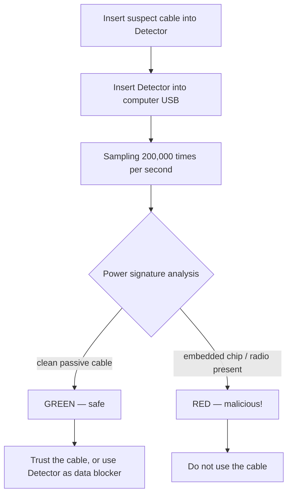

# Malicious Cable Detector — 完整指南

> **一句話定位**：Malicious Cable Detector 是目前市面上唯一能偵測「所有已知惡意 USB 線材」的防禦型小工具——包括 O.MG Cable 家族——它用每秒 20 萬次的側信道電力分析找出藏在線材裡的植入晶片。同時它也是一顆資料阻斷器，能安全充電。

這是 Hak5 目錄中罕見的*防禦型*工具 — 而且它是由製造 O.MG 惡意線材的同一個團隊打造的。重點就在這裡：最會打造隱形植入裝置的人，最清楚怎麼找到它們。

為什麼需要它？大多數惡意線材可以透過檢查 USB 資料線上的異常訊號來抓獲。但 O.MG 線材在 payload 觸發之前，在**資料線上完全隱形**。更糟的是，它們外觀看起來完全正常。要抓到休眠的植入裝置，你必須看向植入裝置藏不住的地方：**電力消耗**。Detector 每秒對一條線材的電力消耗取樣 200,000 次，並分析它的「行為指紋」，尋找嵌入式微控制器/無線電的典型電氣特徵。

> **誠實的侷限：** 它能偵測*所有已知*的商用惡意線材，以及共享相同電氣家族的專業級設計。沒有任何工具能保證抓到訂製的國家級植入裝置 — 但對商務差旅、研討會與事件應變來說，它是務實的防禦。

---

## 規格一覽

| 項目 | 規格 |
|---|---|
| 偵測方法 | 側信道電力分析 |
| 分析速率 | 每秒 200,000 次取樣 |
| 介面 | USB-A（到電腦）+ USB-A（受測線材） |
| 附加功能 | USB 資料阻斷器（安全充電，阻斷資料） |
| 指示燈 | LED 活動燈 |
| 電源 | 匯流排供電（無電池） |
| 可改裝性 | 6-pin ISP 接頭 + 焊接跳線（Arduino IDE 改裝、序列輸出、資料阻斷/穿透選擇） |
| 尺寸 / 重量 | 約 17 × 9 × 1 cm，約 13 g |
| 官方文件 | https://docs.hak5.org |

---

## 偵測如何運作



| 訊號 | Detector 讀到什麼 |
|---|---|
| 純被動線材 | 沒有嵌入式電子 → 乾淨的電力消耗 → **安全** |
| 基本惡意線材 | 在資料線上顯示活動 → 容易被抓 |
| **O.MG / 休眠植入裝置** | 資料線不活動，但電力消耗洩漏了隱藏晶片 → **被抓** |

---

## 快速入門 — 一分鐘內測試一條線材

### 步驟 1 — 連接
1. 把可疑 USB 線材插進 **Detector 的**線材端連接埠。
2. 把 **Detector** 插進你電腦的 USB 埠。
3. 等幾秒讓電力穩定。

### 步驟 2 — 讀取 LED
檢查 LED 活動燈：

| LED | 意義 |
|---|---|
| 綠 / 乾淨 | 沒有偵測到植入裝置 — 線材可以安全使用 |
| 紅 / 警告 | 偵測到植入裝置 — **不要使用這條線材** |

### 步驟 3 — 依結果行動
- **安全：** 繼續使用線材，或讓它留在 Detector 中同時充當資料阻斷器。
- **不安全：** 標記線材供調查 / 銷毀它，並向你的安全團隊記錄事件。

> **你可能會問：** *「它能偵測休眠狀態的 O.MG 線材嗎？」* **可以 — 這是它的招牌能力。** 因為 O.MG 線材藏在資料線上，Detector 的電力分析方法正是為了看到它們而設計，即使完全休眠。

---

## 把它當資料阻斷器用

Detector 同時也是一個 **USB 資料阻斷器（USB 保險套）**，用於安全充電：

- 把電力傳給你的裝置。
- **阻斷資料線**，所以惡意連接埠無法外洩或植入。
- 焊接跳線讓你在資料阻斷與資料穿透行為之間選擇（硬體改裝）。

---

## 進階 / 改裝

| 能力 | 怎麼做 |
|---|---|
| 韌體改裝 | 6-pin ISP 接頭 — 用標準便宜程式設計器透過 Arduino IDE 燒錄 |
| 序列輸出 | 透過焊接跳線啟用，用於除錯/資料串流 |
| 資料阻斷 vs 穿透 | 焊接跳線可選行為 |
| 事件應變套件 | 搭配標籤機，在稽核期間標記好/壞線材 |

---

## 動手做：稽核你的桌面

一個使用 Detector 的具體「線材衛生」例行程序：

```text
1. For each cable on your desk / travel bag:
   a. Plug it into the Detector → computer.
   b. Read the LED.
   c. Safe → label GREEN and return to use.
   d. Unsafe → label RED, quarantine, and report.
2. For conference/freebie cables: test every single one before use.
3. For travel: test your own cables before each trip (implants can be swapped).
```

---

## 疑難排解

| 症狀 | 原因 | 修正 |
|---|---|---|
| 完全沒有 LED | Detector 沒有收到電力 | 確認牢固插在供電的 USB 埠中 |
| 編織線材誤報 | 異常遮蔽短暫改變電力 | 重新測試；按住幾秒讓它穩定 |
| 資料意外穿透 | 焊接跳線設為穿透 | 把跳線改為資料阻斷（見文件） |
| 線材無法完全插入 | 與笨重連接器的機械配合問題 | 使用標準外型線材 / 轉接器；用力重新插好 |
| 想要影片/照片證據 | — | 記錄 LED 讀數；照片對事件報告很有用 |

---

## 相關資源

- [O.MG Cable](/hak5/products/omg-cable/) — 這台 Detector 就是為了找它而造的植入裝置
- [O.MG UnBlocker](/hak5/products/omg-unblocker/) — *帶有*植入裝置的資料阻斷器（測試你的！）
- [Key Croc](/hak5/products/key-croc/) — 在可疑連接埠上要檢查的鍵盤側錄轉接頭
- [韌體與下載](/hak5/firmware-downloads/) — 文件與更新資訊
- [疑難排解索引](/hak5/troubleshooting-index/)
- [Hak5 總覽](/hak5/)