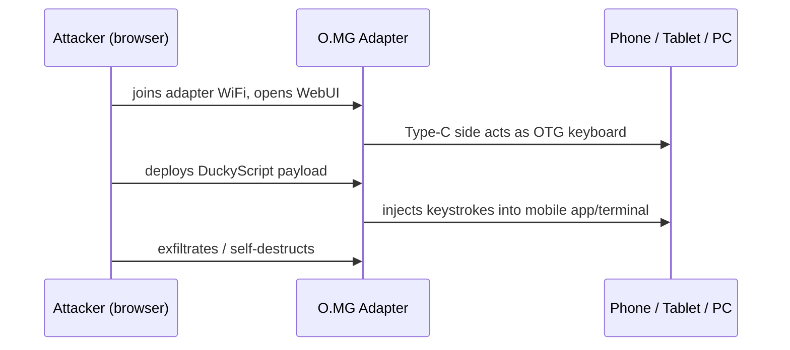

# O.MG Adapter — 完整指南

> **一句話定位**：O.MG Adapter 把無線植入晶片藏在一顆「USB-A 轉 USB-C 轉接頭」裡——你今天可能剛剛用它幫平板充電，卻不知道它能透過 Wi-Fi 被控制。它特別的地方是：Type-C 這一端能對**手機與平板**執行鍵盤注入。

O.MG 家族把植入晶片藏在日常 USB 物品裡。**Adapter** 選擇了最常見的旅行配件：每個人用來幫現代裝置充電的 USB-A 轉 USB-C 轉接頭。因為 Type-C 端是*主動*端，它表現得像一個 **OTG 轉接頭** — 把它插進手機或平板的 Type-C 埠，你就能對行動裝置部署 payload，而不只是電腦。

當它沒有傳輸 payload 時，Adapter 會穿透正常的 USB 2.0 資料，同時植入晶片保持無法偵測。這是把 O.MG 能力帶進行動優先世界的低調方式。

> **⚠️ 僅限授權測試 — 出廠停用。** 只在你擁有的裝置上測試，或取得書面許可。搭配 [Malicious Cable Detector](/hak5/products/malicious-cable-detector/) 瞭解防禦面。

---

## 規格一覽

| 專案 | 規格 |
|---|---|
| 外型 | USB-A（host）→ USB-C（主動/攻擊端）轉接頭 |
| 植入晶片 | 支援 WiFi 的無線 HID 晶片（WebUI + 802.11 無線電） |
| Payload 語言 | DuckyScript 3.0（Elite）/ 2.0（Basic） |
| 行動裝置 | OTG 主動 Type-C 端 — 注入手機與平板 |
| 啟用 | 需要 [O.MG Programmer](/hak5/products/omg-programmer/) — 出廠停用 |
| 特色功能 | 自我銷毀、地理圍欄、WiFi 觸發、偽造身分、資料穿透 |
| 官方檔案 | https://docs.hak5.org/omg-cable |

---

## 為什麼這個轉接頭重要 — 行動攻擊



| 情境 | 為什麼用 Adapter |
|---|---|
| 手機/平板滲透測試 | Type-C OTG 能在 USB-A 裝置做不到的地方注入 |
| 充電站社交工程 | 每個人都會拿起 A 轉 C 轉接頭 |
| 行動優先任務 | 現代目標是智慧型手機 |
| 電腦 + 行動涵蓋 | 同一個轉接頭兩者都適用 |

---

## 快速入門（3 步驟啟用）

1. **啟用：** 把 Adapter 插進 [O.MG Programmer](/hak5/products/omg-programmer/)，插進 Chrome/Edge 機器，開啟 WebFlasher（https://o.mg.lol/setup/），3 步驟精靈。
2. **連線：** 從瀏覽器連上 Adapter 的 WiFi；開啟它的 WebUI。
3. **部署：** 把 **Type-C** 端插進目標（手機、平板或 PC），然後觸發 payload — 它會透過 OTG HID 連結注入。

```text
REM On an Android test device, open a terminal app and type
DELAY 1500
STRING echo hello from O.MG adapter
ENTER
```

---

## 進階與隱蔽

| 功能 | 作用 |
|---|---|
| OTG 主動 Type-C | 對智慧型手機/平板部署 payload（使用 Type-C 端） |
| 資料穿透 | 休眠期間正常 USB 2.0 資料；植入晶片隱形 |
| 可偽造身分 | 複製 VID/PID / 延伸 USB ID / MAC |
| 自我銷毀 / 地理圍欄 / WiFi 觸發 | 標準 O.MG 安全控制 |
| 加密 C²（Elite） | 從任何地方透過加密隧道遠端控制 |
| 硬體鍵盤側錄器（Elite） | FullSpeed USB 鍵盤側錄器附加元件，附額外儲存 |

---

## 疑難排解

| 症狀 | 原因 | 修正 |
|---|---|---|
| 沒有 WebUI | 未啟用 | 透過 Programmer 啟用 |
| 行動裝置收不到按鍵 | 錯誤的一端 / OTG 模式 | 在行動裝置上用 Type-C 端（主動）；在 PC 上用 USB-A |
| WebFlasher 偵測不到 | 瀏覽器 / bootloader | Chrome 或 Edge（WebSerial）；在提示前保持未插上 |
| 資料有穿透但沒有攻擊 | 休眠 / payload 未觸發 | 透過 WebUI 或 WiFi beacon 觸發 |

---

## 相關資源

- [O.MG Cable](/hak5/products/omg-cable/) / [O.MG Plug](/hak5/products/omg-plug/) — 兄弟植入裝置
- [O.MG UnBlocker](/hak5/products/omg-unblocker/) — 植入晶片藏在資料阻斷器
- [O.MG Programmer](/hak5/products/omg-programmer/) — 啟用與更新
- [Malicious Cable Detector](/hak5/products/malicious-cable-detector/) — 偵測
- [韌體與下載](/hak5/firmware-downloads/) — O.MG 韌體與 WebFlasher
- [疑難排解索引](/hak5/troubleshooting-index/)
- [Hak5 總覽](/hak5/)