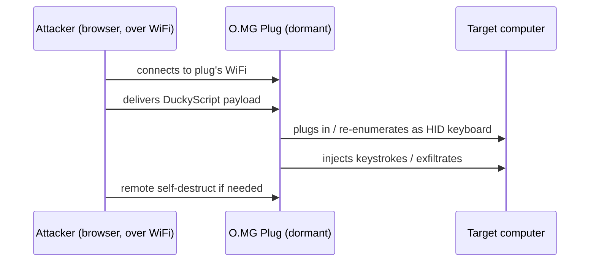

# O.MG Plug — 完整指南

> **一句話定位**：O.MG Plug 把 O.MG 的無線植入晶片塞進一支「鑰匙圈 USB 隨身碟」外型的插頭——掛在鑰匙上完全不起眼，一旦插進目標的 USB 孔，就能透過 Wi-Fi 遠端注入按鍵、執行 DuckyScript Payload。

[O.MG Cable](/hak5/products/omg-cable/) 把植入晶片藏在線材裡。**O.MG Plug** 則把完全相同的植入晶片藏在更不起眼的東西裡：一個看起來像廉價隨身碟 / 手機充電器的鑰匙圈 USB 插頭。它是「把它留在桌上，祈禱有人插上去」的社交工程工具。

同樣的能力，不同的偽裝。因為它是插頭而不是線材，它更容易攜帶，也更容易塞進目標的 USB 埠 — 經典的「撿到一支 USB 隨身碟，好奇心毀了安全防線」情境。

> **⚠️ 僅限授權測試 — 出廠停用。** 在你自己的實驗室使用，或取得明確授權。防禦工具見 [Malicious Cable Detector](/hak5/products/malicious-cable-detector/)。

---

## 規格一覽

| 項目 | 規格 |
|---|---|
| 外型 | 鑰匙圈 USB 插頭（看起來像隨身碟） |
| 植入晶片 | 支援 WiFi 的無線 HID 晶片（WebUI + 802.11 無線電） |
| Payload 語言 | DuckyScript 3.0（Elite）/ 2.0（Basic） |
| 啟用 | 需要 [O.MG Programmer](/hak5/products/omg-programmer/) — 出廠停用 |
| 觸發 | WiFi — 長距離 beacon 觸發、地理圍欄 |
| 特色功能 | 自我銷毀、地理圍欄、偽造 VID/PID/MAC、WebUI 控制 |
| 官方文件 | https://docs.hak5.org/omg-cable |

> Plug 的硬體等級（Basic/Elite）與 O.MG Cable 相同 — 完整的 Basic vs Elite 表格（槽位、速度、鍵盤側錄器、隱蔽連結、加密 C²）見 [O.MG Cable 頁面](/hak5/products/omg-cable/)。

---

## 使用情境與攻擊流程

O.MG 家族的縮影版，以插頭形式呈現：



| 情境 | 為什麼 Plug 適合 |
|---|---|
| USB 丟棄 /「撿到一支隨身碟」 | 看起來像無辜的隨身碟 |
| 鑰匙圈攜帶 | 永遠在你身邊，永遠可否認 |
| 鞋帶網路社交工程 | 偽裝成留在桌上的充電器 |
| 紅隊示範 | 教團隊可移除媒體攻擊如何運作 |

---

## 快速入門（3 步驟啟用）

1. **啟用：** 把 Plug 插進 [O.MG Programmer](/hak5/products/omg-programmer/)，把 Programmer 插進 Chrome/Edge 機器，開啟 WebFlasher（https://o.mg.lol/setup/），依照 3 步驟精靈操作。
2. **連線：** 啟用後，從瀏覽器連上 Plug 的 WiFi 並開啟它的 WebUI。
3. **部署：** 點擊 DuckyScript payload 的 **Run** — Plug 會注入到它所插入的任何裝置。

```text
REM Proof-of-concept — open notepad, type a message
DELAY 1000
GUI r
DELAY 500
STRING notepad
ENTER
DELAY 800
STRING Hello from an O.MG Plug!
ENTER
```

---

## 隱蔽與進階

| 功能 | 作用 |
|---|---|
| Port Stealthing | 在 payload 部署前保持休眠 — 不列舉、無日誌 |
| 可偽造身分 | 複製 VID/PID / 延伸 USB ID / MAC |
| 自我銷毀 | 遠端清除 → 失效；可透過 Programmer 復原 |
| 地理圍欄 | 依位置觸發或自我銷毀 |
| WiFi 觸發 | 用單一 beacon 長距離觸發 payload |
| 批次韌體（Elite） | Programmer 可大量刷寫多台裝置 |

---

## 疑難排解

| 症狀 | 原因 | 修正 |
|---|---|---|
| 沒有 WebUI / 休眠 | 未啟用 | 透過 Programmer 啟用 |
| WebFlasher 看不到它 | 瀏覽器錯誤 / 不在 bootloader 模式 | Chrome 或 Edge（WebSerial）；在提示前保持未插上 |
| 作為隨身碟看起來「怪怪的」 | payload 武裝時列舉為 HID | 只有你觸發時才會列舉 — 休眠時預期是正常的 |
| Payload 沒打字 | 配置不符 | 載入正確鍵盤配置 / 使用正確的 DuckyScript 版本 |

---

## 相關資源

- [O.MG Cable](/hak5/products/omg-cable/) — 同款植入晶片，線材偽裝
- [O.MG Adapter](/hak5/products/omg-adapter/) — 植入晶片藏在 USB-A 轉 C 轉接頭
- [O.MG UnBlocker](/hak5/products/omg-unblocker/) — 植入晶片藏在資料阻斷器
- [O.MG Programmer](/hak5/products/omg-programmer/) — 啟用與更新
- [Malicious Cable Detector](/hak5/products/malicious-cable-detector/) — 偵測
- [韌體與下載](/hak5/firmware-downloads/) — O.MG 韌體與 WebFlasher
- [疑難排解索引](/hak5/troubleshooting-index/)
- [Hak5 總覽](/hak5/)