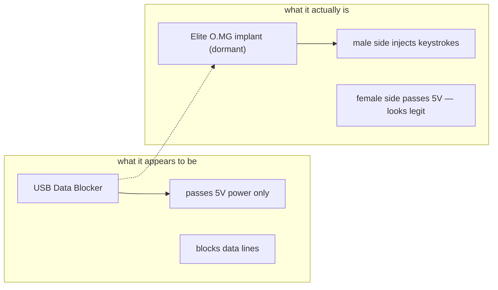

# O.MG UnBlocker — 完整指南

> **一句話定位**：O.MG UnBlocker 把無線植入晶片藏進一顆「安全 USB 資料阻斷器（USB 保險套）」裡——那個人人都相信最安全的裝置，其實是顆隨時能被 Wi-Fi 遙控的攻擊端點。

有一種廣為人知的防禦硬體：**USB 資料阻斷器**（「USB 保險套」）。它只穿透電力並阻斷資料線，所以你能安全地從未知連線埠充電。它是旅行者與高階主管的首選推薦。O.MG UnBlocker 把這種信任武器化：它看起來、用起來都完全像一個資料阻斷器，但內部藏著一顆休眠的 O.MG 無線植入晶片。

**公**端是主動攻擊端 — 插進目標時，它能傳輸 payload。**母**端像真正的阻斷器一樣向下遊穿透 5V 電力，所以騙局得以維持。客製化標籤以配合你的目標環境，獲得最大可信度。它內含 Elite 系列植入晶片，提供業界領先的速度與未來的韌體能力。

> **⚠️ 僅限授權測試 — 出廠停用。** 這是目錄中最具欺騙性的工具，直接瞄準人們無條件信任的*防禦型*小工具。只在你自己的系統上、在授權的任務範圍內測試它。

---

## 規格一覽

| 專案 | 規格 |
|---|---|
| 外型 | USB 資料阻斷器外觀（3 種顏色；可客製標籤/標誌） |
| 植入晶片 | Elite 系列 O.MG 無線 HID 晶片，觸發前保持休眠 |
| 連線埠 | USB-A 公（主動攻擊端）+ USB-A 母（5V 電力穿透） |
| Payload 語言 | DuckyScript 3.0（Elite） |
| 注入速度 | 最高 890 鍵/秒 |
| Payload 槽位 | 最高 200（附額外儲存） |
| 鍵盤對應 | 內建 192 組全球鍵盤對應 |
| 啟用 | 需要 [O.MG Programmer](/hak5/products/omg-programmer/) — 出廠停用 |
| 特色功能 | 自我銷毀、地理圍欄、WiFi 觸發、偽造 ID、Port Stealthing、WebUI 內建 IDE |
| 官方檔案 | https://docs.hak5.org/omg-cable |

---

## 騙局，解釋



| 情境 | 為什麼用 UnBlocker |
|---|---|
| 受信任裝置社交工程 | 每個人都會把手機插進「安全」資料阻斷器 |
| 高階主管差旅 | 預先放在受信任充電器旁 — 最沒人懷疑的裝置 |
| 藍隊訓練 | 示範即使是「安全」硬體也可能被入侵 |
| 紅隊誘餌 | 客製標籤/標誌以配合目標環境 |

---

## 快速入門（3 步驟啟用 + 使用）

1. **啟用：** 插進 [O.MG Programmer](/hak5/products/omg-programmer/)，插進 Chrome/Edge 機器，開啟 WebFlasher（https://o.mg.lol/setup/），3 步驟精靈。
2. **連線：** 從瀏覽器連上 UnBlocker 的 WiFi；開啟它的 WebUI（含內建 IDE）。
3. **部署：** 把**公**端插進目標；從 WebUI 觸發 DuckyScript payload。

```text
REM Proof-of-concept — open notepad and type
DELAY 1000
GUI r
DELAY 500
STRING notepad
ENTER
DELAY 800
STRING Hello from an O.MG UnBlocker!
ENTER
```

WebUI 的內建 IDE 在你建構 payload 時提供即時回饋（語法高亮、錯誤捕捉）。

---

## 隱蔽與進階

| 功能 | 作用 |
|---|---|
| Port Stealthing | 在 payload 部署前保持休眠 — 不列舉、無日誌 |
| 可偽造身分 | 複製 VID/PID / 延伸 USB ID / MAC |
| 全球鍵盤對應 | 192 種配置，攻擊世界各地的機器 |
| 自我銷毀 | 遠端清除 → 失效；可透過 Programmer 復原 |
| 地理圍欄 | 裝置離開授權範圍時觸發/自我銷毀 |
| WiFi 觸發 | 長距離單一 beacon payload 觸發 |
| 加密 C²（Elite） | 從任何地方遠端控制；可停用內建 WebUI |
| HIDX StealthLink | 雙向隧道 Target ↔ O.MG ↔ 控制 |

---

## 疑難排解

| 症狀 | 原因 | 修正 |
|---|---|---|
| 沒有 WebUI / 失效 | 未啟用 | 透過 Programmer 啟用 |
| 只有「安全」行為 | 休眠 — 尚未被觸發 | 透過 WebUI / WiFi beacon 觸發 |
| WebFlasher 偵測不到 | 瀏覽器 / bootloader | Chrome 或 Edge（WebSerial）；在提示時連線裝置 |
| Payload 慢 | DuckyScript 版本錯誤 | 在最新韌體上搭配 Elite 植入晶片使用 DuckyScript 3.0 |
| 意外自我銷毀 | 地理圍欄/規則在範圍外觸發 | 用 Programmer 復原；收緊地理圍欄範圍 |

---

## 相關資源

- [O.MG Cable](/hak5/products/omg-cable/) / [O.MG Plug](/hak5/products/omg-plug/) / [O.MG Adapter](/hak5/products/omg-adapter/) — O.MG 家族
- [O.MG Programmer](/hak5/products/omg-programmer/) — 啟用與更新
- [Malicious Cable Detector](/hak5/products/malicious-cable-detector/) — 能抓到這個的工具
- [USB Rubber Ducky](/hak5/products/usb-rubber-ducky/) — DuckyScript 參考
- [韌體與下載](/hak5/firmware-downloads/) — O.MG 韌體與 WebFlasher
- [疑難排解索引](/hak5/troubleshooting-index/)
- [Hak5 總覽](/hak5/)