# Packet Squirrel Mark II — 完整指南

> **一句話定位**：Packet Squirrel Mark II 是一部「夾在網路中間的小盒子」——把目標裝置接上 Target 埠、把真正的網路接上 Network 埠，它就位於流量路徑上，能嗅探、改寫、重導甚至切斷流量。三向撥桿一掰就換一套 Payload。

[Shark Jack](/hak5/products/shark-jack/) 是跳*到*網路上掃描，而 **Packet Squirrel** 則坐在*網路連結內部*，成為中間人。它是示範（與防禦）內嵌式攔截的完美方式：把它插在裝置與其網路之間，撥一下開關，它就會擷取、代理、重導或隔離那臺裝置的流量。

Mark II 執行 DuckyScript、Bash 與 Python payload，並加入 VPN 支援（WireGuard）、動態代理、DNS 操控與 Cloud C²。紅隊喜歡它來悄悄放一個竊聽點，藍隊則用它來確切理解內嵌式 MITM 是怎麼運作的。

> **⚠️ 僅限授權測試。** 攔截你不擁有的流量是違法的。在你自己擁有的裝置與網路上使用 Squirrel。

---

## 規格一覽

| 專案 | 規格 |
|---|---|
| 連線埠 | 2× 乙太網路（Target + Network）+ USB 2.0 host |
| 電源 | USB-C（只要 0.2 A） |
| 介面 | 內嵌式 layer-2 / layer-3 裝置置中 |
| Payload | DuckyScript + Bash + Python |
| 網路 | NAT、BRIDGE、TRANSPARENT、JAIL、ISOLATE 模式 |
| 操控 | 動態代理、killport、killstream、spoof-DNS、DNS sinkhole、封包擷取 |
| VPN | NAT/BRIDGE 模式支援 WireGuard |
| Arming/設定 | Web UI + SSH 於 `172.16.32.1` |
| 尺寸 / 重量 | 50 × 40 × 15 mm，24 g |
| 官方檔案 | https://docs.hak5.org/packet-squirrel-mk-ii |

## 構造

| 零件 | 用途 |
|---|---|
| **Target** 乙太網路埠（左上） | 你想觀察/操控的裝置 |
| **Network** 乙太網路埠（右上） | 真正的網路 / uplink |
| 3 段式開關 | 選擇執行哪個 payload |
| USB-C | 電源 |
| USB 2.0 host | 儲存 / 額外介面 |

---

## 網路模式（核心所在）

Squirrel 的行為由 payload 透過 `NETMODE` 指令設定。這裡是 90% 學習發生的地方：

| 模式 | 作用 | 隱蔽性 | VPN/C² |
|---|---|---|---|
| `NAT` | 把 Target 路由到 Network，作為自己的路由器（DHCP 172.16.32.X） | 低 | ✅ |
| `BRIDGE` | 透明 layer-2 橋接（Target 從網路取得 IP） | 中 | ✅ |
| `TRANSPARENT` | 與 bridge 相同但**哪裡都看不到**（沒有自己的 IP） | 最高 | ❌ |
| `JAIL` | 把 Target 從網路斷開；Squirrel 保留網路存取 | — | ✅ |
| `ISOLATE` | 斷開 Target *並*把 Squirrel 從網路踢掉 | — | ❌ |

```mermaid
%% name: hak5-product-packet-squirrel-mark-ii-inline
flowchart LR
    T[Target device] -->|Target port| S[Packet Squirrel]
    S -->|Network port| N[Real network / router]
    style S fill:#333,stroke:#fff
    subgraph inline["Traffic path — Squirrel is in the middle"]
        T
        S
        N
    end
    S -.->|"sniff / proxy / DNS / jail"| A[Loot + observations]
```



> **你可能會問：** *「我該用哪個模式？」* 學習時，**NAT** 最簡單（你控制 DHCP）。要真正的隱蔽，**TRANSPARENT** 不留痕跡 — 但你會失去 VPN/C²。依「安靜」或「連線能力」哪個更重要來選擇。

---

## 快速入門 — 第一次擷取

### 步驟 1 — 接線
1. **Network** 埠 → 你的路由器/交換器。
2. **Target** 埠 → 你想觀察的裝置（你的測試筆電！）。
3. 用 USB-C 供電。

### 步驟 2 — Arming 模式
把開關放到 **arming** 位置。把你的 NIC 設為 `172.16.32.0/24` 並瀏覽到 Web UI（或 SSH）：

```
http://172.16.32.1
```

設定 admin 密碼，你就能載入或編輯 payload。

### 步驟 3 — 執行嗅探 payload
把一個封包擷取 payload 放在某個開關位置，撥過去，觀察裝置的流量：

```bash
# From the Squirrel shell (arming mode / SSH)
tcpdump -i eth0 -w /root/loot/capture.pcap
```

然後在你的筆電上用 Wireshark 開啟 `.pcap` 分析。

---

## Payload 點子與指令

| 目標 | 指令 / payload |
|---|---|
| 嗅探到檔案 | `tcpdump -i eth0 -w /root/loot/capture.pcap` |
| 封鎖 TCP 連線埠 | `killport 80`（TCP RST 注入） |
| 依內容切斷 TCP 串流 | `killstream "secret"` |
| 偽造 DNS 回應 | `spoofdns example.com 1.2.3.4` |
| Sinkhole 所有 DNS | `DNS SINKHOLE`（重導選定的網域） |
| 改寫流量 | `DYNAMIC PROXY`（記錄/修改使用者端-伺服器資料） |
| 大按鈕網路開關 | `GATEKEEPER` — 按下按鈕切斷連結 |

```text
REM Example payload — capture traffic and sinkhole known-bad domains
NETMODE BRIDGE
LED R
DNS SINKHOLE bad-domain.example.com
tcpdump -i eth0 -w /root/loot/capture.pcap &
LED G
```

---

## 進階

| 能力 | 怎麼做 |
|---|---|
| WireGuard VPN | 在 NAT/BRIDGE 模式加密 Squirrel 的網路路徑 |
| Cloud C² | 遠端管理 payload + 解除安裝 loot |
| Python payload | 完整 Python 用於更複雜的指令碼邏輯 |
| 背景指令 | 執行長時間任務，再從 shell 互動 |
| 流量偵測（藍隊） | 用 JAIL + 過濾器在任務中途隔離被入侵的裝置 |
| USB host 擴充 | 接上儲存以擴充 loot 容量 |

---

## 疑難排解

| 症狀 | 原因 | 修正 |
|---|---|---|
| TRANSPARENT 中 Target 沒有 IP | 由網路發放 IP — 需要真實 uplink 存在 | 確認 Network 埠連結；或改用 NAT 取得獨立 DHCP |
| 透過 Squirrel 網際網路變慢 | NAT 模式改寫 | NAT 中屬預期；用 BRIDGE/TRANSPARENT 保留 IP |
| Web UI 連不上 | 子網路錯誤 | NIC 設為 `172.16.32.0/24`，瀏覽 `172.16.32.1` |
| killport/killstream 沒作用 | Target 使用不同的連線埠/模式 | 比對確切連線埠；檢查你韌體的 payload 語法 |
| Payload 沒有自動執行 | 開關位置與 payload 資料夾對應錯誤 | 確認哪個開關位置執行哪個 payload |

---

## 相關資源

- [Shark Jack](/hak5/products/shark-jack/) — 跳*到*網路上（vs 坐在*裡面*）
- [Plunder Bug LAN Tap](/hak5/products/plunder-bug-lan-tap/) — 僅被動嗅探的替代方案
- [WiFi Pineapple Mark VII](/hak5/products/wifi-pineapple-mark-vii/) — 無線端 MITM
- [韌體與下載](/hak5/firmware-downloads/) — packetsquirrel payload 倉庫與韌體
- [疑難排解索引](/hak5/troubleshooting-index/)
- [Hak5 總覽](/hak5/)