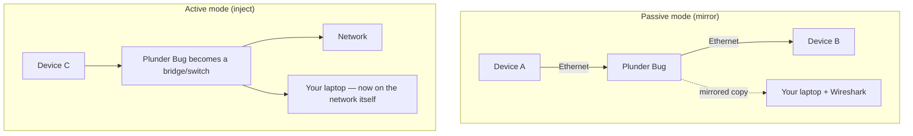

# Plunder Bug LAN Tap — 完整指南

> **一句話定位**：Plunder Bug 是一台口袋大小的「乙太網路竊聽器」——把兩條網路線穿過它，它把流量鏡像給你的電腦，你用 Wireshark 就能看穿這條線上的所有封包。USB-C 供電，Windows / Mac / Linux / Android 都能用。

Plunder Bug 是 Hak5 實體存取工具組的網路端：一個微型 LAN 竊聽器，坐在乙太網路連結上，把流量鏡像到你的分析電腦。它有**兩種模式**：

- **被動模式** — 靜默地把被竊聽連結上的流量鏡像到你的筆電。
- **主動模式** — 把你的分析裝置*注入*網路（它變成一個簡單的交換器/host）以進行主動掃描。

因為它由 USB-C 供電並使用 ASIX AX88772C 晶片組，它能透過微型跨平台腳本在各種平台上運作 — 甚至能用 Android root 應用程式在現場進行行動擷取。它與 **Wireshark** 搭配做分析是絕配。

> **⚠️ 僅限授權測試。** 竊聽你不擁有的網路連結是違法的。在你自己的實驗室網路上使用，或取得書面許可。

---

## 規格一覽

| 項目 | 規格 |
|---|---|
| 網路介面 | 2× 10/100BASE-T Fast Ethernet，自動協商（最高 100 Mbps） |
| USB 介面 | USB-C（竊聽 + 電源，5V，20–300 mA 耗電） |
| USB 乙太網路晶片組 | ASIX AX88772C |
| 模式 | 被動（鏡像流量）/ 主動（注入網路） |
| 分析軟體 | Wireshark 與其他開源分析器 |
| 行動支援 | Android root 應用程式用於現場 pcap 擷取 |
| 官方文件 | https://docs.hak5.org/plunder-bug |

## 構造

| 零件 | 用途 |
|---|---|
| 乙太網路埠 A | 被竊聽連結的一端 |
| 乙太網路埠 B | 被竊聽連結的另一端 |
| USB-C 埠 | 連到你的分析電腦（電源 + 資料） |

---

## 被動 vs 主動 — 兩種性格



| 模式 | 發生什麼 | 最適合 |
|---|---|---|
| **被動** | A↔B 的流量鏡像到你的筆電；連結持續運作 | 隱蔽的「這條線上到底有什麼？」嗅探 |
| **主動** | 你的筆電透過 Bug 加入網路 | 主動掃描、ARP 工作、服務探索 |

---

## 快速入門 — 用 Wireshark 嗅探

### 步驟 1 — 接線
1. 把一個乙太網路端連到一台裝置/交換器（實驗室網路！）。
2. 把另一個乙太網路端連到第二台裝置。
3. 把 **USB-C** 端插進你的筆電。

### 步驟 2 — 載入連線腳本
Hak5 附帶跨平台連線腳本。在 Linux 上：

```bash
# Run Hak5's provided setup script, or configure manually:
sudo ip link set dev usb0 up
sudo dhclient usb0            # get an IP for active mode
```

被動擷取時，介面會自動出現（例如 `usb0` / Windows 或 macOS 上的新乙太網路轉接器）。

### 步驟 3 — 在 Wireshark 中擷取
在新介面上啟動 Wireshark 並擷取：

```text
$ wireshark                      # or tcpdump -i usb0 -w capture.pcap
```

即時觀看被竊聽連結上的流量。

### 步驟 4 — 在模式之間切換
依你 OS 的模式切換說明切換被動/主動（裝置隨附 Windows / Mac / Linux 腳本）。

---

## 動手做：在你自己的實驗室看它運作

要證明被動擷取有效，產生一些流量：

```bash
# From a device on the tapped link, ping something
ping -c 3 8.8.8.8
```

在 Wireshark 中你應該看到 ICMP echo request/reply 穿越這條連結。這就是你的竊聽器在盡職。

---

## 進階

| 能力 | 怎麼做 |
|---|---|
| 被動鏡像 | 你的筆電不需要 IP — 只要嗅探鏡像的訊框 |
| 主動注入 | 把你的筆電帶上網路做主動偵察 |
| 行動 pcap | Android root 應用程式隨身擷取 `.pcap` |
| 協定分析 | 把擷取內容餵進 Wireshark / tcpdump |
| 簡單交換器用途 | 串接起來橋接一個網段，不需分析 |

---

## 疑難排解

| 症狀 | 原因 | 修正 |
|---|---|---|
| Wireshark 中沒有流量 | 介面錯誤 / 連結未啟動 | 確認新介面名稱（`ip link`）；確認乙太網路連結有亮燈 |
| 主動模式筆電拿不到 IP | DHCP 沒到達 | 設定與網段相符的手動 IP |
| Windows 驅動程式缺失 | ASIX 驅動程式未安裝 | 安裝 ASIX AX88772C 驅動程式，或使用隨附腳本 |
| Android 看不到它 | 應用程式需要 root + OTG | 使用 Android root 應用程式；啟用 USB OTG |
| 一端沒有連結 | 線材或連接埠故障 | 獨立交換/測試兩個乙太網路端 |

---

## 相關資源

- [Shark Jack](/hak5/products/shark-jack/) — 主動網路偵察，不需要竊聽器
- [Packet Squirrel Mark II](/hak5/products/packet-squirrel-mark-ii/) — 內嵌式操控 vs 被動鏡像
- [Screen Crab](/hak5/products/screen-crab/) — 把竊聽器翻轉到影像
- [ALFA Network](/alfa-network/) — 無線擷取的 Wi-Fi 轉接器
- [疑難排解索引](/hak5/troubleshooting-index/)
- [Hak5 總覽](/hak5/)