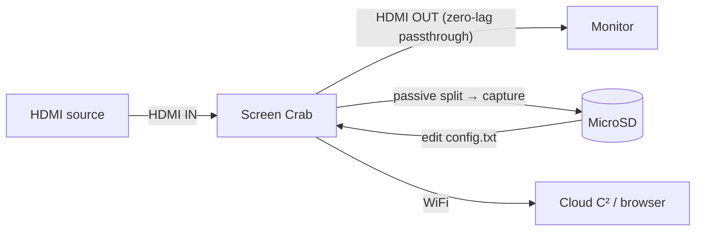

# Screen Crab — 完整指南

> **一句話定位**：Screen Crab 是一台「藏在 HDMI 線中間的隱形監視器」——把它夾在電腦與螢幕（或遊戲機與電視）之間，它零延遲地把畫面截圖或錄影存進 MicroSD，還能透過 Wi-Fi 串流到 Cloud C²。系統管理員、滲透測試與想「看到別人看到什麼」的人最愛它。

Screen Crab 是第一款為滲透測試者打造的 HDMI **中間人**裝置。它攔截的不是網路流量 — 它攔截的是*視訊訊號本身*。因為它被動地分流 HDMI 訊號（資料路徑上沒有重新編碼），輸出顯示器看到的是**零延遲、零中斷**，而 Crab 安靜地擷取第二份副本。

它簡單得令人卸下心防：內嵌插上、USB 供電，開箱就開始把截圖存到 MicroSD 卡。編輯 `config.txt` 檔案可以改變間隔、啟用錄影，或連上 Wi-Fi + [Cloud C²](/hak5/firmware-downloads/) 從瀏覽器即時觀看畫面。

> **⚠️ 僅限授權測試。** 未經同意擷取別人的螢幕是違法的（台灣：刑法第三一五條之一妨害秘密罪，以及其他）。只在你自己的機器/顯示器上使用，或取得明確授權。

---

## 規格一覽

| 項目 | 規格 |
|---|---|
| 介面 | 2× 全尺寸 HDMI（IN / OUT）+ USB-C（電源）+ MicroSD |
| 標準 | HDMI 1.4 / DVI 1.0；802.11 b/g/n（WiFi，2.4 GHz） |
| 解析度 | 最高 1920×1080（Full HD 1080p）的多數 16:9 格式，自動升/降頻 |
| 擷取模式 | 間隔截圖，或全動態錄影（MPEG-4，2 / 4 / 16 Mbps） |
| 儲存 | MicroSD（支援 SDXC）；循環錄影覆寫最舊檔案 |
| 延遲 | 零 — 被動訊號分流器，輸出無延遲 |
| WiFi | RP-SMA 偶極天線用於 Cloud C² 串流 |
| 電源 | USB 5V 1A（5 W） |
| 尺寸 | 105 × 51 × 21 mm |
| 官方文件 | https://docs.hak5.org/screen-crab |

## 構造

| 零件 | 用途 |
|---|---|
| HDMI **IN** | 來自來源（電腦 / 遊戲機） |
| HDMI **OUT** | 到螢幕 / 電視（穿透，零延遲） |
| USB-C | 電源 |
| MicroSD 插槽 | 截圖 / 錄影儲存 |
| WiFi 天線（RP-SMA） | Cloud C² 串流 |
| RGB LED + 按鈕 | 狀態（隱蔽操作可停用 LED） |

---

## 安裝與資料流



1. 把來源連到 Crab 的 **HDMI IN**。
2. 把你的螢幕連到 Crab 的 **HDMI OUT**（正常運作，無延遲）。
3. 用 USB-C 供電。截圖開始以預設間隔存到 MicroSD。

---

## 快速入門 — 2 分鐘內完成第一次擷取

### 步驟 1 — 插入 MicroSD 卡
任何 MicroSD 都行；SDXC 可提供數月的儲存空間。Crab 首次開機時會自動產生 `config.txt`。

### 步驟 2 — 內嵌接線
- **HDMI IN** ← 你的電腦。
- **HDMI OUT** → 你的螢幕。
- **USB-C** → 電源。

預期結果：螢幕運作與之前完全相同（無延遲），而 MicroSD 開始收集截圖。

### 步驟 3 — 讀取擷取內容
退出 MicroSD 並瀏覽：

```text
/root/
  loot/
    2026-08-21-1430/screenshot_001.jpg
    2026-08-21-1430/screenshot_002.jpg
    ...
  config.txt
```

### 步驟 4 — 啟用錄影
編輯 MicroSD 根目錄的 `config.txt`：

```text
# Capture mode: image or video
capture_mode = video
# MPEG4 quality: 2, 4, or 16 Mbps
bitrate = 4
# Seconds between captures
interval = 30
```

安全移除 MicroSD，重新插入，重新開機。Crab 現在會錄製 MPEG-4 影片。

---

## Cloud C² — 從任何地方觀看

要遠端串流畫面/影片：

1. 編輯 `config.txt` 並加入你的 Wi-Fi 網路：

```text
wifi_ssid = OfficeWiFi
wifi_pass = hunter2example
```

2. 把你的 [Cloud C²](/hak5/firmware-downloads/) 裝置檔加到 MicroSD。
3. 開機。Crab 連上 Wi-Fi 並向 C² 註冊 — 你現在可以從瀏覽器串流截圖並下載擷取內容。

> **你可能會問：** *「零延遲 — 怎麼做到的？」* Crab 在 HDMI 路徑上使用**被動視訊訊號分流器**。來源的訊號原封不動地鏡像到螢幕；一份副本餵給擷取硬體。原始路徑中沒有任何東西被重新編碼，所以沒有額外延遲。這也正是它如此隱形的原因。

---

## 進階

| 能力 | 怎麼做 |
|---|---|
| 循環錄影 | 連續擷取會刪除最舊檔案以騰出空間（永遠不會塞滿） |
| 間隔截圖 | 可設定的 `interval`（秒） |
| 多種位元率 | 2 / 4 / 16 Mbps MPEG-4 品質等級 |
| 隱蔽 LED | 停用 RGB LED 以進行隱蔽操作 |
| 解析度處理 | 從多數來源自動升/降頻到 1080p |
| 遠端管理 | Cloud C²：更改設定、下載擷取內容、即時檢視 |

---

## 疑難排解

| 症狀 | 原因 | 修正 |
|---|---|---|
| 沒有存到截圖 | MicroSD 沒插好 / 寫入保護 | 重新插好；檢查鎖定開關；用已知良好的卡測試 |
| 插入 Crab 時螢幕閃爍 | 電源 / HDMI 協商 | 確認 5V/1A USB 電源；重新插好 HDMI 連接 |
| 影片卡頓 | 對場景而言位元率太低 | 提高到 16 Mbps |
| Cloud C² 一直連不上 | Wi-Fi 憑證錯誤 / 沒有裝置檔 | 重新檢查 `config.txt`；把 C² 裝置檔複製到卡上 |
| 找不到 config.txt | 卡還沒開機過一次 | 插入卡，開機一次，它會自動產生設定 |

---

## 相關資源

- [韌體與下載](/hak5/firmware-downloads/) — Cloud C² 伺服器設定
- [Key Croc](/hak5/products/key-croc/) — 按鍵層級的攔截（互補：按鍵*和*螢幕）
- [Packet Squirrel Mark II](/hak5/products/packet-squirrel-mark-ii/) — 網路端攔截
- [疑難排解索引](/hak5/troubleshooting-index/)
- [Hak5 總覽](/hak5/)