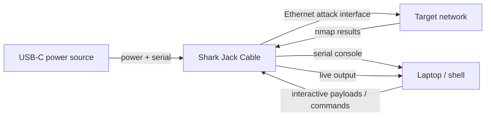

# Shark Jack Cable — 完整指南

> **一句話定位**：Shark Jack Cable 是 Shark Jack 的「長時間供電版」——改用 USB-C 供電，還多了一條專屬序列埠，偵察能跑好幾小時，而且不必抽卡就能直接開一個 live shell 看結果。

經典 [Shark Jack](/hak5/products/shark-jack/) 受限於它 10–15 分鐘的電池。**Cable 版**修正了限制前一代的那一件事：電源。用任何 USB-C 電源（筆電、行動電源、充電器）供電，它就能在你需要的時間內持續進行網路偵察。

額外的收穫是**專屬 USB-C 序列主控台**。在經典 Shark Jack 上，你要撥到 arming 模式、把線移到筆電、然後 SSH 進入。Cable 版給你一個*透過序列*的即時 shell — 你可以即時觀看掃描進度、與 payload 互動，而且永遠不用把裝置從網路上拿下來。

> **⚠️ 僅限授權測試。** 對你不擁有的網路進行長時間偵察是違法的。在自己的實驗室使用。

---

## 規格一覽

| 項目 | 規格 |
|---|---|
| 攻擊介面 | Fast Ethernet（RJ45） |
| 電源 | USB-C（只要有供電就能一直跑） |
| 相較經典版新增 | 專屬 USB-C 序列主控台（即時 shell） |
| OS | Linux，root shell，DuckyScript/Bash payload |
| 預設 payload | nmap 掃描 → `/root/loot/` |
| Arming 位址 | `172.16.24.1`（透過 SSH） |
| 預設憑證 | `root` / `hak5shark` |
| 官方文件 | https://docs.hak5.org/shark-jack |

## 經典版 vs Cable 版 — 改變了什麼

| | Shark Jack | Shark Jack Cable |
|---|---|---|
| 電源 | 內建電池（約 10–15 分鐘） | USB-C（供電期間無限） |
| 序列主控台 | 無 | **有 — 透過 USB-C 的即時 shell** |
| 續航 | 短，掛在鑰匙圈上 | 長，持續性任務 |
| 最適合 | 快速、可攜的偵察 | 長時間監控 + 互動式工作 |



---

## 快速入門

### 步驟 1 — 連接它
1. 把 **USB-C** 端插進電源 / 你的筆電 — 這同時供電並給你序列主控台。
2. 把 **Ethernet** 端插進目標網路（你的實驗室）。

### 步驟 2 — 選擇模式
- **攻擊模式：** 撥開關；預設 nmap payload 執行並記錄到 `/root/loot/`。
- **Arming 模式：** 撥到另一個位置；透過序列連接，你立刻得到一個 root shell。

### 步驟 3 — 透過序列的即時 shell
不像經典版，你不需要額外的 SSH 跳板就能看到結果。連接 USB-C 序列主控台並即時互動：

```bash
# Typical: open the serial console (exact device depends on your OS)
screen /dev/ttyACM0 115200
```

預期輸出 — 裝置 shell：

```text
Welcome to Shark Jack (kernel 4.x.y)
# 
```

### 步驟 4 — 載入 payload 與取回 loot
從 shell：

```bash
cat /root/loot/scan/*.txt      # read scan results
UPDATE_PAYLOADS                 # sync community payload library
```

預期輸出：

```text
Nmap scan report for 192.168.1.20
PORT     STATE SERVICE
22/tcp   open  ssh
445/tcp  open  microsoft-ds
```

---

## 序列主控台的指令

Cable 版附帶實用的 shell 指令（韌體 1.2.0+）：

| 指令 | 作用 |
|---|---|
| `HELP` | 列出所有 Shark Jack 輔助指令與指令 |
| `ACTIVATE` / `ACTIVATE_PAYLOAD` | 執行選定的 payload |
| `LIST` / `LIST_PAYLOADS` | 列出本機 payload 函式庫 |
| `UPDATE_PAYLOADS` | 與遠端倉庫同步函式庫 |
| `UPDATE_FIRMWARE` | 檢查並安裝韌體更新 |
| `SERIAL_WRITE` | 直接寫入序列主控台 |
| `LED` | 設定 LED |

---

## 進階

| 能力 | 怎麼做 |
|---|---|
| 長時間被動偵察 | 用行動電源供電，整天監控一個網路 |
| 即時 payload 開發 | 序列 shell → 編輯 payload → `ACTIVATE`，不用重新接線 |
| 互動式 nmap | 即時觀看掃描串流到序列主控台 |
| 透過網路外洩 | Payload 透過乙太網路連結把 loot 推出去 |
| `NETMODE` 控制 | 每個 payload 可設 DHCP client/server/bridge |

---

## 疑難排解

| 症狀 | 原因 | 修正 |
|---|---|---|
| 序列主控台沒顯示 | 序列速度錯誤 / 裝置節點錯誤 | 使用文件記載的鮑率（115200）與正確的 `/dev/tty*` |
| 沒電 / 沒序列 | USB-C 沒接好 | 確認 USB-C 同時傳輸電源與資料 |
| 有乙太網路連結但沒掃描 | Payload 缺失 | 重新 arm 並 `UPDATE_PAYLOADS` / 放置 `payload.sh` |
| 讀不到 loot | 路徑錯誤 | Loot 依 payload 存放在 `/root/loot/` |

---

## 相關資源

- [Shark Jack](/hak5/products/shark-jack/) — 電池供電的原版
- [Packet Squirrel Mark II](/hak5/products/packet-squirrel-mark-ii/) — 內嵌式乙太網路 MITM
- [Plunder Bug LAN Tap](/hak5/products/plunder-bug-lan-tap/) — 被動嗅探
- [韌體與下載](/hak5/firmware-downloads/) — payload 倉庫與韌體
- [疑難排解索引](/hak5/troubleshooting-index/)
- [Hak5 總覽](/hak5/)