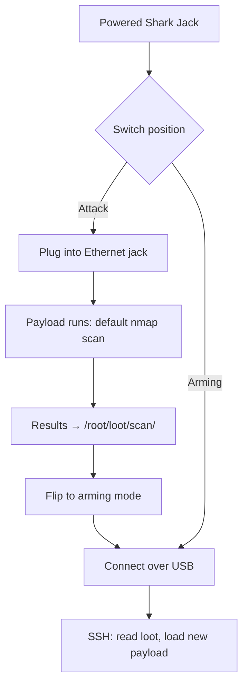

# Shark Jack — 完整指南

> **一句話定位**：Shark Jack 是一臺口袋大小的網路偵察機——往人家的乙太網路孔一插，60 秒內告訴你這個網段有誰、開了些什麼服務。充一次電能跑 10–15 分鐘，最適合掛在鑰匙圈上的臨時稽核。

Shark Jack 把一臺完整的 Linux 電腦和一個 nmap 掃描器塞進一個能掛在鑰匙圈上的東西。它體現了 Hak5 的「熱插拔攻擊，遇見 LAN」哲學：只要對一個運作中的乙太網路埠有實體存取，就足以取得情報立足點。

開箱它就很危險 — 把開關撥到**攻擊模式**，它會執行預先安裝的 nmap 掃描，把結果存進 loot。撥回**arming 模式**，你就能 SSH 進去取回發現或載入自訂 payload。

> **⚠️ 僅限授權測試。** 侵入你不擁有的網路是違法的。在你自己的交換器/實驗室網路上練習。

---

## 規格一覽

| 專案 | 規格 |
|---|---|
| 攻擊介面 | Fast Ethernet（RJ45）— 直接插進網路 |
| 電源 | 內建電池（每次充電可跑 10–15 分鐘），透過 USB |
| OS | Linux 附 root shell；執行由 Bash 驅動的 DuckyScript payload |
| 預設 payload | nmap 掃描 → 結果存到 `/root/loot/` |
| Arming 存取 | SSH 於 `172.16.24.1`（arming 模式下的靜態 IP） |
| 預設憑證 | `root` / `hak5shark` |
| 回饋 | 多色 RGB LED |
| 開關 | 撥動開關：攻擊模式 vs arming 模式 |
| 官方檔案 | https://docs.hak5.org/shark-jack |

## 構造

| 零件 | 用途 |
|---|---|
| RJ45 乙太網路孔 | 攻擊介面 — 進入目標網路 |
| USB 埠 | 電源/充電 + 連線 |
| 撥動開關 | 攻擊模式（執行 payload）↔ Arming 模式（SSH/設定） |
| RGB LED | 開機 / 充電 / 模式 / 錯誤狀態 |
| 鑰匙圈環 | 隨身攜帶 |

---

## 操作模式

| 模式 | 發生什麼 | 怎麼進入 |
|---|---|---|
| **攻擊模式** | 執行選定的 payload（預設：nmap 掃描） | 撥開關，插進乙太網路 |
| **Arming 模式** | SSH 伺服器於 `172.16.24.1`；載入 payload、讀取 loot | 撥開關，透過 USB 連線 |



---

## 快速入門 — 60 秒內完成第一次偵察

### 步驟 1 — 攻擊
1. 把 Shark Jack 充飽電。
2. 把開關撥到**攻擊模式**。
3. 插進**你的實驗室**裡任何運作中的乙太網路孔。
4. 等約 60 秒。LED 會告訴你正在發生什麼（見[疑難排解](/hak5/troubleshooting-index/)）。

### 步驟 2 — Arming 與 loot 取回
1. 把開關撥到**arming 模式**，從網路拔掉，用 USB 連到你的電腦。
2. 你電腦的乙太網路必須在 Shark 的子網路上：

```bash
ip addr add 172.16.24.2/24 dev eth0     # your NIC joins 172.16.24.0/24
ssh root@172.16.24.1                     # password: hak5shark
```

預期輸出：

```text
root@172.16.24.1's password:
Welcome to Shark Jack
# ls /root/loot/
scan
# ls /root/loot/scan/
2026-08-21-1430-network-scan.txt
# cat /root/loot/scan/2026-08-21-1430-network-scan.txt
Nmap scan report for 192.168.1.10
Host is up (0.0034s latency).
PORT     STATE    SERVICE
22/tcp   open     ssh
80/tcp   open     http
443/tcp  open     https
```

這就是你的第一次偵察：主機、開放連線埠、服務 — 足以規劃後續行動（或回報給你的藍隊）。

---

## 自訂 payload

預設掃描只是一個範本。用你自己的 Bash payload 取代它：

1. 如上 SSH 進入（arming 模式）。
2. 編輯 `/root/payload/payload.sh`（這就是攻擊模式執行時跑的）。

```bash
#!/bin/bash
# Arming-mode file: /root/payload/payload.sh
NETMODE DHCP_CLIENT
LED R
sleep 5
nmap -sV -p- --open ${SUBNET}.0/24 -oN /root/loot/full-scan.txt
LED G
```

> `${SUBNET}` 佔位符與 `NETMODE` 輔助指令來自 Hak5 的 payload 框架 — 你的 payload 決定 Shark 是 DHCP client、server 等。完整參考在 payload 檔案中。

3. 或從社群倉庫拉現成的 payload（`UPDATE_PAYLOADS`，見[韌體與下載](/hak5/firmware-downloads/)）。

---

## LED 參考

| LED | 意義 |
|---|---|
| 綠（閃爍） | 開機中 |
| 藍（閃爍） | 充電中 |
| 藍（恆亮） | 已充飽 |
| 黃（閃爍） | Arming 模式 — SSH 伺服器執行中 |
| 紅（閃爍） | 錯誤 — 找不到 payload |
| （payload 定義） | payload 執行期間你自己的 `LED` 顏色 |

---

## 進階

| 能力 | 怎麼做 |
|---|---|
| `NETMODE` 選項 | `DHCP_CLIENT`（取得 IP）、`DHCP_SERVER`（發放 IP）、`BRIDGE`、`OFF` — 視任務而定 |
| SMB/HTTP 外洩 | Payload 可以透過網路把 loot 推出裝置 |
| 自動化掃描 | 排程掃描；loot 會跨部署累積 |
| 遠端 payload 函式庫 | `UPDATE_PAYLOADS` 從社群倉庫同步 |
| Root Linux 工具 | `nmap`、`tcpdump`、`curl`、指令碼 — 完整 Bash |

---

## 疑難排解

| 症狀 | 原因 | 修正 |
|---|---|---|
| 紅色閃爍 LED | 找不到 payload | 重新 arm；把 `payload.sh` 放在 `/root/payload/` |
| 無法 SSH | 你的 NIC 不在 `172.16.24.0/24` | `ip addr add 172.16.24.2/24 dev eth0`（或等效指令） |
| 掃描中途電池沒電 | 10–15 分鐘續航 | 先充飽；長時間執行用 Cable 版 |
| 掃描太慢 / 輸出太大 | `-p-` 全連線埠 | 用有針對性的連線埠清單加快偵察 |
| DHCP 模式失敗 | 沒有上游 DHCP 伺服器 | 在有伺服器時用 `NETMODE DHCP_CLIENT`，或使用靜態 |

---

## 相關資源

- [Shark Jack Cable](/hak5/products/shark-jack-cable/) — 同一臺盒子，USB-C 供電 + 序列主控臺，跑更久
- [Packet Squirrel Mark II](/hak5/products/packet-squirrel-mark-ii/) — 內嵌式乙太網路操控
- [Plunder Bug LAN Tap](/hak5/products/plunder-bug-lan-tap/) — 被動/主動嗅探
- [韌體與下載](/hak5/firmware-downloads/) — shark payload 倉庫與韌體
- [疑難排解索引](/hak5/troubleshooting-index/)
- [Hak5 總覽](/hak5/)