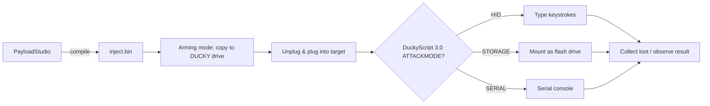

# USB Rubber Ducky — 完整指南

> **一句話定位**：USB Rubber Ducky 是一支「會自己打鍵盤」的隨身碟 — 插入 USB 孔後，它以每秒數百次的速度把預錄好的按鍵輸進電腦，10 秒內做完一個人工要花五分鐘的動作。這是所有 Hak5 裝置裡最適合初學者入門的機器。

當你插上任何 USB 鍵盤時，電腦會立刻信任它 — 沒有密碼、沒有「你確定嗎？」的提示。USB Rubber Ducky 利用的正是這種信任。它對 OS 呈現為一般鍵盤（一個 **HID 裝置**，Human Interface Device，人機介面裝置），然後以人類永遠追不上的速度重播一串按鍵腳本。

Ducky 只做**一件事，而且做得極好**：按鍵注入。它不需要漏洞利用程式碼或弱點 — 它就只是*打字*。這使它成為學習 HID 攻擊的完美教學工具，也是其他所有 Hak5 payload 裝置的基礎。

> **⚠️ 僅限授權測試。** 只在你的電腦、你實驗室裡的機器上使用 Ducky，或取得明確許可。把按鍵注入別人的電腦是違法的（台灣：刑法第 358–363 條）。

---

## 規格一覽

| 項目 | 規格 |
|---|---|
| 用途 | 按鍵注入（HID 攻擊） |
| 語言 | DuckyScript 1.0（經典）與 3.0（完整語言） |
| 腳本儲存 | MicroSD 卡（隨附；保留小卡以獲得最快開機速度） |
| 輸出 | 編譯過的 `inject.bin`，放在 `DUCKY` 磁碟上 |
| 注入模式 | HID、Storage、Serial、Ethernet（各種攻擊模式） |
| 介面 | USB-A（插進任何 USB host） |
| 回饋 | 單一按鈕（預設：退出到 arming/storage 模式） |
| 編碼器 | PayloadStudio（官方、瀏覽器為基礎）— 唯一支援的編譯器 |
| 官方文件 | https://docs.hak5.org/hak5-usb-rubber-ducky |

## 構造

| 零件 | 用途 |
|---|---|
| USB-A 插頭 | 「鍵盤」那一端 — 插進目標 |
| MicroSD 插槽 | 存放 `inject.bin` 與 payload 腳本 |
| 按鈕 | 在 payload 執行期間/之後，預設回到儲存（arming）模式 |
| 可翻轉 USB-A 頭 | 兩種方向（標準與反向連接器） |

---

## DuckyScript — 這個語言

DuckyScript 簡單得令人意外。經典腳本就只是 `STRING`（打這個）+ `DELAY`（等待）。3.0 版加入了真正的程式能力：`if`/`else`、`while` 迴圈、函式，以及 `ATTACKMODE` 控制。

### 「Hello, World!」payload

```text
REM This is a comment — type into whatever application is focused
DELAY 1000
STRING Hello from my USB Rubber Ducky!
ENTER
```

發生什麼事：Ducky 等 1 秒，然後在任何作用中的視窗裡打出 `Hello from my USB Rubber Ducky!` 並按下 Enter。

### 控制流程範例（DuckyScript 3.0）

```text
ATTACKMODE HID
DELAY 1000
GUI r
DELAY 500
STRING notepad
ENTER
DELAY 800
REM Only type if the window title changed (keystroke reflection)
VAR $os = GET_SYSTEM_ID
IF ($os == "WINDOWS") THEN
    STRING Running on Windows!
    ENTER
ELSE
    STRING Running on something else.
    ENTER
END_IF
```

> **你可能會問：** *「『打進任何有焦點的視窗』不是很脆弱嗎？」* 是的 — 所以真正的 payload 會*先開啟一個應用程式*（這裡是 `GUI r` → `notepad`），然後再打字。注入前永遠先控制你自己的焦點。

---

## 快速入門 — 你的第一個 payload，5 分鐘

### 步驟 1 — 在 PayloadStudio 寫 payload
1. 開啟 https://payloadstudio.hak5.org（Community 版免費）。
2. 貼上上面的 Hello World 腳本。
3. 選擇你的**目標鍵盤配置**（預設 US）。**這很重要** — 用錯誤的配置注入，按鍵會變成亂碼。
4. 點 **Generate Payload**。PayloadStudio 會把它編譯成 `inject.bin`。

### 步驟 2 — Arm 你的 Ducky
把 Ducky 插進你的電腦。它會掛載成一個叫 **`DUCKY`** 的隨身碟 — 這就是 arming 模式。

### 步驟 3 — 複製 payload
把 `inject.bin` 複製到 `DUCKY` 磁碟的**根目錄**，取代現有檔案。安全退出，拔掉。

### 步驟 4 — 部署
1. 在目標機器（你自己的筆電，在你的實驗室裡）開啟**記事本**。
2. 插上 Ducky。
3. 看 — 它打出 `Hello from my USB Rubber Ducky!` 並按下 Enter。

```bash
# On Linux, verify the Ducky enumerates as a keyboard when armed:
lsusb | grep -i ducky
# Expected: Bus 001 Device 00X: ID .... Hak5 LLC USB Rubber Ducky
```

---

## 攻擊模式（ATTACKMODE）

Ducky 可以呈現為不只是鍵盤。`ATTACKMODE` 選擇裝置的角色：

| ATTACKMODE | Ducky 假裝成 | 用途 |
|---|---|---|
| `HID` | 鍵盤 | 按鍵注入（未指定時的預設） |
| `HID STORAGE` | 鍵盤 + 隨身碟 | 注入*並*保持可作為儲存裝置存取 |
| `STORAGE` | 隨身碟 | 僅 arming / 檔案傳輸 |
| `SERIAL` | 序列裝置 | 與序列主控台通訊 |
| `HID SERIAL` | 鍵盤 + 序列 | 注入到序列連線的機器 |

一個常見模式 — 注入，然後切到 storage 以便取回 loot：

```text
ATTACKMODE HID STORAGE
DELAY 2000
...payload keystrokes...
ATTACKMODE STORAGE
```



---

## 鍵盤配置 — 經典陷阱

Ducky 不是打出「字母 A」— 它按下 US 鍵盤上 A 的*實體按鍵*，然後重現那次按壓。用 US 配置的 payload 在德文或法文鍵盤上打字，你會得到完全不同的字元。

**規則：** 用*目標機器*的鍵盤配置編譯，而不是你自己的。在 PayloadStudio 中於產生前設定。

| 症狀 | 原因 |
|---|---|
| `@` 變成 `"` | Payload 用 US 編譯，目標是 UK/德文 |
| 數字變成符號 | 移位列上的配置不符 |
| 完全沒打字 | 缺少 `DELAY`（OS HID 堆疊未就緒）或攻擊模式錯誤 |

---

## 進階

| 技巧 | 怎麼做 |
|---|---|
| 按鍵反射 | 讀取目標狀態/視窗標題並分支（`IF` 搭配系統查詢） |
| 滑鼠注入 | 移動游標 / 點擊 — 對僅 GUI 的目標很有用 |
| 抖動與隨機化 | 加入擬人化延遲以躲避按鍵時序偵測 |
| Payload 函式庫 | 從社群倉庫放入腳本（見[韌體與下載](/hak5/firmware-downloads/)） |
| 結合 HID+Ethernet | 在相容韌體上，同時扮演鍵盤 + 攻擊者自己的網路介面 |
| 復原 | 從失控的 payload 中長按按鈕重新進入儲存模式 |

> **實驗室專業提示：** 永遠先針對你自己的可拋棄 VM 測試新 payload。真實世界 payload 的一個錯字，就會把亂碼打進真實機器 — 而在不支援的 host 上一個失控的 `ATTACKMODE ETHERNET` 可能搞掛整個 session。在沙盒裡練習。

---

## 疑難排解

| 症狀 | 原因 | 修正 |
|---|---|---|
| 螢幕上什麼都沒出現 | 開頭沒有 `DELAY`；OS USB 堆疊未就緒 | 第一行加上 `DELAY 1000` |
| 打出錯誤字元 | 鍵盤配置不符 | 在 PayloadStudio 用目標的配置重新編譯 |
| Payload 只跑過一次就不再跑 | 舊的 `inject.bin` 覆蓋了你的 | 把你的 `.bin` 再複製到磁碟根目錄 |
| 回不去 arming 模式 | Payload 覆寫了按鈕預設行為 | 按按鈕；如果沒有 `BUTTON_DEF`，預設行為會讓你回到儲存模式。見文件 |
| 按鈕做出意料之外的事 | Payload 使用 `BUTTON_DEF` | 檢查你的 payload；範例腳本可能重新對應了按鈕 |
| 韌體刷寫警告 | 第三方韌體 | **絕對不要刷** — Ducky 的架構設計就是不需要刷；刷寫會使保固失效並可能搞掛裝置 |

> **重大警告：** 不要刷 USB Rubber Ducky。它出廠設計就是圍繞 PayloadStudio，所以你永遠不需要刷。舊版/第三方韌體可能讓它永久無法復原。永遠只使用官方更新 — 見[韌體與下載](/hak5/firmware-downloads/)。

---

## 相關資源

- [Bash Bunny Mark II](/hak5/products/bash-bunny-mark-ii/) — 多向量兄弟（鍵盤 + 乙太網路 + 更多）
- [Key Croc](/hak5/products/key-croc/) — 直譯形式的 DuckyScript 2.0，外加鍵盤側錄
- [WiFi Pineapple Pager](/hak5/products/wifi-pineapple-pager/) — 無線手持裝置上的 DuckyScript 3.0
- [O.MG Cable](/hak5/products/omg-cable/) — 從一條線材透過 Wi-Fi 執行 DuckyScript
- [韌體與下載](/hak5/firmware-downloads/) — PayloadStudio 與 payload 倉庫
- [疑難排解索引](/hak5/troubleshooting-index/)
- [Hak5 總覽](/hak5/)