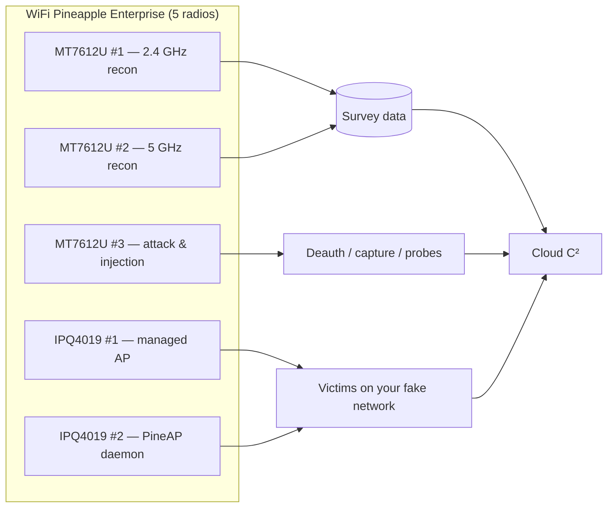
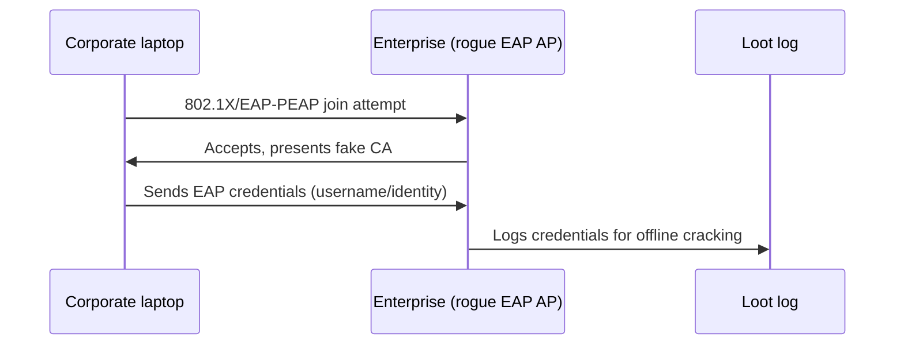

# WiFi Pineapple Enterprise — 完整指南

> **一句話定位**：WiFi Pineapple Enterprise 是 Pineapple 家族的重型砲台 — 一台 1U 機架式主機、五組雙頻無線電、雙 Gigabit 網路埠，專門做長時間、大範圍的企業無線稽核。給進階研究生、實驗室、紅隊與需要 24/7 部署的人。

Mark VII 教你 rogue-AP 的基礎。**Enterprise** 是當「每個工作一組無線電」不夠用時你會得到的東西：五組雙頻無線電（2.4 + 5 GHz）讓你能*同時*執行攻擊、監聽與服務角色，不用在介面之間切來切去。它是給嚴肅實驗室、校園資安課程，或需要一次稽核整個空域的紅隊行動用的 Pineapple。

如果你是學生：你*不需要*一台來學習 — 一台 [Mark VII](/hak5/products/wifi-pineapple-mark-vii/) 就能教你同樣的 PineAP 概念。但如果你的實驗室需要模擬企業部署 — 包括 **WPA2-Enterprise** rogue AP — 就是這台。

> **⚠️ 僅限授權測試。** 一台 5 無線電 rogue AP 是極其強大的工具。只在你擁有、或已取得明確書面授權測試的網路上使用。

---

## 規格一覽

| 項目 | 規格 |
|---|---|
| SoC | 四核 ARM Cortex-A7 @ 717 MHz |
| 無線電 | 5× 雙頻：2× Qualcomm IPQ4019（2.4/5 GHz）+ 3× MediaTek MT7612U（2.4/5 GHz） |
| 標準 | 802.11ac Wave 2（a/b/g/n/ac/p）、MU-MIMO、TxBF |
| 峰值無線電速度 | IPQ4019：1.733 Gbps ・ MT7612U：866 Mbps |
| 記憶體 / 儲存 | 1 GB DDR3L RAM / 4 GB eMMC |
| 乙太網路 | 2× Gigabit RJ45（802.3ab）+ USB-C 3.0（ASIX 乙太網路） |
| 天線 | 8× 高增益 RP-SMA（4× 2:2 MIMO 對） |
| 電源 | AC 100–240 V（牆壁電源，無電池） |
| 外型 | 160 × 244 × 41 mm（1U 機架式） |
| 工作溫度 | −25 °C 至 +50 °C |
| 官方文件 | https://docs.hak5.org/wifi-pineapple-enterprise |

## 構造

| 零件 | 用途 |
|---|---|
| 8× RP-SMA 天線埠 | 四組 2:2 MIMO 無線電對 |
| 2× Gigabit RJ45 | WAN/uplink + 管理或額外 LAN 網段 |
| USB-C 3.0 埠 | 乙太網路主控台/管理介面（ASIX 晶片組） |
| 4× RGB LED | 每組無線電與狀態回饋 |
| AC 輸入 | 100–240 V 電源 |

---

## 為什麼要五組無線電？角色表

| 無線電 | 任務中的典型角色 |
|---|---|
| IPQ4019 Radio 0 | 服務*你自己的*受管理 AP（看起來合法） |
| IPQ4019 Radio 1 | PineAP daemon — 引誘與管理受害者 |
| MT7612U #1 | 持續 Recon（2.4 GHz 掃描） |
| MT7612U #2 | 持續 Recon（5 GHz 掃描） |
| MT7612U #3 | 攻擊介面 — deauth、注入、隨需掃描 |

用 Mark VII 你必須在一組無線電之間分時共享；Enterprise 為每個工作指派一組無線電，所以沒有任何東西會互相干擾。



---

## 快速入門 — 首次部署

### 步驟 1 — 上架、裝天線、供電
裝進 1U 槽位（或放在架子上），鎖上 8 支天線，接上 AC 電源。開機期間 LED 會循環。

### 步驟 2 — 管理存取
兩個選項：
- **Wi-Fi：** 連上 Pineapple 的預設 AP（SSID `PineAP`，密碼 `pineapplesareyummy`）。
- **有線：** 把筆電插進 Gigabit 埠；DHCP 給你一個位址；瀏覽到 `http://172.16.42.1:1471`。

立刻設定你的 admin 密碼（Settings → Password）。

### 步驟 3 — Uplink
把 Gigabit 埠 1 連到你實驗室的交換器/路由器以取得網際網路。在儀表板確認 uplink（Settings → Network）。

### 步驟 4 — 驗證所有無線電
在 **Settings** 中，確認全部 5 組無線電都出現且可指派角色。預期：無線電介面 `wlan0`–`wlan4` 都存在，每組都能進入監聽模式。

```text
$ ssh root@172.16.42.1
# iw dev | grep Interface
Interface wlan0 (managed)
Interface wlan1 (managed)
Interface wlan2 (managed)
Interface wlan3 (managed)
Interface wlan4 (managed)
```

---

## 招牌功能：WPA2-Enterprise rogue AP

Enterprise 內建一個 **Enterprise（WPA-EAP）rogue AP** 分頁 — 模擬企業 802.1X 網路的攻擊：

1. 開啟 **Settings → Enterprise**。
2. 填入 RADIUS/EAP 設定；UI 會**為你產生憑證**。
3. 把 SSID 設為看起來像企業的名稱（僅限測試實驗室！）。
4. 廣播。連上的用戶端會把憑證交給*你的* RADIUS 伺服器 — 在 loot 中收割，供離線分析。



> **倫理現實檢查：** 這是*實驗室*技能。用你自己的測試網域憑證練習。對真實組織收割憑證在任何司法管轄區都是嚴重犯罪。

---

## 進階

| 能力 | 備註 |
|---|---|
| 多目標任務 | 把 MT7612U 無線電指派到不同頻道組；同時攻擊 2.4 + 5 GHz 受害者 |
| 長期部署 | AC 電源 + 4 GB eMMC + Gigabit uplink = 數天的擷取 |
| Cloud C² 管理 | 遠端管理、loot 卸載與排程 payload（https://cloudc2.io） |
| 大規模封包擷取 | 擷取到 eMMC/USB；卸載 `.pcap` 檔案供 Wireshark 分析 |
| 802.11p（車載） | 標準清單包含 `p` — 研究功能，不是主要使用情境 |
| 透過 USB 加更多無線電 | 額外 MT7612U 轉接器插進 USB 3.0 host，獲得更多涵蓋 |

---

## 相容性注意事項 — 轉接器

Enterprise 的 3 組 MT7612U 無線電是內建的，所以做 5 GHz 工作不需要外接轉接器（不像 Mark VII）。如果你用 USB 無線電擴充，堅持用基於 MT7612U 的型號 — ALFA 等效型號（如 AWUS036ACM）見[相容轉接器指南](/alfa-network/)。

---

## 疑難排解

| 症狀 | 原因 | 修正 |
|---|---|---|
| 只看到 3 組無線電 | 天線鬆脫或無線電在設定中被停用 | 重新插好全部 8 支天線；檢查 Settings → Network 的無線電啟用狀態 |
| 透過乙太網路 UI 連不上 | 筆電拿到 APIPA 位址 | 先用 Wi-Fi 管理 AP；然後修好 DHCP |
| Enterprise 分頁缺失 | 韌體低於 Enterprise 發行版本 | 從 Web UI 更新韌體 |
| 用戶端連上但 loot 中沒有憑證 | EAP 設定 / 憑證步驟被跳過 | 重新執行 Enterprise 分頁精靈；確認憑證已產生 |
| 高溫警告 | 機架通風 | Enterprise 額定 −25 至 +50 °C，但在機架中需要氣流 |

---

## 相關資源

- [WiFi Pineapple Mark VII](/hak5/products/wifi-pineapple-mark-vii/) — 可攜式 Pineapple，同樣的 PineAP 引擎
- [WiFi Pineapple Pager](/hak5/products/wifi-pineapple-pager/) — 三頻手持裝置
- [ALFA Network](/alfa-network/) — MT7612U 轉接器與 Kali 驅動程式指南
- [韌體與下載](/hak5/firmware-downloads/) — 更新路徑
- [疑難排解索引](/hak5/troubleshooting-index/)
- [Hak5 總覽](/hak5/)