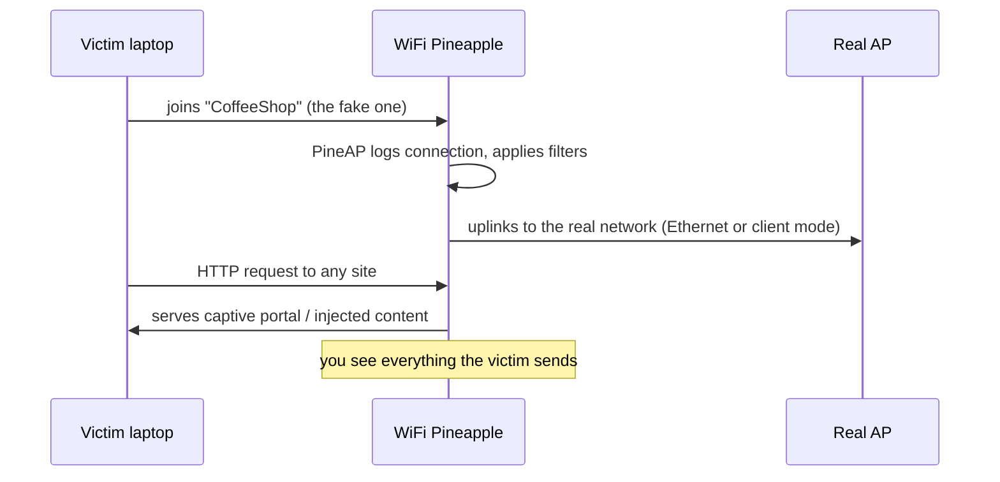

# WiFi Pineapple Mark VII — 完整指南

> **一句話定位**：WiFi Pineapple Mark VII 是一台「會自己開 Wi-Fi 來釣魚」的無線攻擊平台 — 它假裝成你信任的無線網路，再用 PineAP 引擎接管受害者的連線。給想學 Wi-Fi 滲透測試、evil twin 攻擊的大學生與 CTF 玩家。

如果 Wi-Fi 滲透測試有吉祥物，那就是 WiFi Pineapple。Mark VII 是讓 **rogue 存取點（evil twin）** 攻擊聲名大噪的裝置的現役世代：它廣播自己的網路，*看起來*像一個合法網路，引誘受害者上鉤，然後給你對他們流量的完整可視性與控制 — 全部從瀏覽器介面操作。

如果你正在學習無線安全，Mark VII 就是該買的裝置：它可攜（USB-C 供電）、價格親民，而且 PineAP 套件是學習 Wi-Fi 攻擊概念的業界標準方式，這些概念適用於任何現代 rogue-AP 工具。

> **⚠️ 僅限授權測試。** 只對*你自己的*網路、你自己的裝置，或取得書面許可後執行 Pineapple。在別人的網路上廣播假「免費 Wi-Fi」是違法的（台灣：刑法第 358–363 條；另見電信法）。

---

## 規格一覽

| 項目 | 規格 |
|---|---|
| 無線 | 2.4 GHz 802.11 b/g/n，3 組專用角色無線電（MediaTek MT7601U + MT7610U）；透過選配 MK7AC 轉接器（MT7612U）支援 5 GHz 802.11ac |
| SoC / RAM / 儲存 | 單核 MIPS 網路 SoC / 256 MB RAM / 2 GB eMMC |
| 天線 | 3× 高增益 RP-SMA（外接、可更換） |
| 連接埠 | USB-C（電源 + 乙太網路）、USB 2.0 host |
| 電源 | USB-C 5V 2A（10 W） |
| 指示燈 | 單顆 RGB LED |
| 尺寸 | 107 × 93 × 21 mm |
| OS / UI | 基於 OpenWrt 的韌體，瀏覽器管理介面於連接埠 1471 |
| 官方文件 | https://docs.hak5.org/wifi-pineapple |

## 構造

| 零件 | 用途 |
|---|---|
| 3× RP-SMA 天線埠 | AP / client / monitor 角色的無線電 |
| USB-C 埠 | 電源 AND 乙太網路 uplink（一條線，兩份工作） |
| USB 2.0 host 埠 | 插入 MK7AC 5 GHz 轉接器或 USB 隨身碟 |
| RGB LED | 開機、更新與狀態回饋 |
| 重置針孔 | 原廠重置 / 復原 |

---

## 你能用它做什麼

| 使用情境 | 怎麼做 |
|---|---|
| Evil twin / rogue AP | 廣播一個複製的 SSID；受害者連到你而不是真正的 AP |
| 中間人 | PineAP 從真正的 AP 搶走用戶端；他們的流量經過你 |
| 偵察 | 被動調查附近的 AP 與用戶端（原生 2.4 GHz；搭配 MK7AC 支援 5 GHz） |
| 強制入口網站 | 託管一個假登入頁面模組並收割憑證 |
| WPA/WPA2 enterprise 測試 | Rogue RADIUS 風格 enterprise AP（自韌體 1.1.0 起支援） |
| 自動化任務 | PineAP Marketplace 的模組（pmkid 攻擊、握手擷取等） |



---

## 快速入門 — 10 分鐘內首次開機

### 步驟 1 — 開機
把 USB-C 線插進 5V/2A 充電器（或你的電腦）。等 LED 穩定。

### 步驟 2 — 連上它的網路
在你的筆電上，尋找 Pineapple 的預設 Wi-Fi：SSID `PineAP`，密碼 `pineapplesareyummy`。

### 步驟 3 — 開啟管理介面
瀏覽到：

```
http://172.16.42.1:1471
```

預期結果 — WiFi Pineapple 儀表板。**第一件事：** 在 **Settings → Password** 設定你的 admin 密碼。

### 步驟 4 — 更新韌體並連接 uplink
1. 在 **Settings → Software Update**，點 **Check for updates**，然後 **Update**。
2. 網際網路：把乙太網路線插進 USB-C **Ethernet** 埠（需要時使用隨附的 USB-C 轉接器），或設定 client 模式 Wi-Fi uplink。
3. 確認儀表板頁尾顯示新版本。

### 步驟 5 — 執行你的第一次 Recon
1. 在 UI 中開啟 **Recon**。
2. 把介面設為內部無線電（`wlan1` 是 2.4 GHz 監聽無線電）。
3. 點 **Scan**。幾秒內你會看到附近的 AP 與用戶端填入清單 — Pineapple 在*被動*監聽。

```text
[+] Scanning for wireless networks...
[+] Found 12 APs, 23 clients
    CoffeeShop (2.4 GHz, WPA2)
    Home-5G (5 GHz — visible only with MK7AC attached)
    ...
```

---

## PineAP — 核心引擎

PineAP 是讓 Pineapple 有別於無聊路由器的東西。四個面板，四份工作：

| 面板 | 工作 | 典型用途 |
|---|---|---|
| **PineAP** | 引擎：回應 probe request、deauth、冒充 | 開啟「PineAP Daemon」+「Beacon Response」引誘用戶端 |
| **Recon** | 被動 AP/用戶端探索 | 攻擊前調查空域 |
| **Modules** | 現成工具的市集 | 握手擷取、PMKID、強制入口網站、DNS 偽造 |
| **Client** | 管理已連線的受害者 | 看誰連上了、觀察他們的流量 |

**經典實驗室示範 — deauth + evil twin：**

1. 在 **Recon** 中，找到一個你擁有的目標 AP。
2. 在 **PineAP** 中，啟用 *PineAP Daemon* 與 *Beacon Response*；把 *SSID* 設為與目標相符。
3. 從 **Client** 頁面（或一個模組）向目標的用戶端發送 deauthentication 訊框。
4. 受害者重新連線 — 連到*你的*複製品。開啟 **Client** 面板看他們出現。

> **你可能會問：** *「為什麼受害者會連上假 AP？」* 因為用戶端會持續為它們記得的網路發送 **probe request**（「Home-5G？」），而 PineAP daemon 會用相符的 beacon 回應每一個 probe。你的複製品看起來一模一樣，所以用戶端選了它。這就是全部的把戲 — 而它之所以有效，是因為 Wi-Fi 用戶端*會廣播自己的歷史*。

---

## 升級到 5 GHz（MK7AC 轉接器）

Mark VII 的內部無線電是 2.4 GHz。要做 5 GHz 監聽與注入，把 **MK7AC**（MediaTek MT7612U）接到 USB 2.0 host 埠：

1. 插上 MK7AC 並重新開機。
2. 在 **Settings** 中，把 *Recon Wireless Interface* 設為新轉接器的介面（`wlan3`）。
3. Recon 現在會掃描 2.4 GHz **和** 5 GHz。

相容轉接器（Hak5 已確認）：MK7AC、**ALFA AWUS036ACM**（MT7612U）與 EP-AC1605 V1。其他晶片組*可能*可用但不保證 — 為了可靠性，堅持用 MT7612U。完整的轉接器目錄與 Kali 驅動程式指南見 [ALFA Network 專區](/alfa-network/)。

---

## 進階

| 技巧 | 從哪裡開始 |
|---|---|
| 用戶端隔離 / 過濾 | PineAP → Filters：封鎖特定用戶端連到真正的 AP |
| 強制入口網站釣魚 | 從 Marketplace 安裝強制入口網站模組；在 loot 中收割 POST 的憑證 |
| WPA 握手擷取 | 握手擷取模組儲存 `.cap` 檔案 — 在你的筆電上離線破解 |
| WPA2-Enterprise rogue AP | Settings → Enterprise 分頁：產生 EAP 設定與憑證，然後廣播 |
| Cloud C² 遠端操作 | 搭配免費自架的 Cloud C² 伺服器遠端管理 Pineapple（https://cloudc2.io） |
| 工具的 USB 網路共享 | USB host 埠接受儲存；輕鬆把 loot 移出裝置 |

---

## 疑難排解

| 症狀 | 原因 | 修正 |
|---|---|---|
| `PineAP` SSID 看不到 | 還在開機（最多 60 秒） | 等待；檢查 LED。紅燈 = 錯誤 → 透過有線連線查看日誌 |
| 管理介面載入不了 | 你不在 `172.16.42.0/24` 網路上 | 忘記其他網路；確認你連上了 `PineAP`；重試 `172.16.42.1:1471` |
| 儀表板沒有網際網路 | 沒有設定 uplink | 把 USB-C 乙太網路接到真實網路；或設定 client 模式 Wi-Fi |
| Recon 中 5 GHz 裝置缺失 | 沒有接 MK7AC | 加入轉接器；在 Settings 中設定 *Recon Wireless Interface* |
| 模組無法安裝 | 沒有網際網路 uplink | 先修好 uplink；模組從 Marketplace 下載 |
| 忘記密碼 | — | 用重置針孔原廠重置並設定新密碼 |

---

## 相關資源

- [WiFi Pineapple Enterprise](/hak5/products/wifi-pineapple-enterprise/) — 機架式、5 無線電的大哥
- [WiFi Pineapple Pager](/hak5/products/wifi-pineapple-pager/) — 三頻、DuckyScript 驅動的手持裝置
- [ALFA Network](/alfa-network/) — 用於 Pineapple 5 GHz 工作的 MT7612U 轉接器
- [韌體與下載](/hak5/firmware-downloads/) — 更新路徑與模組倉庫
- [疑難排解索引](/hak5/troubleshooting-index/) — LED 與連線診斷
- [Hak5 總覽](/hak5/)