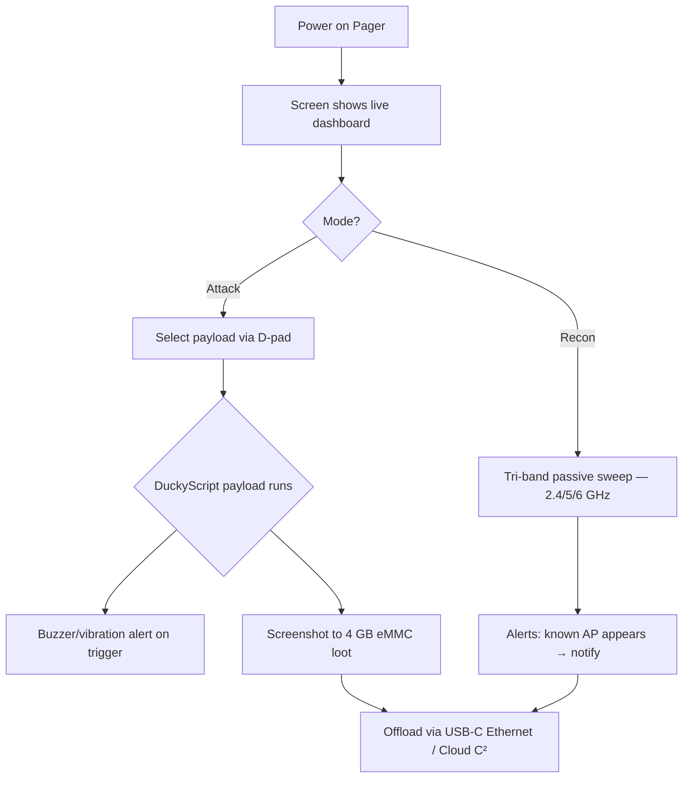

# WiFi Pineapple Pager — 完整指南

> **一句話定位**：WiFi Pineapple Pager 是 Hak5 二十週年的旗艦 — 把整台 Pineapple 塞進口袋，2.4 吋螢幕、三頻無線電（2.4/5/6 GHz）、還有 DuckyScript 驅動的 Payload 系統，完全不需要電腦就能出任務。

Pager 回答了每個 Pineapple 擁有者最終都會問的問題：*「如果我不需要筆電就能跑它呢？」* 它是一台獨立的 Linux 手持裝置，配備全彩螢幕、四顆 RGB 十字鍵、蜂鳴器、震動馬達，以及第 8 代 PineAP 引擎 — 能進行三頻偵察、evil-twin 攻擊與自動化 DuckyScript payload，全部靠夾在腰帶上的 2000 mAh 電池運作。

它是「90 年代的復古呼叫器」外觀配上現代滲透測試大腦 — 對學生來說，它是有史以來最平易近人的 Pineapple，因為**螢幕會告訴你正在發生什麼**，而不是一顆神祕的 LED。

> **⚠️ 僅限授權測試。** 口袋大小的 rogue AP 仍然是 rogue AP。只在你自己的網路上測試。

---

## 規格一覽

| 項目 | 規格 |
|---|---|
| CPU | 580 MHz MIPS 24K 路由器級晶片 |
| 無線（主） | 雙 PHY 2T2R 802.11 a/b/g/n/ac/ax |
| 無線（次） | 單 PHY 2T2R 802.11 b/g/n |
| 頻段 | 三頻：2.4 GHz / 5 GHz / 6 GHz |
| 藍牙 | Bluetooth 5.2 + BLE 4.2 |
| 顯示 | 2.4 吋 LED 背光 TFT，480×222 px（221 PPI），16 位元色彩 |
| 記憶體 / 儲存 | 256 MB DDR2 RAM / 128 MB SPI flash / 4 GB eMMC |
| 電池 | 2000 mAh LiPo（可維修、BMS、LED 充電指示） |
| 連接埠 | USB-C（充電 + 內建乙太網路）、USB 2.0（擴充） |
| 指示器 | 4× RGB LED、PWM 蜂鳴器、震動馬達、RTC |
| OS / Payload | 基於 OpenWrt 的 Linux；DuckyScript + Bash + Python |
| 官方文件 | https://docs.hak5.org/wifi-pineapple-pager |

## 構造

| 零件 | 用途 |
|---|---|
| 2.4 吋彩色螢幕 | 即時儀表板：偵察結果、payload 狀態、選單 |
| 4 向十字鍵 + A/B 按鈕（RGB） | 瀏覽選單、觸發 payload、取得觸覺回饋 |
| USB-C 埠 | 充電 AND 乙太網路轉接器（host 存取 Pager 的 LAN） |
| USB 2.0 埠 | 硬體改裝：GPS、額外無線電、客製模組 |
| 腰帶夾 | 現場作業 — 免手持部署 |
| 喇叭 + 震動 | 即時告警：「目標 AP 出現」、「payload 比對成功」 |

---

## 它與其他 Pineapple 有什麼不同

| | Mark VII | Pager |
|---|---|---|
| 需要筆電 | 是（1471 上的 Web UI） | **不用 — 內建螢幕 + 按鈕** |
| 頻段 | 2.4 GHz（+搭配 MK7AC 的 5 GHz） | **開箱即 2.4 / 5 / 6 GHz** |
| Payload 引擎 | 僅模組 | **DuckyScript + Bash + Python** |
| 回饋 | RGB LED | **螢幕、蜂鳴器、震動、RGB** |
| 電源 | USB-C（需接線） | **電池 — 真正可攜** |



---

## 快速入門 — 首次開機

### 步驟 1 — 充電
把 Pager 插上 USB-C。充電 LED 顯示進度；螢幕喚醒。

### 步驟 2 — 開機與第一個儀表板
按下電源按鈕。約 30 秒內螢幕顯示主選單：**Recon**、**PineAP**、**Payloads**、**Settings**。

### 步驟 3 — 設定時區與密碼
- **Settings → System** → 時區（RTC 即使關機也能保持時間戳記正確）。
- **Settings → Security** → 為 web/SSH 存取設定 admin 密碼。

### 步驟 4 — 執行你的第一次 Recon
1. 用十字鍵到 **Recon** → **Start Scan**。
2. 看螢幕填入：2.4 GHz 與 5 GHz 上的 AP 與用戶端（6 GHz 需要在 Settings → Network → 6 GHz 開啟 — 預設關閉是有原因的：範圍短、用戶端少）。

預期螢幕輸出：

```text
Scanning...
  [2.4G] CoffeeShop      WPA2   ch 6
  [5G]   Home-5G         WPA3   ch 36
  [2.4G] Office-Guest    OPEN   ch 11   ← interesting
Clients: 23   APs: 12
```

### 步驟 5 — 觸發你的第一個 payload
1. **Payloads → Library** → 挑一個內建範例（例如「AP Alert」）。
2. 按 **A** 把它設為預設。
3. 當觸發條件滿足時 payload 會自動執行 — 蜂鳴器叫一聲，螢幕閃出比對結果。

> **你可能會問：** *「我為什麼會想要一個只是提醒我的 payload？」* 因為那是紅隊的核心工作流程：把 Pager 停在目標區域，讓它被動偵察，當特定 AP/用戶端模式出現時**收到通知** — 然後決定行動。Pager 是一個*感測器與觸發器*裝置，不只是攻擊盒。

---

## Payload — Pineapple 上的 DuckyScript

Pager 執行與 [USB Rubber Ducky](/hak5/products/usb-rubber-ducky/) 相同的 DuckyScript 家族，但為無線擴充：payload 可以檢查空域、依事件分支，並控制蜂鳴器/顯示器。Payload Studio v1.5+ 支援 Pager payload（Community 與 Pro）。

```text
REM Example: alert when a specific SSID appears
WAIT_FOR_EVENT ssid "CoffeeShop"
BUZZER 3
DISPLAY "Target AP detected!"
```

```text
REM Example: capture handshakes on a schedule
BEGIN_PAYLOAD
SET_TIME 2 30
REPEAT_FOREVER
    RECON SCAN 60
    IF handshake_found THEN
        BUZZER 2
        SAVE_LOOT "handshake.pcap"
    END_IF
END_PAYLOAD
```

> 這些範例說明的是*概念* — 確切的指令名稱隨每個韌體版本發布。永遠查 Pager 文件（https://docs.hak5.org/wifi-pineapple-pager）取得目前的指令集。

---

## 進階

| 能力 | 怎麼做 |
|---|---|
| Rogue AP / evil twin | **PineAP** 選單 — 複製 SSID、beacon-response 引誘、deauth |
| WPA3-Enterprise 測試 | 三頻無線電涵蓋最新的企業認證；搭配 [Enterprise](/hak5/products/wifi-pineapple-enterprise/) 分頁概念 |
| 自動化現場偵察 | Payload 排程：掃描 → 儲存 loot → 通知，免手持 |
| 客製硬體改裝 | USB 2.0 埠 + root Linux：GPS 模組、SDR 無線電，應有盡有 |
| 遠端管理 | **Virtual Pager** 網頁介面 — 從瀏覽器看螢幕、按按鈕 |
| Cloud C² | 遠端卸載 loot 並管理 payload |
| Host 存取 | USB-C 乙太網路轉接器讓電腦直接 LAN 存取 Pager |

---

## 疑難排解

| 症狀 | 原因 | 修正 |
|---|---|---|
| Recon 中 6 GHz AP 從不出現 | 6 GHz 預設停用 | Settings → Network → 啟用 6 GHz（預期範圍較短） |
| 螢幕變暗 / 沒有蜂鳴器 | 省電模式或告警被靜音 | 檢查 Settings → Display / Audio |
| Payload 不觸發 | 觸發模式不符 | 在 payload 編輯器中重新檢查 SSID/BSSID 比對 |
| 掃描期間電池耗很快 | 持續三頻掃描很耗電 | 只用 2.4+5 GHz，或排程 payload |
| 連不上 Virtual Pager | Pager 與你的瀏覽器不在同一網路 | 透過 USB-C 乙太網路連接，或連上 Pager 的熱點 |

---

## 相關資源

- [WiFi Pineapple Mark VII](/hak5/products/wifi-pineapple-mark-vii/) — 經典 Web UI Pineapple
- [WiFi Pineapple Enterprise](/hak5/products/wifi-pineapple-enterprise/) — 5 無線電機架怪獸
- [USB Rubber Ducky](/hak5/products/usb-rubber-ducky/) — DuckyScript 3.0 語言參考概念
- [韌體與下載](/hak5/firmware-downloads/) — PayloadStudio 與韌體
- [疑難排解索引](/hak5/troubleshooting-index/)
- [Hak5 總覽](/hak5/)