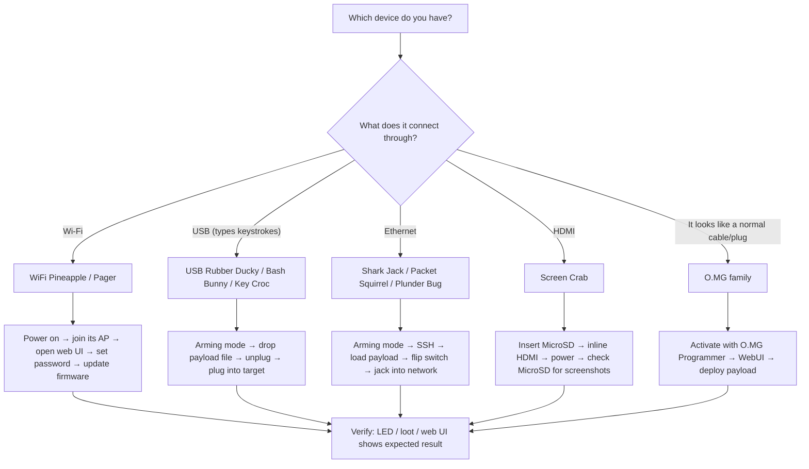

# Hak5 快速入門 — 你的前 15 分鐘

> **學習目標**：讀完你將能為任一台 Hak5 裝置完成首次啟動 — 進入 arming mode、載入第一個 Payload、並回收第一批 loot（竊取/收集到的資料）。
> **適用對象**：初學者（完全沒碰過 Hak5 也可以）｜ **前置需求**：一台 Hak5 裝置、一台電腦、一條 USB 線（或 Wi-Fi）。

每一台 Hak5 裝置都講同樣的三個詞，所以讓我們一次學會 — 它們會讓底下的每個快速入門都變得輕而易舉：

1. **Arming 模式** — 一個開關位置、隱藏按鈕，或預設按鍵序列，能把裝置變成無害且可編輯的東西（隨身碟、Web UI，或 SSH 伺服器）。*你在這裡載入 payload。*
2. **Payload** — 當裝置「武裝」進入*攻擊模式*時所執行的腳本。它只是一個文字檔（或編譯過的 `.bin`）。
3. **Loot** — 結果存放的地方（按鍵、掃描結果、截圖）。幾乎總是一個 `loot/` 資料夾。



---

## 0. 開始之前 — 架設你的實驗室

你需要一個安全的地方來測試。黃金法則：

- 只在**你擁有的設備**上測試：一台舊筆電、一台備用路由器、你自己的 VM。
- 手邊準備一組**USB 鍵盤和螢幕**，以防 payload 把機器鎖住。
- 做 Wi-Fi 工作時，在 Kali Linux 上搭配[ALFA 轉接器](/alfa-network/)進入監聽模式，是嗅探自家 Pineapple 流量的完美搭檔。

檢查清單：

- [ ] Hak5 裝置（任何型號）+ 它的 USB 線 / 電源
- [ ] 一台有網頁瀏覽器和 SSH 客戶端的電腦
- [ ] 一個你擁有的目標（舊筆電、VM、備用路由器）
- [ ] （Wi-Fi 裝置）一個你控制的 2.4 GHz 網路

---

## 1. WiFi Pineapple 家族（Mark VII / Enterprise / Pager）

Pineapple 是一個 **rogue 存取點**：它廣播自己的 Wi-Fi，讓你能從瀏覽器管理它並執行 PineAP 套件。

1. 開機（[Mark VII](/hak5/products/wifi-pineapple-mark-vii/) 用 USB-C、[Enterprise](/hak5/products/wifi-pineapple-enterprise/) 用 AC 電源、[Pager](/hak5/products/wifi-pineapple-pager/) 用電池）。
2. 在你的筆電上，連上 Pineapple 的 Wi-Fi。Mark VII 預設：SSID `PineAP`，密碼 `pineapplesareyummy`。
3. 在瀏覽器開啟管理介面：`http://172.16.42.1:1471`。
4. 立刻設定**管理員密碼**（Settings → Password）。更新韌體（Settings → Software Update）。
5. 如果你想要模組更新，就接上網際網路 uplink。

預期輸出 — 瀏覽器顯示 Pineapple 儀表板，包含 **Recon**、**PineAP**、**Modules** 與 **Client** 面板。

> **初學者陷阱：** 如果你看不到 `PineAP` SSID，裝置還在開機 — 等 30–60 秒。完整步驟與 5 GHz 升級路徑在 [Mark VII 產品頁](/hak5/products/wifi-pineapple-mark-vii/)。

---

## 2. USB 按鍵裝置（USB Rubber Ducky / Bash Bunny / Key Croc）

這些裝置假裝自己是鍵盤。三台的流程都一樣：**arm → 丟入 payload → 部署**。

### 2.1 USB Rubber Ducky — Hello, World!

1. 把 [USB Rubber Ducky](/hak5/products/usb-rubber-ducky/) 插進你的電腦。它會掛載成一個叫 `DUCKY` 的隨身碟 — 這就是 **arming 模式**。
2. 在 PayloadStudio（https://payloadstudio.hak5.org）寫一個 payload，然後點 **Generate Payload**。你會得到一個編譯好的 `inject.bin`。
3. 把 `inject.bin` 複製到 `DUCKY` 磁碟的根目錄，取代現有檔案。
4. 拔掉。在目標機器（你自己的機器！）上開啟記事本。插上 Ducky。看它打字。

```text
REM This is a DuckyScript payload — type into whatever app is focused
DELAY 1000
STRING Hello from my first payload!
ENTER
```

預期結果 — `Hello from my first payload!` 出現在記事本中。

### 2.2 Bash Bunny — 切換 payload

[Bash Bunny](/hak5/products/bash-bunny-mark-ii/) 有一個 3 段式開關。位置 3（最靠近 USB 插頭）是 **arming 模式** — Bunny 會以隨身碟和序列主控台的形式出現。把 `payload.txt` 丟進 `/payloads/switch1/`，然後撥到位置 1 再重新插上。

### 2.3 Key Croc — 零設定的鍵盤側錄

[Key Croc](/hak5/products/key-croc/) **開箱即用**地記錄按鍵：把它串接在鍵盤和電腦之間，它就會記錄到 `/root/loot/keystrokes.log`，完全不需要設定。按下隱藏的 arming 按鈕，它就會變成隨身碟，讓你可以讀取 loot。

---

## 3. 網路裝置（Shark Jack / Packet Squirrel / Plunder Bug）

### 3.1 Shark Jack — 60 秒內完成第一次掃描

[Shark Jack](/hak5/products/shark-jack/) 出廠時**已預載 nmap 偵察 payload**。只要：

1. 把開關撥到**攻擊模式**。
2. 插進任何乙太網路孔（你自己的交換器，在你的實驗室裡！）。
3. 觀察 RGB LED。等約 60 秒。
4. 撥回**Arming 模式**，用 USB 插進電腦，然後 SSH 進去收集 loot。

```bash
# From your computer — your NIC must be on the Shark's subnet
ip addr add 172.16.24.2/24 dev eth0
ssh root@172.16.24.1          # password: hak5shark
cat /root/loot/scan/*.txt     # read the nmap results
```

預期輸出 — 網路上找到的主機、開放連接埠與服務清單。

### 3.2 Packet Squirrel — 內嵌式中間人

[Packet Squirrel Mark II](/hak5/products/packet-squirrel-mark-ii/) 位於目標與網路**之間**。把 *Network* 連接埠 → 你的路由器，*Target* 連接埠 → 你想觀察的裝置，用 USB-C 供電，再用開關選擇 payload。Arming 模式（給你 Web UI 的開關位置）在 `172.16.32.1`。

### 3.3 Plunder Bug — 用 Wireshark 嗅探

[Plunder Bug](/hak5/products/plunder-bug-lan-tap/) 是一個 USB-C LAN 竊聽器：把它內嵌串接在一對乙太網路上，把 USB-C 端插進你的筆電，執行跨平台連線腳本，然後在 Wireshark 中擷取。

---

## 4. Screen Crab — 2 分鐘內截圖

1. 把 MicroSD 卡插入 [Screen Crab](/hak5/products/screen-crab/)。
2. 把 Screen Crab **內嵌**：HDMI 來源（例如電腦）→ Screen Crab → 螢幕。
3. 用 USB-C 供電。不需要任何設定 — 它會以預設間隔把截圖存到 MicroSD 卡。
4. 退出 MicroSD 並瀏覽擷取內容；編輯 `config.txt` 來改變間隔、啟用錄影，或加入 Wi-Fi + [Cloud C²](/hak5/firmware-downloads/)。

---

## 5. O.MG 裝置 — 先啟用

O.MG 裝置（Cable / Plug / Adapter / UnBlocker）基於法律原因出廠時是**停用狀態**。在它們能運作之前，你必須用 [O.MG Programmer](/hak5/products/omg-programmer/) 啟用它們：

1. 把 O.MG 裝置插進 Programmer，再把 Programmer 插進一台執行 **Chrome 或 Edge** 的電腦。
2. 開啟 WebFlasher（https://o.mg.lol/setup/）並依照 3 步驟精靈操作。
3. 啟用後，裝置會廣播自己的 Wi-Fi；連上它並開啟 WebUI 來部署你的第一個 DuckyScript payload。完整細節在 [O.MG Cable 頁面](/hak5/products/omg-cable/)。

---

## 6. 確認你準備好了

| 檢查項目 | 怎麼做 | 成功的樣子 |
|---|---|---|
| 裝置被列舉 | `lsusb`（Linux）/ 裝置管理員（Windows） | 看到 Hak5 裝置與廠商名稱 |
| Loot 已收集 | 透過 SSH 執行 `ls /root/loot/`，或開啟 MicroSD | 檔案存在且有時間戳記 |
| Web UI 可連 | 瀏覽器連到裝置 IP | 儀表板正常渲染 |
| Payload 已執行 | 觀察目標（記事本、日誌檔） | 出現預期的按鍵 / 檔案 |

---

## 常見的首次執行錯誤

| 症狀 | 原因 | 修正 |
|---|---|---|
| 找不到裝置的 Wi-Fi | 還在開機，或型號不對 | 等 60 秒；查[疑難排解索引](/hak5/troubleshooting-index/) |
| 隨身碟沒有掛載 | 裝置在攻擊模式，不是 arming 模式 | 撥開關 / 按 arming 按鈕 / 查你型號的文件 |
| SSH 被拒絕 | 子網路錯誤或裝置不在 arming 模式 | 在裝置的網段設定靜態 IP（例如 `172.16.24.2/24`） |
| Payload 什麼都沒打 | 鍵盤配置錯誤或開頭沒有 `DELAY` | 用目標的配置編譯；先加 `DELAY 1000` |
| O.MG 沒有顯示 WebUI | 裝置未啟用 | 先用 O.MG Programmer 啟用 |

現在你武裝好了 — 名副其實。下一步：從[產品目錄](/hak5/)挑一台裝置深入學習。需要確切的韌體或 payload 連結？[韌體與下載](/hak5/firmware-downloads/)頁面應有盡有。