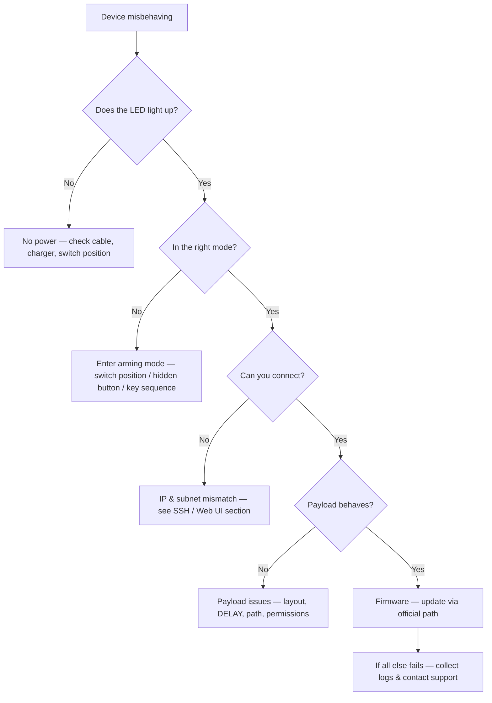

# Hak5 疑難排解索引

> **排查鐵律**：先確認電源與模式 → 再查 LED 狀態 → 然後驗證連線（SSH/Web UI）→ 最後檢查 Payload 與韌體。照這個順序走，90% 的問題五分鐘內解決。



---

## 問題分類

| 類別 | 典型症狀 | 跳轉到 |
|---|---|---|
| 電源與開機 | 沒有 LED、沒有 Wi-Fi、裝置無回應 | [電源與開機](#power--boot) |
| Arming 模式 | 隨身碟 / Web UI / SSH 沒出現 | [Arming 模式問題](#arming-mode-problems) |
| 連線 | SSH 被拒絕、Web UI 連不上、IP 錯誤 | [SSH 與 Web UI 連線](#ssh--web-ui-connection) |
| Payload | 什麼都沒打、掃描沒產生 loot、腳本錯誤 | [Payload 問題](#payload-problems) |
| Wi-Fi | Pineapple AP 看不到、沒有網際網路 uplink | [Wi-Fi 問題](#wi-fi-issues) |

---

## LED 參考 — 燈號代表什麼

### WiFi Pineapple Mark VII（單顆 RGB LED）

| LED | 意義 |
|---|---|
| 恆亮綠 | 已開機，健康 |
| 閃爍藍 | 啟動中 / 韌體更新中 |
| 紅色閃爍 | 錯誤 — 檢查 Web UI 日誌 |

### Bash Bunny（RGB LED — 顏色顯示*階段*）

| LED | 意義 |
|---|---|
| 恆亮琥珀 | Arming 模式（開關位置 3） |
| 紅 → 綠閃爍 | Payload 執行中 |
| 恆亮綠 | Payload 完成，正常 |
| 紅色閃爍 | Payload 出錯 — 檢查 `payload.txt` |

### Shark Jack / Shark Jack Cable

| LED | 意義 |
|---|---|
| 綠（閃爍） | 開機中 |
| 藍（閃爍） | 充電中 |
| 藍（恆亮） | 已充飽 |
| 黃（閃爍） | Arming 模式 — SSH 伺服器執行中 |
| 紅（閃爍） | 錯誤 — 找不到 payload |

### Key Croc

| LED | 意義 |
|---|---|
| 側錄期間關閉 | 隱蔽模式 — 這是正常的！ |
| 恆亮（各種顏色） | 設定 / 攻擊模式活動 |

> **每台裝置都不一樣 —** 上面的顏色代碼對應目前韌體。不確定時，官方各裝置文件（從每個[產品頁](/hak5/)連結）包含你韌體版本的權威圖例。

---

## 電源與開機

### 裝置完全沒有生命跡象
**診斷**：LED 完全沒亮嗎？檢查線材和電源。

| 原因 | 修正 |
|---|---|
| 電池沒電（Shark Jack / Pager） | 用 USB-C 充電；Shark Jack 充滿約需 30 分鐘 |
| 電源轉接器錯誤 | Mark VII 需要 5V/2A USB-C；Enterprise 需要它的 AC 轉接器 |
| 開關在錯誤位置 | 有些裝置（Bash Bunny）不是每個位置都會啟動 payload — 先移到 arming 模式 |

### 裝置不斷重複開機
**原因：** 通常是損壞的 payload 或失敗的更新。**修正：** 進入 arming 模式（它會繞過 payload 執行），用一個已知良好的 payload 取代，或使用[韌體與下載](/hak5/firmware-downloads/)頁面的官方方法重新刷韌體。

---

## Arming 模式問題

### 裝置掛載成磁碟，但沒有 `payloads` 資料夾
**診斷**：`lsusb` 或檔案管理員看得到裝置，但目錄結構看起來不對。
**原因：** 你看的是 *loot/設定* 分割區而不是 payload 區域，或這台裝置的配置不同。
**修正：** 在你型號的產品頁查確切的分割區配置（例如 [Bash Bunny](/hak5/products/bash-bunny-mark-ii/) 使用 `/payloads/switch1|2|3/`；[Shark Jack](/hak5/products/shark-jack/) 透過 SSH 暴露 `/root/payload/`，不是以磁碟形式）。

### Bash Bunny 開關沒有觸發 arming 模式
**原因：** 開關位置搞混了。位置 3（最靠近 USB 插頭）是 arming。**修正：** 撥到位置 3，拔掉再重新插上。

### Key Croc 的 arming 按鈕「不存在」
**原因：** arming 按鈕是**隱藏的** — 一個針孔大小的按鈕，必須在插入時按下（或用迴紋針）。**修正：** 確切技巧見 [Key Croc 指南](/hak5/products/key-croc/)。

---

## SSH 與 Web UI 連線

### `ssh: Connection refused` / 頁面載入不了
**診斷步驟 1 — 你在正確的網路上嗎？**

```bash
# Shark Jack in arming mode expects your machine on 172.16.24.0/24:
ip addr add 172.16.24.2/24 dev eth0
ping 172.16.24.1
```

預期輸出：

```text
64 bytes from 172.16.24.1: icmp_seq=1 ttl=64 time=0.4 ms
```

如果 ping 失敗，你不在裝置的子網路上 — 先修正你的 IP。

| 裝置 | Arming 位址 | 憑證 |
|---|---|---|
| Shark Jack | `172.16.24.1` | `root` / `hak5shark` |
| Packet Squirrel | `172.16.32.1`（web UI） | `root` / `hak5squirrel` |
| WiFi Pineapple | `172.16.42.1:1471`（web UI） | 首次開機設定的 admin 密碼 |
| Bash Bunny | USB 序列主控台（無 IP） | `root` / `hak5bunny` |
| Key Croc | `172.16.0.1`（web UI，arming 模式） | `root` / `hak5croc` |

> **不確定你型號的位址？** 查它的產品頁 — [17 份產品指南](/hak5/)每一份都列出確切的管理位址。

### 我能 SSH 但 shell 很小 / 工具缺失
**原因：** 你在裝置受限的開機 shell，而不是完整的 Linux 環境。**修正：** 執行 `exec bash`，或透過你型號頁面上記載的指令啟動完整 shell（例如 Key Croc 和 Shark Jack 暴露完整的 Debian root，內含 `nmap`、`tcpdump` 等）。

---

## Payload 問題

### 按鍵打到錯誤的應用程式 / 什麼都沒打
| 原因 | 修正 |
|---|---|
| Payload 開頭沒有 `DELAY` | 加上 `DELAY 1000`（或更長）— 目標 OS 必須初始化 USB HID |
| PayloadStudio 中鍵盤配置錯誤 | 用目標的配置重新編譯（例如 `German`、`French`） |
| 目標應用程式沒有焦點 | 設計 payload 先開啟記事本/終端機（`GUI r` 等） |
| Payload 為錯誤的裝置編譯 | Key Croc 執行直譯式 `payload.txt`；Rubber Ducky 需要編譯過的 `inject.bin` |

### Payload 有執行但 loot 資料夾是空的
**原因：** payload 的輸出路徑不存在，或 payload 寫到不同的目錄。**修正：** 從 payload 文件驗證路徑（Shark Jack 上是 `/root/loot/`；Key Croc 上是 `/root/loot/keystrokes.log`），並給腳本一點時間 — 掃描需要時間。

### Bash Bunny LED 閃紅燈
**原因：** payload 回傳錯誤。**修正：** 在 arming 模式連接序列主控台並讀取輸出：

```text
LED R
GET SWITCH_POSITION
```

看錯誤那一行，修正腳本，重新部署。

---

## Wi-Fi 問題

### 看不到 Pineapple 的 AP
1. 開機後等 60 秒（首次執行開機很慢）。
2. 檢查 LED — 如果是紅色，透過有線連線查看 Web UI 日誌。
3. 在 [Pager](/hak5/products/wifi-pineapple-pager/) 上，螢幕會直接顯示 AP 狀態。

### Pineapple 沒有網際網路，模組無法更新
**原因：** AP 沒有 uplink。**修正：** 把乙太網路線接到 USB-C 乙太網路埠（Mark VII），或設定 Pager 的乙太網路/USB-C，然後重試 **Settings → Software Update**。

### 5 GHz 用戶端連不上 Pineapple
**原因：** Mark VII 需要 MK7AC 轉接器（MT7612U）才能用 5 GHz。**修正：** 見[相容轉接器表格](/alfa-network/) — ALFA AWUS036ACM 可用。

---

## 還是卡住？像專業人士一樣回報

聯絡支援（或詢問論壇）時，請附上：

- [ ] 裝置型號 + 韌體版本（`cat /etc/version` 或 Web UI 頁尾）
- [ ] 故障當下的電源與開關/按鈕位置
- [ ] LED 顏色/模式
- [ ] 確切的錯誤文字（SSH 輸出、Web UI 日誌、payload 錯誤）
- [ ] 你已經試過什麼（子網路修正、payload 替換、韌體更新）

> **專業提示：** 大部分「壞掉」的 Hak5 裝置其實是模式錯誤或子網路錯誤。在拆開任何東西之前，先重跑本頁頂端的決策樹。

回到 [Hak5 總覽](/hak5/)或[快速入門](/hak5/quickstart/)。