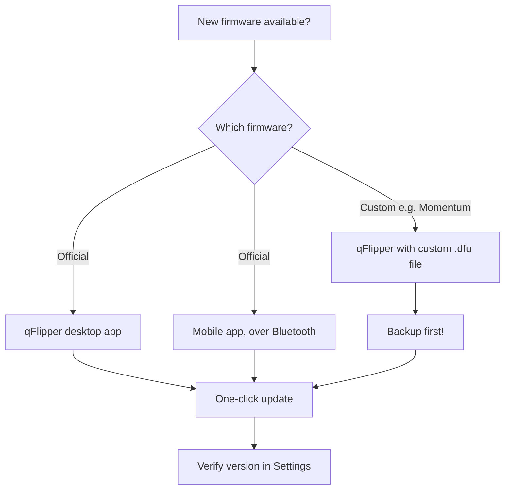
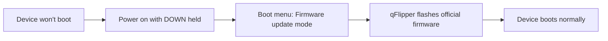

# 韌體與 qFlipper — 更新指南

> **學習目標**：完成後你將瞭解「韌體」在 Flipper Zero 上的意義、知道更新韌體的三種方式、已用桌面版 qFlipper 更新過韌體、製作過備份，並知道如何從失敗的刷寫中復原。
>
> **適用物件**：擁有 Flipper Zero 的初學者。桌面方法需要一臺電腦（Windows / macOS / Linux）。

## 什麼是韌體？

Flipper Zero 是一臺小型電腦：一顆 STM32WB55 微控制器，搭配 1 MB 快閃記憶體晶片，儲存作業系統與所有內建應用程式——Sub-GHz 讀取器、NFC、RFID、紅外線、Bad USB，以及你在主選單中看到的其他一切。這套軟體稱為**韌體（firmware）**（官方名稱為 **FlipperOS**）。

韌體更新會定期發布，並帶來：

- 新的協定支援（新的 Sub-GHz 與 NFC 卡片型別）
- 錯誤修正與安全性修補
- 新的內建應用程式與功能
- 更大、由社群維護的 IR 資料庫

兩大韌體家族：

| 韌體 | 維護者 | 說明 |
|---|---|---|
| **官方 FlipperOS** | Flipper Devices | 建議的預設選擇。穩定，包含所有內建應用程式。 |
| **自訂韌體（Momentum）** | 社群（Momentum 團隊） | 增加額外應用程式、更好的 UI、更多功能。需要透過 qFlipper 手動刷寫。 |



## 前置需求

- [ ] Flipper Zero 至少有 30% 電量（或已插入 USB）
- [ ] 支援資料傳輸的 USB-C 傳輸線（非僅充電）
- [ ] 已安裝 qFlipper（從[官方下載頁面](https://flipper.net/pages/downloads)下載）
- [ ] 若使用自訂韌體：目前韌體與資料的備份

## 方法 A：使用 qFlipper 更新（建議）

### 步驟 1：安裝 qFlipper

qFlipper 是 Flipper Devices 的官方桌面應用程式。從[官方下載頁面](https://flipper.net/pages/downloads)下載。

| 作業系統 | 安裝方式 |
|---|---|
| Windows | 執行 `.exe` 安裝程式，依照精靈指示 |
| macOS | 開啟 `.dmg`，將 qFlipper 拖曳到 Applications |
| Linux（Debian/Ubuntu） | 使用 `sudo apt install ./qFlipper-<version>.deb` 安裝 `.deb` |

在 Ubuntu/Debian 上下載 `.deb` 之後：

```bash
sudo apt install ./qFlipper-1.3.1-x86_64.deb
```

**預期輸出**（結尾部分）：

```text
Preparing to unpack ./qFlipper-1.3.1-x86_64.deb ...
Unpacking qflipper ...
Setting up qflipper (1.3.1) ...
```

> **注意**：下載頁面上的確切檔名與版本會不同。請調整指令以符合你下載的檔案。

### 步驟 2：連線你的 Flipper Zero

1. 將 USB-C 傳輸線插入 Flipper Zero，再插入你的電腦。
2. 在 Flipper Zero 上確認 USB 提示：選擇 **Connect**（預設允許 USB 連線）。
3. 開啟 qFlipper。主畫面應顯示 Flipper Zero 及其**目前的韌體版本**，例如：

```text
Device: Flipper Zero
Firmware version: 1.0.4
Storage: 14.6 GB free
```

**在 Linux 上驗證** — 如果 qFlipper 看不到裝置，請檢查作業系統是否辨識它：

```bash
lsusb
```

**預期輸出**（尋找 Flipper Devices 那一行）：

```text
Bus 001 Device 004: ID 0483:5740 STMicroelectronics Flipper Zero
```

### 步驟 3：更新

1. 在 qFlipper 中，點選頂端工具列的 **Update** 按鈕（帶有向上箭頭的 Flipper 圖示）。
2. qFlipper 會檢查發布頻道並顯示最新版本。點選 **Update Firmware**。
3. 等待。Flipper Zero 螢幕會顯示進度列；qFlipper 會顯示類似以下的記錄：

```text
Downloading firmware ...
Flashing ...
```

4. 裝置重新開機後，qFlipper 會顯示新版本。完成 ✅

### 步驟 4：驗證

在 Flipper Zero 本體上：**主選單 → 設定 → 關於**。確認版本與 qFlipper 剛刷寫的版本相符。

## 方法 B：使用手機應用程式更新

如果你偏好用手機：安裝 [Flipper 手機應用程式](/flipper-zero/mobile-app/)，透過藍芽配對，然後 **App → Firmware Update**。應用程式會透過空中下載並刷寫新韌體。完整的配對步驟請參閱[手機應用程式指南](/flipper-zero/mobile-app/)。

## 方法 C：使用 qFlipper 安裝自訂韌體（Momentum）

> ⚠️ **警告**：自訂韌體可能導致故障或更新較慢。務必先備份，如果你不需要那些額外功能，請切換回官方韌體。

1. **先備份你的資料**（請參閱下一節）。
2. 下載自訂韌體 `.dfu` 檔案（例如從 [Momentum 發布頁面](https://github.com/Next-Flip/Momentum-Firmware/releases)）。
3. 在 qFlipper 中：**點選 Flipper 圖示 → Install from file → 選擇 .dfu → Flash**。

**預期輸出**：

```text
Selected file: momentum-<version>.dfu
Flashing ...
```

4. Flipper Zero 會以自訂韌體重新開機。在 **設定 → 關於** 中驗證——版本字串現在會提到自訂版本。

> 若要回到官方韌體，請使用 [Flipper 發布頁面](https://github.com/flipperdevices/flipperzero-firmware/releases) 的官方 `.dfu` 重複相同步驟。

## 備份與還原

你擷取的鑰匙、IR 編碼與設定都存放在 microSD 卡上——所以**最簡單的備份就是把 microSD 內容複製到你的電腦**。但 qFlipper 也可以備份**內部記憶體**（地區、名稱、設定、Dolphin 等級）。

| 備份型別 | 方式 |
|---|---|
| 完整備份（建議） | Flipper 連線時，在 qFlipper 中：**Files 分頁 → 全選 → Copy to PC** |
| 設定／內部資料 | **Flipper 圖示 → Backup → Save to file** |
| 還原 | **Flipper 圖示 → Restore → 選擇備份檔案** |

## 復原：你的 Flipper 無法開機

別慌——Flipper Zero 有復原路徑：

1. **開機時按住 DOWN**（`LEFT + BACK`）→ 會出現開機選單。
2. 選擇 **Firmware update mode**。
3. 連線 USB 並使用 qFlipper 刷寫官方韌體（上述方法 A）。



## 常見錯誤

| 錯誤 | 原因 | 修正 |
|---|---|---|
| `Device not found` / `No device detected` | 僅充電的傳輸線，或未確認 USB 提示 | 使用資料傳輸線；在 Flipper 上確認「Connect」提示 |
| qFlipper 無法在 Linux 上安裝 | 缺少相依套件 | `sudo apt install ./qFlipper-<ver>.deb`（會安裝相依套件）；若仍失敗，改用 AppImage |
| 更新卡在 0% | USB 連線埠問題 | 嘗試其他 USB 連線埠／傳輸線，重新啟動 qFlipper |
| `Update failed: insufficient storage` | microSD 太滿 | 釋放 microSD 空間，或使用更大的卡片 |
| 自訂韌體更新失敗 | .dfu 檔案錯誤 | 為你的硬體下載正確的檔案；確認它是 `.dfu`，而不是原始碼壓縮檔 |

## 相關

- [Flipper Zero 快速入門](/flipper-zero/quickstart/)
- [Flipper 手機應用程式指南](/flipper-zero/mobile-app/)
- [官方資源](/flipper-zero/official-resources/)
- [Flipper Zero 產品頁面](/flipper-zero/products/flipper-zero/)