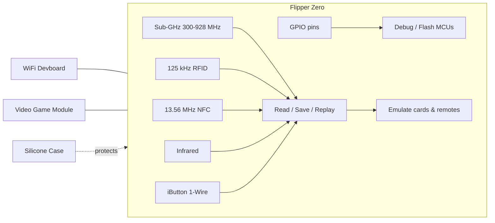

# Flipper Zero

Flipper Zero 是一款可攜式、玩具造型的多功能工具，專為資安研究人員、硬體駭客與好奇的學生設計。它能透過 Sub-GHz 無線電、125 kHz RFID、13.56 MHz NFC、紅外線、iButton（1-Wire）與 GPIO，與你周遭的無線電與電子系統互動——車庫門、門禁卡、NFC 卡片、電視遙控器、溫度感測器、門鈴等。它完全開源且可擴充，而且完全自主運作：5 鍵方向鍵與 1.4 吋單色 LCD 就足以應付日常使用。

把它想成數位系統的瑞士刀：一臺口袋大小的裝置，可以**讀取**訊號、**儲存**訊號、**重播**訊號，並**模擬**門禁卡或遙控器——還能透過 GPIO 接腳充當微控制器的除錯器。

## 快速入門

- **[快速入門](/flipper-zero/quickstart/)** — 充電、開機、瀏覽選單，並在約 10 分鐘內讀取你的第一張卡片。
- **[韌體與 qFlipper](/flipper-zero/firmware-qflipper/)** — 讓你的 Flipper Zero 保持最新狀態，並在刷寫出錯時復原裝置。
- **[手機應用程式](/flipper-zero/mobile-app/)** — 透過藍芽配對、同步資料，並從手機更新韌體。
- **[官方資源](/flipper-zero/official-resources/)** — 韌體原始碼、電路圖、社群，以及尋求協助的地方。
- **[疑難排解](/flipper-zero/troubleshooting/)** — 裝置無法開機、無法充電、無法連線？從這裡開始。

## Flipper Zero 產品家族

我們銷售並支援 Flipper Zero 產品線中的四款產品：

| 產品 | 功能 | 路徑 |
|---|---|---|
| **Flipper Zero** | 多功能工具本體：Sub-GHz、NFC、RFID、IR、iButton、GPIO、BLE | [產品頁面](/flipper-zero/products/flipper-zero/) |
| **WiFi Devboard** | ESP32-S2 擴充板：WiFi Marauder、BlackMagic 除錯探針、Evil Portal | [產品頁面](/flipper-zero/products/wifi-devboard/) |
| **Video Game Module** | RP2040 擴充模組：玩懷舊遊戲、將螢幕映象到電視、動作感測 | [產品頁面](/flipper-zero/products/video-game-module/) |
| **Silicone Case** | 日常攜帶用的保護橡膠保護殼 | [產品頁面](/flipper-zero/products/silicone-case/) |

## 它實際上能做什麼？

- **Sub-GHz（300–928 MHz）** — 使用內建的 CC1101 收發器，讀取、儲存並重播來自車庫門遙控器、停車場柵欄、無線門鈴與 IoT 感測器的訊號。
- **125 kHz RFID** — 讀取並模擬傳統感應卡（EM4100、HID、Indala 等）。
- **13.56 MHz NFC** — 讀取、寫入並模擬高頻卡片（MIFARE Classic、Ultralight、DESFire、FeliCa、iClass）。
- **紅外線** — 學習並重播來自電視／冷氣／投影機遙控器的訊號，並提供社群維護的 IR 資料庫。
- **iButton（1-Wire）** — 讀取、寫入並模擬 Dallas 式接觸鑰匙（DS199x、TM2004、RW1990…）。
- **GPIO** — 2.54 mm 排針上的 13 個使用者接腳，用於刷寫與除錯外部微控制器（SPI、UART、I2C、5V/3.3V 電源）。
- **藍芽 5.4** — 連線到手機應用程式，進行遠端控制、資料分享與空中韌體更新。

## 使用 Flipper Zero 合法嗎？

在大多數地區，擁有並使用 Flipper Zero 進行研究、教育與測試自己的裝置是合法的。然而，各國法律不同：幹擾你不擁有的系統（開啟別人的車庫門、複製你未獲授權測試的門禁卡）可能違法。**只在你自己的裝置上測試，或取得明確授權。** 這同樣適用於 WiFi Devboard 與 Video Game Module。

> 請參閱我們的 [ALFA Network 專區](/alfa-network/) 瞭解用於無線研究的 Wi-Fi 網絡卡與天線，以及 [Hak5 專區](/hak5/) 瞭解 WiFi Pineapple 與 USB Rubber Ducky 等滲透測試工具。