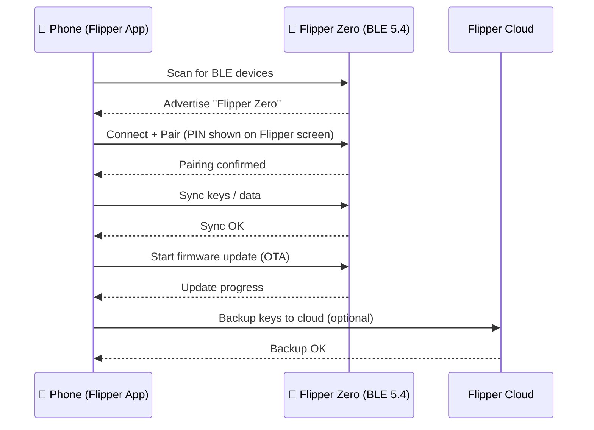

# Flipper 手機應用程式 — 配對指南

> **學習目標**：完成後你將已安裝官方應用程式、透過藍牙配對 Flipper Zero、同步資料，並使用應用程式進行遠端控制與韌體更新。
>
> **適用對象**：擁有 iPhone 或 Android 手機的初學者。Flipper Zero 必須已開機運作（請參閱[快速入門](/flipper-zero/quickstart/)）。

Flipper Zero 的 STM32WB55 無線電處理器內建藍牙低功耗（BLE 5.4）。官方 **Flipper 手機應用程式**（由 Flipper Devices 開發）把你的手機變成這隻小海豚的大螢幕遙控器：瀏覽已儲存的鑰匙、與朋友分享、透過空中更新韌體，甚至從房間另一頭控制裝置。



## 步驟 1：安裝應用程式

| 平台 | 取得方式 |
|---|---|
| iOS（iPhone） | [App Store — Flipper Mobile App](https://apps.apple.com/app/flipper-mobile-app/id1534655259) |
| Android | [Google Play — Flipper Mobile App](https://play.google.com/store/apps/details?id=com.flipperdevices.app) |

請確認手機的藍牙已開啟，且手機距離 Flipper Zero 一兩公尺以內。

## 步驟 2：在 Flipper Zero 上啟用藍牙

1. 開啟 Flipper Zero（`LEFT + BACK`）。
2. 前往 **主選單 → Bluetooth**。
3. 將 **Bluetooth** 設為 **ON**。

Flipper Zero 會開始以 BLE 週邊裝置身分廣播。

> **你可能會被詢問「配對模式」** — 保留預設值。如果你之前配對過但失敗了，請在應用程式與手機的藍牙設定中取消配對，然後重試。

## 步驟 3：在應用程式中配對

1. 開啟 Flipper 手機應用程式。
2. 點擊 **Connect**（應用程式會自動掃描附近的 Flipper Zero 裝置）。
3. 當 Flipper Zero 出現在清單中時，點擊它。
4. Flipper Zero 螢幕上會出現一組 **6 位數 PIN 碼**。在應用程式中輸入它。
5. 在兩端確認。應用程式現在會顯示你的 Flipper Zero，包含名稱、韌體版本與儲存空間。

**預期結果**（應用程式畫面）：

```text
Flipper Zero
  Firmware: 1.0.4
  Storage: 14.6 GB free
  [Synced]
```

> **為什麼需要 PIN 碼？** BLE 配對會保護連線——這與藍牙耳機配對的原理相同。如果 PIN 碼不符，Flipper Zero 與手機會拒絕連線。

## 步驟 4：同步你的資料

配對後，應用程式會同步 Flipper Zero 的內容：

- 已儲存的 Sub-GHz 遙控器
- NFC / RFID 卡片鑰匙
- 紅外線遙控器編碼
- iButton 鑰匙
- 設定

你可以在應用程式的 **Keys** 區塊瀏覽它們、重新命名或刪除，而且——最有用的——透過應用程式**與另一位 Flipper Zero 使用者分享鑰匙**（無需傳輸線的官方交換方式）。

## 步驟 5：遠端控制

應用程式的 **Remote Control** 分頁會在你的手機上鏡像 Flipper Zero 的 UI：

- 點擊螢幕上的按鈕，取代 5 鍵方向鍵
- 從手機觸發「Bad USB」腳本（鍵盤模擬）

當 Flipper 安裝在不好操作的位置（例如插在目標機器上）而你想從口袋操控它時，這非常方便。

## 步驟 6：透過空中更新韌體

1. 在應用程式中，開啟 **Firmware Update**（通常在裝置設定／選單下）。
2. 應用程式會檢查新版本。點擊 **Update**。
3. 讓手機保持在幾公尺內——更新會透過 BLE 串流傳輸，需要幾分鐘。
4. Flipper Zero 會以新韌體重新開機。在 **主選單 → 設定 → 關於** 中驗證。

> 桌面版替代方案與自訂韌體（Momentum）請參閱[韌體與 qFlipper](/flipper-zero/firmware-qflipper/)——自訂韌體是使用 qFlipper 刷寫，而非應用程式。

## 步驟 7（選用）：Flipper Cloud 備份

應用程式可以將你的鑰匙備份到 **Flipper Cloud**（Flipper Devices 的官方雲端服務），之後你可以還原它們或轉移到新裝置。

1. 在應用程式中，開啟 **Flipper Cloud**。
2. 建立帳戶（電子郵件 + 密碼）或登入。
3. 點擊 **Backup** → 應用程式會上傳一份加密的資料快照。

> 🔒 你的鑰匙會以加密方式上傳。不過，還是請把門禁卡與遙控器鑰匙當成密碼看待：不要分享你的雲端帳戶，也不要儲存你未獲授權測試之系統的鑰匙。

## 常見錯誤

| 錯誤 | 原因 | 修正 |
|---|---|---|
| 應用程式中找不到裝置 | Flipper 或手機的藍牙關閉 | 在 Flipper 上開啟 BLE（主選單 → Bluetooth），重新整理掃描 |
| 配對失敗／PIN 碼錯誤 | 先前的配對已過期 | 在應用程式與手機藍牙設定中取消配對，重新啟動兩者，重試 |
| 同步卡住 | 手機距離太遠 | 移動到 1–2 公尺內，重新啟動應用程式 |
| OTA 更新中途失敗 | BLE 連線中斷 | 讓手機保持靠近，重試；若反覆發生，改用 USB 連接的 qFlipper |
| 韌體更新後應用程式無法連線 | 韌體與應用程式版本不符 | 從商店更新應用程式，然後重新連線 |

## 相關

- [Flipper Zero 快速入門](/flipper-zero/quickstart/)
- [韌體與 qFlipper](/flipper-zero/firmware-qflipper/)
- [官方資源](/flipper-zero/official-resources/)