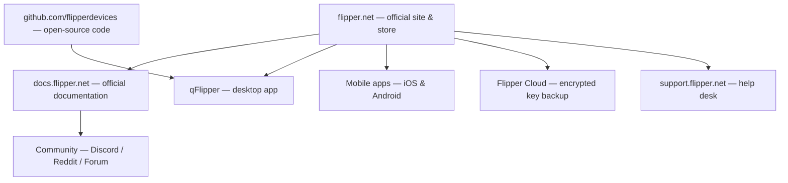

# Flipper Zero 官方資源

> **學習目標**：這個頁面是關於 Flipper Zero 一切官方資訊的單一書籤——公司網站、文件、原始碼、工具，以及尋求協助的地方。把它加入書籤吧。

Flipper Zero 是少數**完全開源**的駭客工具之一：韌體、電路圖與硬體設計檔案都由製造商 Flipper Devices 公開。這代表你可以確切讀懂它的運作方式、提交你自己的功能，並打造你自己的硬體模組。

## 官方網站與商店

| 資源 | URL | 你會找到什麼 |
|---|---|---|
| 官方網站與商店 | https://flipper.net | 產品頁面、購買、配件 |
| 官方文件 | https://docs.flipper.net | 使用者指南、開發者文件、硬體文件 |
| Flipper 部落格 | https://blog.flipper.net | 公告、深入探討、版本說明 |
| 支援入口網站 | https://support.flipper.net | 保固、RMA、支援工單 |

## 下載

| 資源 | URL | 說明 |
|---|---|---|
| qFlipper 桌面應用程式 | https://flipper.net/pages/downloads | Windows / macOS / Linux；韌體刷寫、備份、檔案管理員 |
| Flipper 手機應用程式（iOS） | https://apps.apple.com/app/flipper-mobile-app/id1534655259 | 配對、同步、OTA 更新、遠端控制 |
| Flipper 手機應用程式（Android） | https://play.google.com/store/apps/details?id=com.flipperdevices.app | Android 上相同的功能 |

## 開源儲存庫（GitHub）

所有內容都位於 **Flipper Devices** GitHub 組織下：https://github.com/flipperdevices

| 儲存庫 | 內容 |
|---|---|
| [flipperzero-firmware](https://github.com/flipperdevices/flipperzero-firmware) | FlipperOS 韌體 — 官方發布版本、自訂韌體基礎 |
| [qFlipper](https://github.com/flipperdevices/qFlipper) | 桌面應用程式原始碼 |
| [flipperzero-firmware-sources](https://github.com/flipperdevices/flipperzero-firmware-sources) | 用於自行建置的完整韌體原始碼 |
| [video-game-module](https://github.com/flipperdevices/video-game-module) | Video Game Module 韌體與遊戲 |
| [Flipper Zero 電路圖與硬體](https://docs.flipper.net) | 官方文件提供 GPIO 接腳定義與電路圖 PDF |

> **發布頁面**：用於手動刷寫的官方韌體 `.dfu` 檔案位於 https://github.com/flipperdevices/flipperzero-firmware/releases ——這些是 qFlipper 使用的檔案，也是復原時要刷寫的相同檔案。

## 社群頻道

| 頻道 | URL | 用途 |
|---|---|---|
| 官方 Discord | https://discord.gg/flipper | 即時聊天、開發討論、展示分享 |
| Reddit r/flipperzero | https://www.reddit.com/r/flipperzero/ | 指南、問題、專案展示 |
| 官方論壇 | https://forum.flipper.net | 較長篇幅的討論與問答 |
| YouTube | https://www.youtube.com/flipperzero | 官方影片與示範 |

> ⚠️ **購買者請注意**：只從官方 GitHub 組織或官方應用程式商店下載韌體與應用程式。「Flipper」仿冒網站與第三方韌體包曾被用來散布惡意軟體。

## 你應該加入書籤的內容

1. **docs.flipper.net** — 一切事物的說明手冊。
2. **github.com/flipperdevices** — 原始碼與發布版本。
3. **flipper.net/pages/downloads** — qFlipper 與手機應用程式。
4. **Discord** — 最快的社群協助。

## 相關

- [Flipper Zero 快速入門](/flipper-zero/quickstart/)
- [韌體與 qFlipper](/flipper-zero/firmware-qflipper/)
- [Flipper 手機應用程式指南](/flipper-zero/mobile-app/)
- [Flipper Zero 產品頁面](/flipper-zero/products/flipper-zero/)
- [WiFi Devboard](/flipper-zero/products/wifi-devboard/)
- [Video Game Module](/flipper-zero/products/video-game-module/)