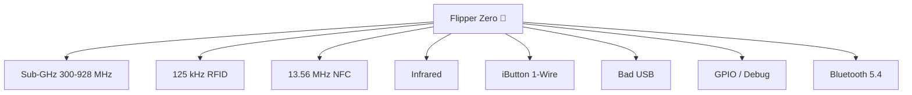

# Flipper Zero — 完整指南

> **一句話定位**：一台口袋大小、玩具造型的多功能工具，用於讀取、儲存、重播與模擬你周遭的無線電訊號與門禁系統——並透過 GPIO 除錯硬體。適合學生、玩家與資安研究人員。



## 規格表

官方規格（來源：Flipper Devices）：

| 類別 | 規格 |
|---|---|
| MCU | **STM32WB55RG** — ARM Cortex-M4 @ 64 MHz + Cortex-M0+ 無線電核心 @ 32 MHz |
| 快閃／SRAM | 1024 KB 快閃 / 256 KB SRAM（應用程式與無線電共用） |
| 顯示器 | 1.4 吋單色 LCD，128×64 px，ST7567 控制器，SPI |
| 電池 | LiPo 2100 mAh，待機長達 28 天 |
| Sub-GHz | CC1101 收發器；315 / 433 / 868 / 915 MHz 頻段（依地區而定） |
| RFID（LF） | 125 kHz；AM/OOK；支援 EM400x/410x/420x、HID、Indala、FDX、Pyramid、AWID、Viking、Jablotron、Paradox、Gallagher 等 |
| NFC（HF） | 13.56 MHz；讀取／寫入／模擬 MIFARE Classic、Ultralight、DESFire、FeliCa、HID iClass（PicoPass）、NFC Forum 協定 |
| 紅外線 | RX 950 nm（38 kHz 載波）；TX 940 nm（0–2 MHz，300 mW）；NEC、Kaseikyo、RCA、RC5/RC6、Samsung、SIRC |
| iButton | 1-Wire 讀取／寫入／模擬；DS199x、DS1971、CYFRAL、Metakom、TM2004、RW1990 |
| 藍牙 | BLE 5.4，TX 最高 4 dBm，RX -96 dBm，2 Mbps |
| USB | USB Type-C，USB 2.0（12 Mbps），充電最高 1A |
| GPIO | 2.54 mm 排針上的 13 個使用者 I/O 接腳，3.3V CMOS，5V 容忍輸入，每腳最高 20 mA |
| microSD | 最高 256 GB（SPI 模式）；建議 2–32 GB；FAT12/16/32、exFAT |
| 機身 | 100 × 40 × 25 mm；102 g；PC/ABS/PMMA |
| 輸入 | 5 鍵方向鍵 + BACK 按鈕 |
| 其他 | 震動馬達、蜂鳴器（100–2500 Hz，87 dB）、掛繩孔 |

## 總覽

Flipper Zero 完全自主運作——方向鍵與單色 LCD 讓你在沒有手機或電腦的情況下也能完整控制。它**開源**（韌體與電路圖由 Flipper Devices 公開），並可透過社群應用程式與硬體模組擴充，例如 [WiFi Devboard](/flipper-zero/products/wifi-devboard/) 與 [Video Game Module](/flipper-zero/products/video-game-module/)。

**學生與玩家的典型使用情境：**

- 研究遙控器與門禁卡實際上如何運作（讀取 → 解碼 → 模擬）
- 用真實的收發器學習 RF 基礎
- 控制 IR 裝置並學習遙控器編碼
- 透過 GPIO 除錯微控制器（SPI / UART / I2C / SWD）
- 把 Flipper 變成 USB 鍵盤（Bad USB）來測試 HID 安全性

> ⚠️ **法律聲明**：只在你擁有或已獲授權測試的裝置上測試。干擾你不擁有的系統（門、汽車、網路）在大多數司法管轄區是違法的。

## 快速入門

完整逐步說明：[Flipper Zero 快速入門](/flipper-zero/quickstart/)。60 秒版本：

1. 透過 USB-C 充電（約 2 小時）。
2. 開機：**LEFT + BACK**。
3. 完成首次開機設定（地區、藍牙）。
4. 插入 microSD 卡（建議 2–32 GB）。
5. **主選單 → RFID → Read** → 將測試門禁卡放在頂部邊緣 → **OK → Save**。
6. **主選單 → Sub-GHz → Read** → 按下你自己遙控器的按鈕 → **OK → Save**。

## 進階用法

### Sub-GHz 深入探討

- **Read** 會擷取原始訊號；Flipper 會解碼常見協定（AM650、AM270、FM 等）。
- **Raw** 模式會儲存確切的波形，供分析或重播。
- **頻率分析器**（Sub-GHz → Analyze）會掃描頻段並顯示哪些頻率正在使用——非常適合發現你周遭有哪些裝置在發射。
- 滾動碼遙控器（例如現代的車庫門開啟器）無法重播——這是預期行為，不是錯誤。

### NFC 與 RFID

- **NFC**：讀取卡片、儲存，然後 **Emulate**。只有可重寫的卡片支援寫入（MIFARE Ultralight、部分 Classic）。
- **RFID**：讀取並模擬 125 kHz 感應卡；你也可以手動輸入卡片 ID（對已知 ID 很有用）。
- 加密卡片（需要驗證的 MIFARE DESFire）在沒有鑰匙的情況下無法讀取——這是正常的。

### 紅外線

- **Learn** 新遙控器：Infrared → Learn → 將原始遙控器對準 Flipper → 儲存。
- 內建的 **IR 資料庫**涵蓋常見的電視／冷氣／投影機品牌，並由社群持續更新。
- 模擬完整的遙控器（電視、冷氣、音響）——有數十個按鈕的冷氣遙控器可以儲存為多個項目。

### iButton（1-Wire）

- 將 Dallas 式鑰匙觸碰**頂部邊緣的彈簧探針**即可讀取。
- 模擬回去；只有可重寫的鑰匙支援寫入（RW1990、TM2004）。

### Bad USB

Flipper Zero 會以 USB HID 鍵盤的身分呈現。腳本（microSD 的 `badusb/` 資料夾中的 `.txt` 檔案）會自動輸入按鍵——適合測試 USB HID 安全性與自動化按鍵輸入。範例腳本：

```text
REM Lock the screen test (Windows)
GUI r
STRING cmd
ENTER
STRING timeout /t 5
ENTER
```

> 只在你擁有的機器上執行 Bad USB 腳本。會自己打字的鍵盤正是 HID 攻擊的教科書定義。

### GPIO 與硬體除錯

2.54 mm 排針暴露 13 個接腳。關鍵接腳（完整接腳定義請參閱官方文件）：

| 接腳 | 功能 |
|---|---|
| 5V / 3V3 | 電源輸出 |
| GND ×2 | 接地 |
| PC0 / PC1 | UART TX / RX |
| PB7 / PA6 / PA7 | SPI SCK / MISO / MOSI |
| PC3 | SWC（SWD 時脈） |
| PA13 / PA14 | SWDIO / SWCLK（除錯） |

Flipper 可以充當 **UART/SPI/I2C 轉 USB 轉換器**、**SPI 快閃程式設計器**、**AVR ISP 程式設計器**與 **OpenDAP 除錯探針**——足以刷寫與除錯許多玩家級開發板。

## 韌體

- 使用 [qFlipper](/flipper-zero/firmware-qflipper/)（桌面版）或[手機應用程式](/flipper-zero/mobile-app/)（透過藍牙）更新。
- 自訂韌體（例如 Momentum）會增加額外應用程式，但必須使用 qFlipper 從 `.dfu` 檔案刷寫。切換前請先備份。
- 完整原始碼、發布版本與電路圖：[官方資源](/flipper-zero/official-resources/)。

## 相容性

| 平台 | 支援 | 說明 |
|---|---|---|
| 獨立使用（無電腦） | ✅ | 使用方向鍵完整控制主選單 |
| Windows | ✅ | qFlipper 桌面應用程式 |
| macOS | ✅ | qFlipper 桌面應用程式 |
| Linux | ✅ | qFlipper `.deb` 或 AppImage；用 `lsusb` 驗證 |
| iOS / Android | ✅ | 透過 BLE 使用 Flipper 手機應用程式 |

## 疑難排解

- 無法開機 → 充電 10 分鐘以上，然後 **LEFT + BACK**；如果卡住，使用[復原模式](/flipper-zero/troubleshooting/#firmware--recovery)。
- 無法擷取 → 檢查地區頻段、天線位置與距離（[Sub-GHz 與卡片](/flipper-zero/troubleshooting/#sub-ghz--cards)）。
- 完整索引：[Flipper Zero 疑難排解](/flipper-zero/troubleshooting/)。

## 相關

- [快速入門](/flipper-zero/quickstart/)
- [韌體與 qFlipper](/flipper-zero/firmware-qflipper/)
- [手機應用程式](/flipper-zero/mobile-app/)
- [WiFi Devboard](/flipper-zero/products/wifi-devboard/)
- [Video Game Module](/flipper-zero/products/video-game-module/)
- [Silicone Case](/flipper-zero/products/silicone-case/)