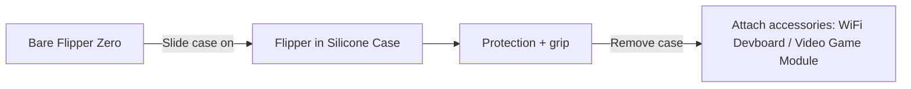
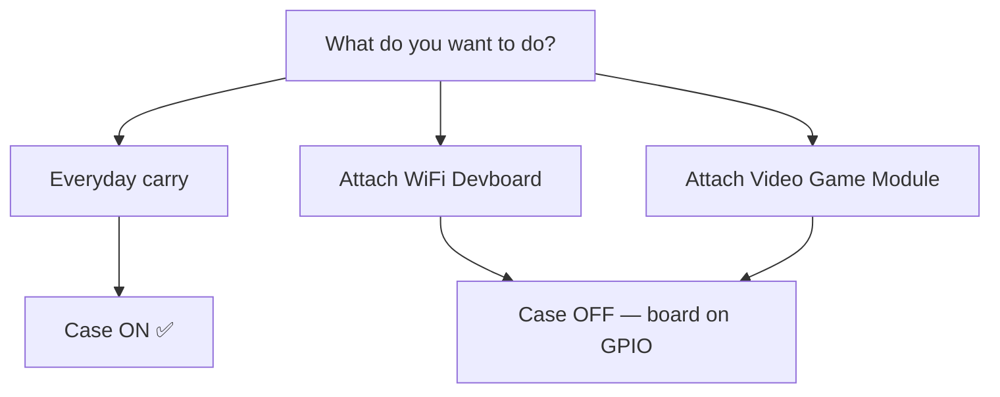

# Silicone Case — 完整指南

> **一句話定位**：Flipper Zero 的官方保護矽膠保護殼——讓你的賽博海豚保持無刮痕、握感更穩，同時仍保留所有按鈕、連線埠與天線的可用性。

## 規格表

| 類別 | 規格 |
|---|---|
| 材質 | 彈性矽膠橡膠 |
| 相容性 | 僅限官方 Flipper Zero（符合 100×40×25 mm 機身） |
| 開口 | 所有按鈕、方向鍵、螢幕、USB-C、microSD、GPIO 排針仍可使用 |
| 顏色 | 黑色（官方） |
| 重量 | 約 20 g（增加極少的體積） |
| 內容物 | 1× 矽膠保護殼（無需工具） |

## 總覽

Flipper Zero 的機身是亮面 ABS/PC 塑膠——握在手上很舒適，但很容易被鑰匙、桌面與口袋刮傷。Silicone Case 是一個緊密的橡膠套，正好解決這個問題：它保護機身與外露的側邊按鈕，同時增加握感，讓裝置不會從手中滑落。

它還兼任**避震**功能，吸收隨身攜帶的駭客工具難免會遇到的日常摔落衝擊。

## 快速入門 — 安裝

不需要工具，不需要拆解。只要 10 秒：

1. 確認保護殼方向：**開孔側朝向螢幕**，**開放的底部露出 GPIO 排針**。
2. 將 Flipper Zero 滑入，**頂部（天線／IR 視窗）先進入**。
3. 推到保護殼在 USB-C 連線埠周圍卡入，且側邊按鈕與保護殼的按鈕蓋對齊。

**驗證安裝** — 以下所有專案都必須保持可用：

| 專案 | 檢查 |
|---|---|
| 方向鍵 + BACK | 按下每個按鈕——完整行程，沒有卡住 |
| 螢幕 | 透過開孔完全可見 |
| USB-C 連線埠 | 傳輸線可完全插入 |
| microSD 插槽 | 卡片可插入／取出 |
| IR 視窗 | 透明視窗與 IR 收發器對齊 |
| iButton 彈簧探針 | 在頂部邊緣外露 |

## 取下

1. 將保護殼的頂部邊緣從裝置上剝開。
2. 一次一個角落鬆開（橡膠有彈性——彎曲它，不要硬扯）。
3. 將裝置滑出。

> 保護殼即使在低溫下也保持彈性，但裝置在溫暖的口袋裡放幾分鐘後會更容易取下。

## 重要：配件與保護殼

保護殼設計上會覆蓋 GPIO 排針區域，所以**配件要直接插在 GPIO 接腳上——必須先取下保護殼**：

- **[WiFi Devboard](/flipper-zero/products/wifi-devboard/)** — 取下保護殼、裝上開發板、再裝回去？不行：開發板與保護殼都佔用 GPIO 那一端。**兩者擇一。**
- **[Video Game Module](/flipper-zero/products/video-game-module/)** — 模組隨附自己的矽膠緩衝墊，適合裸機 Flipper。**安裝模組前先取下保護殼**，否則無法正確就位。
- **原型開發板** — 同樣的規則：裸機裝置，GPIO 外露。

## 保養說明

| 情況 | 做法 |
|---|---|
| 髒汙／灰塵 | 用微溫清水 + 溫和肥皂沖洗，自然風乾 |
| 鬆弛／變形 | 清洗後，讓它離開裝置靜置一晚——矽膠會恢復彈性 |
| 變色 | 矽膠接觸 UV／陽光後變色是正常的——僅影響外觀 |
| 更換 | 保護殼是消耗品；不再緊密貼合時就該更換 |

## 相容性與注意事項

| 專案 | 說明 |
|---|---|
| Flipper Zero（所有硬體版本） | ✅ 適用 |
| WiFi Devboard | ⚠️ 保護殼裝著時無法安裝 |
| Video Game Module | ⚠️ 模組有自己的緩衝墊；請取下保護殼 |
| 裝著保護殼充電 | ✅ USB-C 完全可存取 |
| 無線範圍 | ✅ 無影響（Sub-GHz/NFC 天線在裝置上，不會被橡膠阻擋） |

## 疑難排解

| 症狀 | 原因 | 修正 |
|---|---|---|
| 按鈕感覺很緊 | 保護殼未完全就位 | 推壓保護殼邊緣，直到按鈕蓋對齊 |
| IR 無法控制裝置 | IR 視窗被保護殼摺痕遮住 | 重新安裝保護殼；保持透明視窗清潔 |
| 保護殼滑落 | 方向錯誤或已鬆弛 | 翻轉方向；磨損就換新 |
| 配件裝不上 | 保護殼還裝著 | 先取下保護殼（請參閱上方） |

## 相關

- [Flipper Zero 產品頁面](/flipper-zero/products/flipper-zero/)
- [WiFi Devboard](/flipper-zero/products/wifi-devboard/)
- [Video Game Module](/flipper-zero/products/video-game-module/)
- [Flipper Zero 快速入門](/flipper-zero/quickstart/)