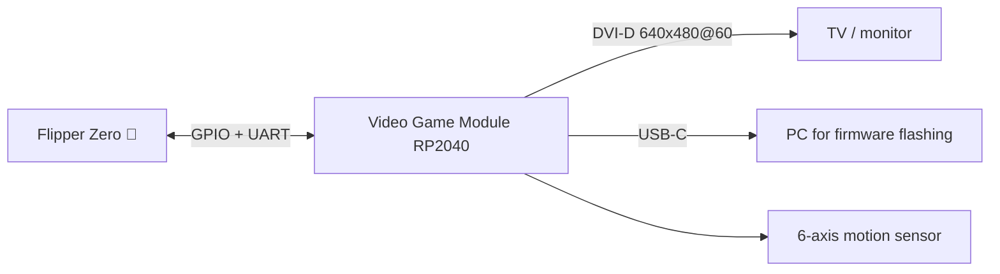
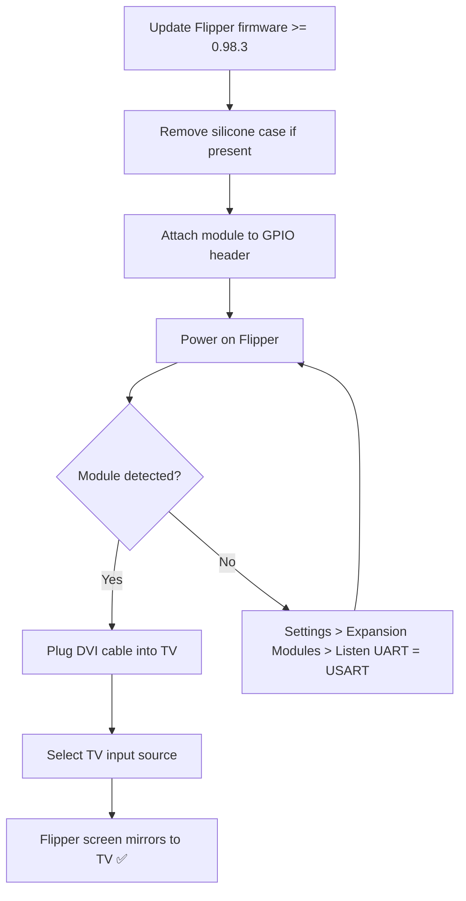

# Video Game Module — 完整指南

> **一句話定位**：一個由 Raspberry Pi RP2040 驅動的模組，卡入 Flipper Zero 後把它變成迷你遊戲主機——將 Flipper 的螢幕鏡像到電視（DVI 640×480）、玩懷舊遊戲，並加入 6 軸動作感測。



## 規格表

官方規格（來源：Flipper Devices + Raspberry Pi RP2040）：

| 類別 | 規格 |
|---|---|
| MCU | **Raspberry Pi RP2040** — 雙核心 ARM Cortex-M0+ @ 最高 133 MHz（為影片輸出稍微超頻） |
| SRAM | 264 KB 晶片內建 |
| 影像輸出 | **DVI-D，640×480 @ 60 Hz**（由 RP2040 PIO 驅動） |
| 動作感測器 | TDK **ICM-42688-P** 6 軸（陀螺儀 + 加速度計） |
| USB | USB Type-C — 裝置或主機模式（不支援供電） |
| GPIO 擴充 | 11 個 GPIO 接腳 + 2 個 GND + 3.3 V |
| 控制 | BOOT 按鈕（開機載入器模式）+ RESET 按鈕 |
| 相容性 | 與 Raspberry Pi Pico 接腳相容，適用於大多數專案 |
| 韌體 | 開源（github.com/flipperdevices/video-game-module） |
| 需求 | Flipper Zero 韌體 **0.98.3 或更新版本** |

## 總覽

Video Game Module 是**與 Raspberry Pi 合作開發**的，使用 RP2040——與 Raspberry Pi Pico 相同的晶片。Flipper Devices 稍微超頻它，讓它的 PIO（可程式化 I/O）區塊能產生 **640×480@60 Hz 的 DVI-D 影像訊號**——經典的「類 HDMI」懷舊影像模式，在現代電視上看起來很清晰，因為 Flipper 自己的螢幕只有 128×64。

它解鎖的功能：

- **螢幕鏡像** — 在電視上顯示 Flipper Zero 的 UI（非常適合示範與教學）。
- **懷舊遊戲** — 從 microSD 卡載入遊戲，用 Flipper 的方向鍵在電視上遊玩。
- **動作控制** — 6 軸 ICM-42688-P 感測器支援空中滑鼠式控制與動作遊戲。
- **獨立開發板** — 因為它是完整的 RP2040，可以獨立執行 Raspberry Pi Pico 專案（例如 **Scoppy** 示波器應用程式）。
- **Flipper Zero Game Engine** — 開源引擎（含 IMU 驅動程式）讓撰寫自己的遊戲變得很容易。

> 模組隨附**矽膠緩衝墊**，讓它能緊密安裝在 Flipper Zero 上。如果你的 Flipper 裝在 [Silicone Case](/flipper-zero/products/silicone-case/) 裡，請先取下保護殼——模組無法套在保護殼上安裝。

## 快速入門

### 步驟 1：先更新 Flipper Zero 韌體

模組需要 **Flipper Zero 韌體 0.98.3 或更新版本**。如果你最近沒更新過，現在就透過 [qFlipper](/flipper-zero/firmware-qflipper/) 或[手機應用程式](/flipper-zero/mobile-app/)更新。

### 步驟 2：安裝模組

1. 如果裝了 Silicone Case 請先取下（模組有自己的緩衝墊）。
2. 關閉 Flipper Zero 電源。
3. 將模組的連接器與 Flipper 的 GPIO 排針對齊（配合方向標記），壓下直到卡入。
4. 開啟 Flipper Zero。它應該會自動偵測模組並進行準備。

**驗證**：**主選單 → 設定 → 擴充模組** → **Listen UART** 選項必須設為 **USART**（模組透過 UART 通訊）。如果設成其他值，模組將無法被偵測。



### 步驟 3：連接到電視

1. 將影像傳輸線插入模組的 **Video Out** 連接埠（DVI-D；使用 DVI 或 DVI 轉 HDMI 傳輸線）。
2. 在電視上，將輸入來源切換到你使用的連接埠。
3. Flipper Zero 的螢幕會以 640×480@60 Hz 出現在電視上。

> 如果你在電視上看到 **「Video Game Module not initialized」**，表示 Flipper 韌體太舊（或模組在沒有 Flipper 的情況下供電）。更新 Flipper 韌體後重試。

### 步驟 4：玩遊戲

1. 將遊戲檔案（`.fap` 應用程式 + 素材）複製到 microSD 卡——請參閱官方模組文件與 Flipper 應用程式目錄。
2. 在 Flipper 上：**Apps → Games** → 選擇你的遊戲。
3. 用方向鍵在電視上遊玩；使用 IMU 的遊戲讓你可以傾斜／移動 Flipper 來控制動作。

## 進階用法

### 空中滑鼠

搭配正確的應用程式，在空中揮動 Flipper Zero（已安裝模組）即可透過藍牙控制電腦游標——ICM-42688-P 會回報旋轉與加速度，Flipper 會將它轉換成滑鼠移動。

### 使用 Game Engine 撰寫你自己的遊戲

[Flipper Zero Game Engine](https://github.com/flipperdevices/flipperzero-game-engine) 處理向量數學、精靈快取、渲染與事件處理。使用標準 Flipper 韌體 SDK 建置，然後將產生的 `.fap` 複製到 microSD 的 `apps/`。

### Raspberry Pi Pico 專案（獨立使用）

模組可以**在沒有 Flipper Zero 的情況下**執行：

1. 按住 **BOOT**，將 USB-C 插入你的電腦 → RP2040 會以 USB 大量儲存裝置的形式出現。
2. 將標準 Pico `.uf2` 檔案丟進去（例如 Scoppy 示波器韌體）。
3. RP2040 會自行執行 Pico 韌體——Flipper 不參與。

```bash
# After BOOT + plug, the drive appears; copying a .uf2 is all it takes
cp scoppy.uf2 /media/$(whoami)/RPI-RP2/
```

**預期輸出**：

```text
(nothing printed — the drive unmounts itself after a successful flash)
```

> ⚠️ 刷寫通用的 Pico `.uf2` 會取代影片遊戲韌體。若要還原，請用相同方式重新刷寫官方 `vgm-fw-*.uf2`（從 [video-game-module 儲存庫](https://github.com/flipperdevices/video-game-module)下載）。

## 韌體

- 模組韌體更新是透過 USB-C 在 **BOOT 模式**下刷寫（`.uf2` 檔案——與 Pico 相同的流程）。
- **模組韌體**與 Flipper 自己的韌體是分開的。兩者都更新以獲得最佳相容性。
- 原始碼與發布韌體：[github.com/flipperdevices/video-game-module](https://github.com/flipperdevices/video-game-module)。

## 相容性

| 平台 | 支援 | 說明 |
|---|---|---|
| Flipper Zero（官方） | ✅ | 需要韌體 ≥ 0.98.3 |
| 電視／顯示器 | ✅ | DVI-D 640×480@60；透過 DVI 轉 HDMI 傳輸線使用 HDMI |
| 獨立使用（無 Flipper） | ✅ | 執行 Raspberry Pi Pico 韌體 |
| 電腦刷寫 | ✅ | BOOT + USB-C → 拖放 `.uf2` |

## 疑難排解

| 症狀 | 原因 | 修正 |
|---|---|---|
| 「Video Game Module not initialized」 | Flipper 韌體太舊 | 更新 Flipper 韌體至 ≥ 0.98.3 |
| 偵測不到模組 | Listen UART 未設為 USART | 設定 → 擴充模組 → Listen UART = USART |
| 電視上沒有畫面 | 輸入來源／傳輸線錯誤 | 選擇正確的 HDMI/DVI 輸入；使用支援資料傳輸的傳輸線 |
| 遊戲中沒有動作控制 | IMU 未初始化 | 重新安裝模組（先關機），重新啟動遊戲 |
| 模組無法刷寫 | 不在開機載入器模式 | 插入 USB-C 前先按住 BOOT |

## 相關

- [Flipper Zero 產品頁面](/flipper-zero/products/flipper-zero/)
- [韌體與 qFlipper](/flipper-zero/firmware-qflipper/)
- [Silicone Case](/flipper-zero/products/silicone-case/)
- [Flipper Zero 疑難排解](/flipper-zero/troubleshooting/)