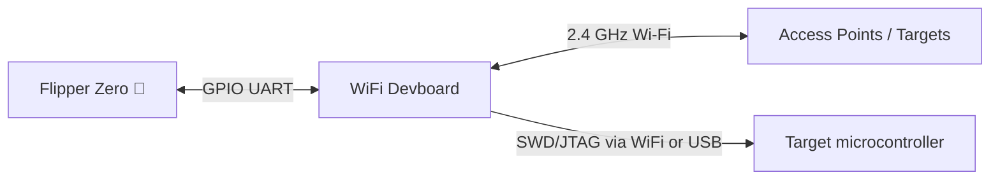
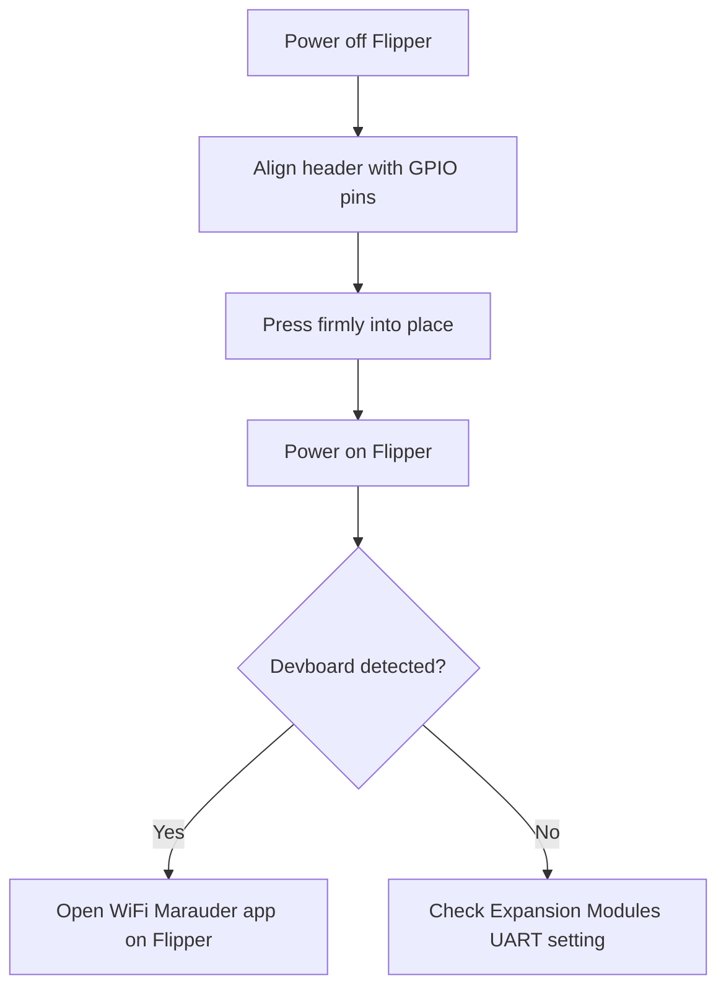

# WiFi Devboard — 完整指南

> **一句話定位**：一塊插在 Flipper Zero GPIO 排針上的小型 ESP32-S2 開發板，為它提供 2.4 GHz Wi-Fi——用於 Wi-Fi 稽核（Marauder）、強制入口網站示範（Evil Portal），以及作為無線除錯探針（BlackMagic）。



## 規格表

官方規格（來源：Flipper Devices + Espressif ESP32-S2-WROVER 資料表）：

| 類別 | 規格 |
|---|---|
| 模組 | **ESP32-S2-WROVER** |
| CPU | Xtensa 單核心 LX7，最高 240 MHz |
| 無線 | 2.4 GHz Wi-Fi，IEEE 802.11 b/g/n（**無 5 GHz、無藍芽**——S2 晶片） |
| 快閃／PSRAM | 4 MB 快閃 / 2 MB PSRAM |
| SRAM | 320 KB SRAM，16 KB RTC SRAM |
| USB | USB Type-C（USB OTG） |
| 按鈕 | BOOT 與 RESET 輕觸開關 |
| 介面 | UART、SPI、I2C、GPIO（透過 Flipper 聯結器 + 擴充） |
| 預載韌體 | **BlackMagic**（透過 Wi-Fi 或 USB 進行 SWD/JTAG 除錯） |
| 相容性 | 官方 Flipper Zero GPIO 聯結器（UART 連結） |

## 總覽

WiFi Devboard 是 Flipper Zero 的官方 Wi-Fi 擴充配件。有兩件事讓它特別：

1. **它給 Flipper 一個 Wi-Fi 無線電** — Flipper Zero 本身沒有 Wi-Fi，只有 Sub-GHz、NFC、RFID 與 BLE。裝上開發板並刷寫 **WiFi Marauder** 後，Flipper 就變成可攜式 Wi-Fi 稽核工具：掃描網路、對使用者端解除認證、探測隱藏 SSID。
2. **它是無線除錯探針** — 它隨附 **BlackMagic** 韌體，讓你可以透過 SWD/JTAG 刷寫與除錯其他微控制器（包括 Flipper Zero 自己的 STM32），有線**或透過 Wi-Fi** 皆可。

它同時也是一個完整的 ESP32-S2 開發平臺：你可以撰寫自己的 ESP-IDF 或 Arduino 韌體並刷寫——這塊板子是真正的開發套件，不只是配件。

> ⚠️ **法律宣告**：Wi-Fi 稽核工具可能幹擾網路。只在你擁有或已取得明確授權的網路上測試。對他人網路發動解除認證攻擊在大多數地方是違法的。

## 快速入門

### 步驟 1：安裝開發板

1. 關閉 Flipper Zero 電源。
2. 將開發板的 2.54 mm 排針與 Flipper 的 GPIO 接腳對齊——**配合絲印方向**（板子插上接腳時 USB-C 連線埠朝外）。
3. 用力壓下直到完全貼合。
4. 開啟 Flipper。你應該會看到新模組被偵測（檢查 **設定 → 擴充模組**——UART 應該已啟用）。



### 步驟 2：在 Flipper 上安裝 WiFi Marauder 應用程式

**WiFi Marauder** Flipper 應用程式（由 0xchocolate 開發）會與開發板上執行的 Marauder 韌體通訊。

1. 將 Flipper 插入你的電腦（USB-C）。
2. 在 qFlipper 中，開啟 **Apps** 目錄（或從 Marauder 專案下載 `.fap`）並安裝 **WiFi Marauder**。
3. 在 Flipper 上：**Apps → WiFi Marauder**。
4. 應用程式會透過 UART 連結連線到開發板並顯示其狀態。

### 步驟 3：將 Marauder 韌體刷寫到開發板

開發板出廠時搭載 BlackMagic；Marauder 是另一套需要刷寫一次的韌體。有兩種方式：

**選項 A — 直接從 Flipper Zero 刷寫**（官方支援的路徑）：

1. 開發板已安裝且 Flipper 已開機時，透過 USB 將 Flipper 連線到你的電腦。
2. 在 qFlipper 中，使用內建的 **ESP32 刷寫**選項（qFlipper ≥ 1.3）：它會下載 Marauder 韌體並透過 Flipper 的 UART 刷寫。
3. qFlipper 記錄會顯示類似以下的內容：

```text
ESP32 firmware flashing started
Erasing flash ...
Writing 0x00000000 ...
Flashing complete. Rebooting board ...
```

**選項 B — 從你的電腦透過開發板的 USB-C 刷寫**：

1. 將開發板切換到**下載模式**：按住 **BOOT**，然後將 USB-C 插入你的電腦（放開 BOOT）。
2. 安裝 Espressif 的 `esptool`（Python）：

```bash
python3 -m pip install esptool
```

3. 刷寫 Marauder `.bin`：

```bash
esptool.py --chip esp32s2 --port /dev/ttyACM0 erase_flash
esptool.py --chip esp32s2 --port /dev/ttyACM0 write_flash 0x10000 marauder_vX.Y_esp32s2.bin
```

**預期輸出**（結尾部分）：

```text
Hash of data verified.
Leaving...
Hard resetting via RTS pin...
```

> 連線埠名稱依作業系統而異：`/dev/ttyACM0`（Linux）、`COMx`（Windows）、`/dev/cu.usbmodem*`（macOS）。請據此調整。

### 步驟 4：驗證

回到 Flipper 上：**Apps → WiFi Marauder** → 應用程式應該會顯示開發板的韌體版本與偵測到的 AP 數量。將 Flipper 對準任何你擁有的附近網路並執行 **Scan**——你會在 Flipper 螢幕上看到 SSID、頻道與加密型別清單。

## 進階用法

### WiFi Marauder 功能

| 功能 | 作用 |
|---|---|
| Scan APs / stations | 列出附近的網路與已連線使用者端 |
| Beacon spam | 廣播假 SSID（只在你自己的測試實驗室使用） |
| Deauth | 強制使用者端離開網路（僅限測試網路！） |
| Sniff | 擷取探測請求 |
| Hidden SSID reveal | 當使用者端探測時顯示隱藏網路名稱 |
| Packet capture | 將原始 802.11 訊框記錄到 SD 卡 |

### Evil Portal

刷寫 **Evil Portal** ESP32 韌體後，它會提供一個強制入口網站（假的登入頁面），示範開放 Wi-Fi 如何被濫用。搭配我們 Hak5 系列中的 [WiFi Pineapple](/hak5/)，這就是真實世界強制入口網站攻擊的測試方式——永遠在你控制的實驗室中進行。

### BlackMagic 除錯

保留出廠的 BlackMagic 韌體（或重新刷寫它），即可將開發板用作除錯探針：

- 將開發板的 **SWDIO / SWCLK** 接腳連線到目標 MCU（例如 STM32 開發板）。
- 透過 USB-C 除錯，或透過 `netcat` 風格的 TCP 連線經 Wi-Fi 除錯——上工作臺後就不需要傳輸線。
- 適用於 GDB 與 OpenOCD 工作流程；Flipper Zero 自己的韌體復原也可以使用這條路徑。

### 你自己的 ESP32 專案

因為它是標準的 ESP32-S2，安裝 ESP-IDF 或 Arduino core 後，就能像任何其他 ESP32 開發板一樣刷寫你自己的程式碼。2 MB PSRAM 為影像密集的實驗（相機串流示範等）提供了空間。

## 相容性

| 平臺 | 支援 | 說明 |
|---|---|---|
| Flipper Zero（官方） | ✅ | 透過 GPIO 使用 UART；在擴充模組中偵測 |
| 任何 ESP32 主機 | ✅ | 標準 ESP32-S2 開發板 |
| 電腦刷寫 | ✅ | 透過 USB-C 使用 esptool（BOOT + 插入） |
| qFlipper ESP32 刷寫器 | ✅ | Flipper 內嵌刷寫，qFlipper ≥ 1.3 |

## 疑難排解

| 症狀 | 原因 | 修正 |
|---|---|---|
| Flipper 偵測不到開發板 | 擴充模組 UART 停用 | 設定 → 擴充模組 → 啟用 UART / USART |
| Marauder 應用程式顯示「no connection」 | 板上的韌體錯誤 | 刷寫 Marauder 韌體（步驟 3） |
| `esptool` 無法連線 | 開發板不在下載模式 | 插入 USB-C 前先按住 BOOT，插入後放開 |
| 偵測到開發板但無法掃描 Wi-Fi | 板子刷的是 BlackMagic，不是 Marauder | 重新刷寫 Marauder；BlackMagic 不會掃描 |
| 看不到 5 GHz 網路 | S2 只支援 2.4 GHz | 設計如此——測試時使用 2.4 GHz |

## 相關

- [Flipper Zero 產品頁面](/flipper-zero/products/flipper-zero/)
- [韌體與 qFlipper](/flipper-zero/firmware-qflipper/)
- [Flipper Zero 疑難排解](/flipper-zero/troubleshooting/)
- [官方資源](/flipper-zero/official-resources/)
- [Hak5 WiFi Pineapple](/hak5/) — 專用的 Wi-Fi 稽核平臺