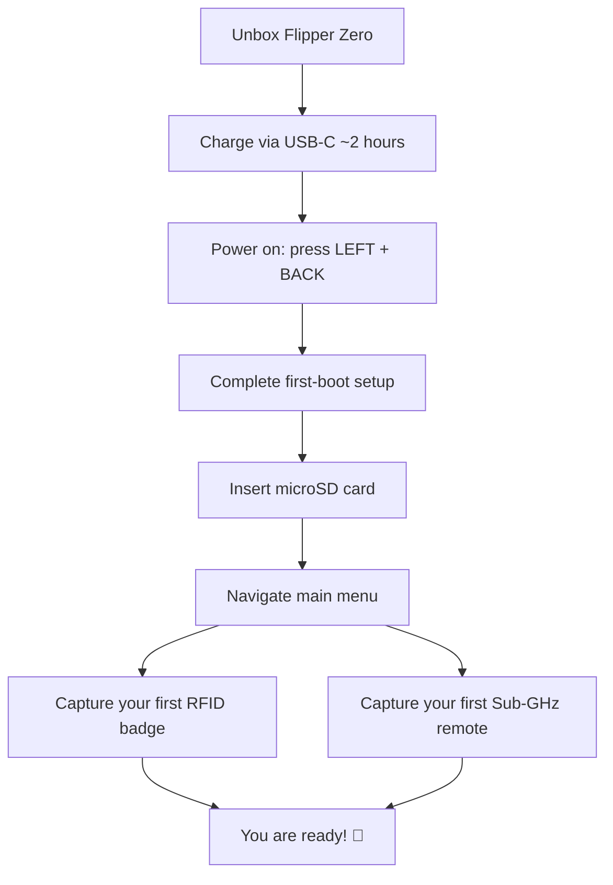

# Flipper Zero 快速入門

> **學習目標**：完成本指南後，你將已為 Flipper Zero 充電、首次開機、插入 microSD 卡、瀏覽主選單，並擷取你的第一張 RFID 門禁卡與第一個 Sub-GHz 遙控器。
>
> **適用物件**：完全的新手。不需要焊接，也不需要電腦——Flipper Zero 完全自主運作。

你的 Flipper Zero 出廠時已預先安裝韌體，電池也已有部分電量。讓我們把它從盒子裡拿出來，開始與世界互動。



## 包裝內容

| 專案 | 用途 |
|---|---|
| Flipper Zero 裝置 | 多功能工具本體 |
| USB Type-C 傳輸線 | 充電與連線電腦 |
| 塑膠保護膜（可撕除） | 運送期間保護螢幕 |

你還會需要一張 **microSD 卡（建議 2–32 GB）**——裝置會將擷取的鑰匙、IR 資料庫與應用程式儲存在上面。Flipper Zero 支援 FAT12、FAT16、FAT32 與 exFAT 格式、最高 256 GB 的卡片，但為了可靠性（SPI 模式）建議使用 2–32 GB 的卡片。

## 步驟 1：充電

將 USB-C 傳輸線插入 Flipper Zero 與任何 USB 電源（筆電、手機充電器、行動電源）。

- 螢幕右上角的電池圖示會顯示電量。
- 完全充飽約需 **2 小時**，待機狀態下電池可持續 **長達 28 天**（LiPo 2100 mAh）。
- 充電會在 100% 時自動停止——整夜插著充電是安全的。

> **小訣竅**：充電時 Flipper 仍可使用，但使用電池供電時無線傳輸距離最佳。

## 步驟 2：開機

同時按下 **LEFT + BACK** 即可開機。會播放賽博海豚（cyber-dolphin）標誌動畫，接著出現主選單。

| 動作 | 按鍵組合 |
|---|---|
| 開機 | LEFT + BACK |
| 關機 | LEFT + BACK（長按 2 秒，確認） |
| 瀏覽 | 方向鍵（UP / DOWN / LEFT / RIGHT） |
| 選擇／進入 | OK（中央按鍵） |
| 返回 | BACK |

如果沒有任何反應，電池可能已完全耗盡——插入 USB-C 並等待 5 分鐘後再試一次。

## 步驟 3：首次開機設定

首次開機時，Flipper Zero 會引導你完成一段簡短設定：

1. **選擇你的地區** — 這會設定啟用的 Sub-GHz 頻段（依地區為 315、433、868 或 915 MHz）。
2. **啟用藍芽** — 選用但建議開啟；之後使用[手機應用程式](/flipper-zero/mobile-app/)時需要。
3. **進行韌體更新檢查** — 你可以立即更新或略過（請參閱[韌體與 qFlipper](/flipper-zero/firmware-qflipper/)）。我們建議在開始把玩之前先更新。

## 步驟 4：插入 microSD 卡

1. 檢視裝置底部邊緣——microSD 插槽位於 USB-C 連線埠旁。
2. 將卡片推入直到發出卡嗒聲（**推入式機構**——卡片會卡入定位）。
3. 重新啟動裝置（LEFT + BACK → 關機 → 開機）。

你可以確認卡片已被辨識：**主選單 → 設定 → 儲存空間**。你應該會看到卡片容量與可用空間，而不是 `SD card: not present`。

> **如果我略過 microSD 卡會怎樣？** 內部快閃記憶體（1 MB）很快就會裝滿——擷取的訊號、IR 編碼與安裝的應用程式都需要儲存空間。強烈建議使用卡片。

## 步驟 5：瀏覽主選單

主選單是垂直清單。使用 **UP / DOWN** 捲動、**OK** 進入、**BACK** 返回。

| 選單專案 | 功能 |
|---|---|
| Sub-GHz | 讀取並重播 300–928 MHz 訊號（遙控器、感測器） |
| NFC | 讀取／寫入／模擬 13.56 MHz 卡片 |
| RFID | 讀取／模擬 125 kHz 感應卡 |
| Infrared | 學習並重播 IR 遙控器訊號 |
| iButton | 讀取／模擬 1-Wire 接觸鑰匙 |
| Bad USB | 充當 USB 鍵盤並輸入指令碼（HID 攻擊） |
| GPIO | 與 2.54 mm 排針互動 |
| Bluetooth | 切換 BLE 並檢視已配對裝置 |
| Settings | 地區、顯示、儲存空間、關於、韌體版本 |
| Apps | 社群與內建應用程式（Weather Station 等） |

## 步驟 6：擷取你的第一張 RFID 門禁卡

讓我們實際擷取一次——這是 Flipper Zero 的「hello world」。

1. 前往 **主選單 → RFID**。
2. 選擇 **Read**（它會讀取 125 kHz 卡片）。
3. 將測試門禁卡平放在 **Flipper Zero 的頂部邊緣**（RFID 天線位於該處，靠近 iButton 彈簧探針）。
4. 觀察螢幕——讀取成功時，你會看到卡片型別與 ID 出現，例如：

```text
EM4100
Key: 04 00 45 23 12
```

5. 按下 **OK → Save**。為它命名，例如 `test-badge`。

現在你可以模擬它：**RFID → Saved → 選擇你的門禁卡 → Emulate**。將 Flipper Zero 放在你平常放卡片的位置。讀卡機會把你的 Flipper 視為那張門禁卡。

> ⚠️ **只在你擁有或已獲授權測試的卡片與門上測試。** 複製你不擁有的門禁卡在大多數司法管轄區是違法的。

## 步驟 7：擷取你的第一個 Sub-GHz 遙控器

將 Flipper Zero 對準你擁有的 Sub-GHz 遙控器（車庫門、無線門鈴、汽車鑰匙遙控器——**只用自己的裝置測試**）。

1. 前往 **主選單 → Sub-GHz**。
2. 按下 **OK → Read**（原始訊號擷取模式）。
3. 將遙控器對準 Flipper Zero（天線在頂部）並按下遙控器的按鈕。
4. 螢幕會顯示偵測到的頻率與調變方式，例如：

```text
433.92 MHz, AM650
```

5. 按下 **OK → Save** 並命名為 `my-remote`。

之後要重播：**Sub-GHz → Saved → 選擇 → Send**。Flipper Zero 會傳送擷取的訊號。

> **為什麼我的頻率不同？** 地區有影響：歐洲使用 868 MHz、美國使用 915 MHz，而許多遙控器在全球使用 433.92 MHz。如果你的遙控器顯示的頻率不在你地區啟用的頻段內，請參閱[疑難排解](/flipper-zero/troubleshooting/)。

## 你準備好了 🎉

接下來你可以探索：

- **[韌體與 qFlipper](/flipper-zero/firmware-qflipper/)** — 讓裝置保持最新狀態，並在出問題時復原。
- **[手機應用程式](/flipper-zero/mobile-app/)** — 從手機遠端控制與同步。
- **[Flipper Zero 產品頁面](/flipper-zero/products/flipper-zero/)** — 完整規格表、GPIO 接腳定義與進階用法。
- **[WiFi Devboard](/flipper-zero/products/wifi-devboard/)** — 把 Flipper 變成 WiFi 滲透測試工具。
- **[Video Game Module](/flipper-zero/products/video-game-module/)** — 懷舊遊戲與電視映象。

## 常見錯誤

| 錯誤 | 症狀 | 修正 |
|---|---|---|
| 忘記插入 microSD | 設定中顯示「SD card: not present」 | 插入卡片，重新啟動 |
| 地區限制太嚴格 | 收不到 433 MHz 遙控器 | 在設定中變更地區（或使用支援的 868/915 頻段） |
| RFID 門禁卡放錯位置 | 沒有讀取，螢幕保持空白 | 沿著頂部邊緣滑動門禁卡直到卡入 |
| 首次開機時電池耗盡 | 無法開機 | 插入 USB-C，等待 5 分鐘，再試一次 |