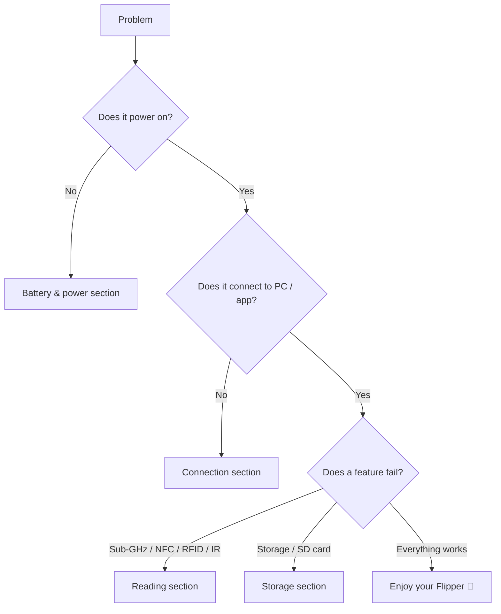

# Flipper Zero 疑難排解

> **除錯鐵律（Rule of thumb）**：先硬體 → 再韌體／驅動程式 → 最後設定。以 Flipper Zero 來說：**電池與傳輸線 → 韌體版本 → 組態（地區、藍芽、SD 卡）**。

這個頁面是決策樹索引。找到你的症狀，跳到該章節，並依序遵循診斷步驟。



## 問題索引

| 類別 | 症狀 | 前往 |
|---|---|---|
| 電源 | 無法開機、無法充電、耗電快 | [電池與電源](#battery--power) |
| 連線 | qFlipper 找不到裝置、應用程式無法配對 | [USB 與藍芽](#usb--bluetooth) |
| 讀取 | 無法擷取 Sub-GHz、NFC/RFID 無法讀取 | [Sub-GHz 與卡片](#sub-ghz--cards) |
| 儲存空間 | 偵測不到 SD 卡、「no storage」 | [儲存空間與 microSD](#storage--microsd) |
| 韌體 | 更新失敗、裝置卡在標誌畫面 | [韌體與復原](#firmware--recovery) |

## 電池與電源

### Q1：裝置無法開機

**診斷** — 嘗試充電：

1. 將 USB-C 連線到已知良好的充電器，持續 **10 分鐘以上**。
2. 按下 **LEFT + BACK**。
3. 如果螢幕仍然全黑，電池可能已完全耗盡（安全模式）——長時間存放後這是正常的。

**根本原因**：鋰聚合物電池保護電路在深度放電時會進入低電壓狀態。

**修正**：讓它充電（LED 保持亮起）最多一小時；一旦電芯電壓高於門檻，它就會正常開機。如果充電 2 小時後仍無法開機，電池或充電 IC 可能有問題——請參閱[還是卡住？](#still-stuck)。

### Q2：充電很慢或完全無法充電

**診斷**：

```text
Charge LED: OFF → ORANGE (charging) → GREEN (full)
```

| 症狀 | 原因 | 修正 |
|---|---|---|
| 完全沒有 LED | 傳輸線／連線埠／充電器故障 | 嘗試另一條 USB-C 資料傳輸線與 5V 充電器 |
| 充電非常慢 | 設計上充電限制在約 1A 上限 | 使用任何良好的 5V/2A 充電器；充飽時間約 2 小時 |
| 停在某個百分比 | 電芯不平衡或電池老化 | 在較涼爽的房間充電；若持續發生，聯絡支援 |

## USB 與藍芽

### Q3：qFlipper 顯示「no device found」

**診斷** — 在 Linux 上，檢查 USB 匯流排：

```bash
lsusb
```

**預期輸出**（Flipper Zero 已連線並確認）：

```text
Bus 001 Device 004: ID 0483:5740 STMicroelectronics Flipper Zero
```

| 症狀 | 原因 | 修正 |
|---|---|---|
| `lsusb` 什麼都沒顯示 | 僅充電的傳輸線 | 使用支援資料傳輸的 USB-C 傳輸線 |
| `lsusb` 看得到，qFlipper 看不到 | 未在 Flipper 上確認 USB 提示 | 在 Flipper 被詢問時選擇 **Connect**；重新插拔 |
| qFlipper 看得到但卡住 | qFlipper 版本過舊 | 從 [flipper.net/pages/downloads](https://flipper.net/pages/downloads) 更新 qFlipper |
| Windows 可用、Linux 不行 | 缺少 udev 規則 | 參閱 qFlipper Linux 安裝說明／AppImage |

### Q4：手機應用程式無法透過藍芽配對

**診斷** — 在 Flipper Zero 上：**主選單 → Bluetooth** 必須顯示 **ON**。

| 症狀 | 原因 | 修正 |
|---|---|---|
| 應用程式找不到裝置 | BLE 關閉／距離太遠 | 在 Flipper 上啟用 BLE，讓手機保持在 1–2 公尺內 |
| PIN 碼不符 | 過期的配對 | 在應用程式與手機藍芽設定中取消配對，重新啟動兩者，重新配對 |
| 配對成功但同步卡住 | 應用程式太舊，無法搭配新韌體 | 更新應用程式；參閱[手機應用程式指南](/flipper-zero/mobile-app/) |
| 重新開機後才能連線 | BLE 堆疊卡住 | 重新啟動 Flipper（LEFT + BACK → 關機 → 開機） |

## Sub-GHz 與卡片

### Q5：Sub-GHz 無法擷取遙控器

**診斷** — 檢查 Flipper 看到了什麼：

1. **Sub-GHz → Read**。
2. 將遙控器對準 **Flipper Zero 的頂部**（天線位於頂部邊緣）。
3. 觀察螢幕右上角——訊號強度計有在移動嗎？

| 症狀 | 原因 | 修正 |
|---|---|---|
| 強度計有訊號但無法解碼 | 未知協定或訊號太弱 | 靠近一點（範圍可達約 50 公尺，但近距離讀取最強）；按住遙控器按鈕再試一次 |
| 完全沒有訊號 | 頻段不符合你的地區 | 地區必須允許遙控器的頻率（315/433/868/915 MHz）。在 **設定 → 地區** 中變更地區（在法規允許下） |
| 擷取成功但重播沒反應 | 訊號重播的時機不對 | 有些遙控器使用滾動碼——原始訊號使用過後就無法重播。這不是故障 |
| 只聽到雜訊 | 幹擾 | 遠離 Wi-Fi 路由器／其他發射器 |

> ⚠️ 重播你不擁有的訊號可能違法。只在你自己的裝置上測試。

### Q6：NFC / RFID 無法讀取卡片

**診斷**：

1. **NFC**（13.56 MHz）：將卡片放在裝置的**背面中央偏上**，平放。
2. **RFID**（125 kHz）：沿著**頂部邊緣**滑動卡片。

| 症狀 | 原因 | 修正 |
|---|---|---|
| 「No card detected」 | 天線位置錯誤／卡片型別不符 | 將卡片旋轉 90°，試試兩面；有些卡片需要一點時間耦合 |
| 有些卡片讀得到、有些不行 | 卡片型別不受支援（例如需要驗證的加密 DESFire） | 在[產品頁面](/flipper-zero/products/flipper-zero/)檢視支援清單；沒有鑰匙就無法讀取加密卡片 |
| 讀得到但無法模擬 | 模擬範圍設計上就很短 | 模擬天線很小——將 Flipper 緊貼讀卡機 |

## 儲存空間與 microSD

### Q7：「SD card: not present」或儲存失敗

**診斷** — **主選單 → 設定 → 儲存空間**：

| 症狀 | 原因 | 修正 |
|---|---|---|
| 「not present」 | 卡片未完全推入 | 推到發出卡嗒聲（推入式插槽），然後重新啟動 |
| 偵測到卡片但無法儲存檔案 | 檔案系統錯誤或卡片損壞 | 重新格式化為 FAT32（或 exFAT）；請參閱下方 |
| 「Storage full」 | 1 MB 內部快閃記憶體已耗盡 | 使用 microSD 卡（建議 2–32 GB） |

**從 Linux 重新格式化**（將 `/dev/sdX` 換成你的卡片裝置——務必用 `lsblk` 再次確認！）：

```bash
sudo mkfs.vfat -F 32 /dev/sdX
```

**預期輸出**：

```text
mkfs.fat 4.2 (2021-01-31)
```

> ⚠️ 格式化會清除卡片。請先備份。絕對不要把 `mkfs` 指向你的作業系統磁碟——執行前務必用 `lsblk` 確認裝置名稱。

## 韌體與復原

### Q8：更新失敗，或裝置卡在開機標誌

**診斷** — 判斷裝置是否還活著：

1. 按住 **DOWN** 同時按下 **LEFT + BACK** → 應該會出現**開機選單**。
2. 如果會，表示開機載入器完好——復原很簡單。

**修正**：


如果連開機選單都不出現：讓它充電 1 小時，然後重試。如果還是沒反應，韌體儲存空間可能已損壞——這種情況很少見，需要[尋求支援](#still-stuck)。

## 還是卡住？

如果以上方法都無法解決，請在[官方支援入口網站](https://support.flipper.net)開啟工單。為了快速獲得回覆，請準備：

- 韌體版本（**設定 → 關於**）與應用程式版本
- 作業系統／手機型號與 qFlipper 版本
- 故障前你做了什麼（更新？自訂韌體？摔到？）
- 如果是 USB 問題，提供 `lsusb` / `dmesg` 輸出（在 Linux 上）

## 相關

- [Flipper Zero 快速入門](/flipper-zero/quickstart/)
- [韌體與 qFlipper](/flipper-zero/firmware-qflipper/)
- [Flipper 手機應用程式指南](/flipper-zero/mobile-app/)
- [官方資源](/flipper-zero/official-resources/)