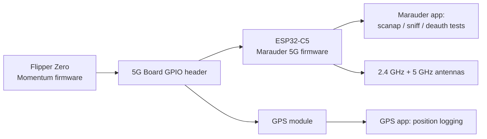
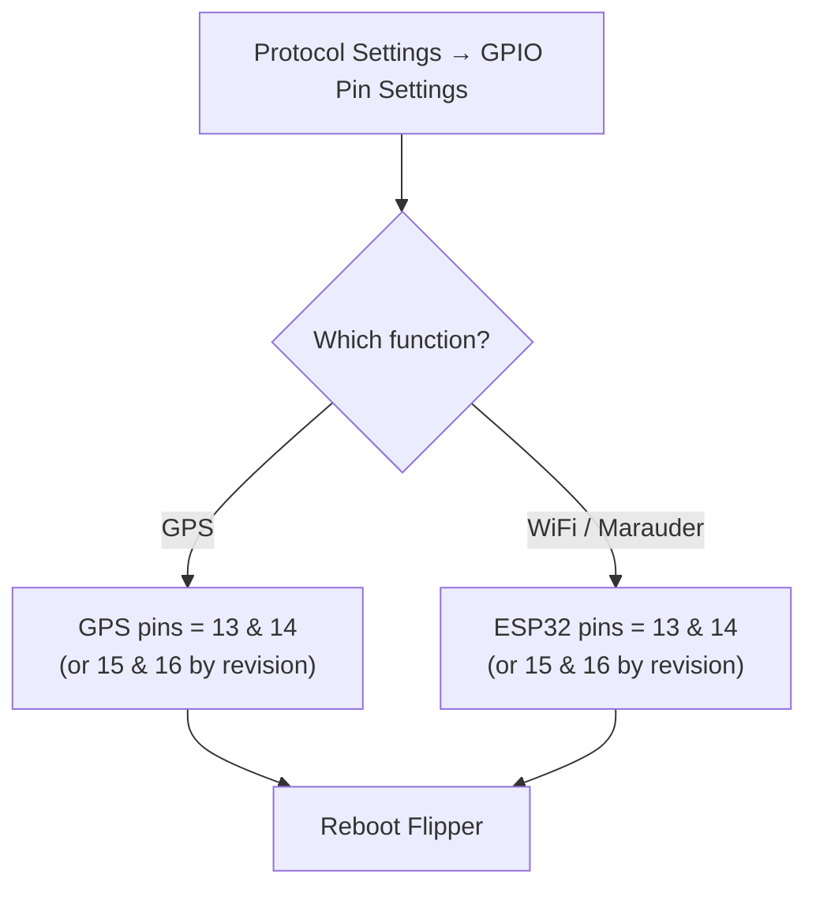

# Flipper Zero 5G 擴充板 — 完整指南

> **一句話總結**：5G 擴充板把雙頻 **2.4 GHz + 5 GHz WiFi** 工具裝上你的 Flipper Zero——一顆執行 Marauder 韌體的 ESP32-C5，加上 GPS 接收器與板載電池，全部整合在一個小巧的模組裡。

## 規格一覽

| 專案 | 規格 |
|---|---|
| WiFi 模組 | ESP32-C5（2.4 GHz + 5 GHz），預先燒錄 Marauder 5G 韌體 |
| GPS | 板載 GPS 模組，自動切換電源（接上時用 Flipper 電源，分離時用電池電源） |
| 電池 | 800 mAh，板上附充電指示燈 |
| 保護 | 每個訊號腳位都有 TVS 二極體 |
| 天線 | WiFi 3 dBi 雙頻（11 cm）、GPS 20 dBi、SMA 內針聯結器 |
| 燒錄 | USB-C 連線埠（左前方）；按住右後方的按鈕，再插入 USB 進入燒錄模式 |
| 控制 | Flipper Zero 應用程式：WiFi Marauder、GPS |

## 這塊板子要做什麼

ESP32-C5 是 WiFi 主力：搭配 **Marauder 韌體**，它可以掃描存取點與使用者端、嗅探 beacon 與 probe request、執行 deauth 與 PMKID 擷取測試，並記錄 WiFi 活動——現在還包括舊款 ESP32 板子看不到的 **5 GHz** 網路。GPS 模組把你的 war driving 工作階段變成有座標的資料，而小電池讓 WiFi 那一側不必耗盡 Flipper 的電力。

> **請在自己的網路與裝置上使用。** Deauth 攻擊與 probe 嗅探會干擾他人，且在大多數國家受到管制——這是實驗室／教學工具。



## 開始之前

- Flipper 需要包含 Marauder 與 GPS 應用程式的**自訂韌體**——**Momentum**、**Unleashed** 或 **Xtreme**。（韌體基礎請見 [Flipper Zero 專區](/flipper-zero/)。）
- 依廠商快速入門的說明把模組安裝到 Flipper 上（有些版本包含 433 MHz sub-GHz 模組和／或 2.8 吋 Marauder 螢幕——請閱讀你主機板的說明）。

## 設定：GPIO 腳位（Momentum 韌體）

在 **Momentum** 上：

1. 開啟 `Protocol Settings → GPIO Pin Settings`。
2. 把 **GPS 腳位**設為 `13` 與 `14`（UART 腳位；有些主機板版本用 15/16——請查閱廠商快速入門）。
3. 把 **ESP32 / ESP8266 腳位**設為 `13` 與 `14`（或依主機板版本用 15/16）——這是與 ESP32-C5 通訊的 UART。
4. 離開設定並重新開機 Flipper。



## 使用這塊板子

### WiFi Marauder

1. 接上板子後，開啟 `Apps → GPIO → [ESP32] WiFi Marauder`。
2. 執行 **Scan AP**：附近的存取點會連同 SSID、頻道、RSSI 與加密方式一起出現。
3. 執行 **Scan PSD**（封包嗅探）觀察 beacon／probe 流量。
4. **頻道跳躍**與**war driving**（搭配 GPS）會產生可匯出的日誌。

執行 `scanap` 後預期的第一個畫面：

```
SSID              CH  RSSI  ENC  AUTH
yupitek-lab       6   -55   WPA2 PSK
Campus_Guest      11  -72   OPEN
...
```

### GPS

1. 接上 GPS 天線，朝天空方向（靠近窗戶也可以；戶外更好）。
2. 開啟 `Apps → GPIO → GPS`。等待——首次定位可能需要幾分鐘。
3. 取得衛星後，位置資料就會流入。搭配 Marauder，你就能得到帶座標的 WiFi 日誌。

## 更新 ESP32-C5 韌體

1. 進入燒錄模式：按住右後方的按鈕，然後插入 USB-C 纜線。
2. 用你偏好的工具燒錄 Marauder 5G（廠商指示 / ESP 燒錄器 / FZEasyMarauderFlash 風格的 ESP32 工具）。
3. 拔掉、重新開機 Flipper、重新開啟 Marauder 應用程式。

## 疑難排解

| 問題 | 原因 | 修正 |
|---|---|---|
| 應用程式顯示「no module」 | GPIO 腳位未設定 | 重新檢查 `GPIO Pin Settings`；重新開機 Flipper |
| GPS 一直無法定位 | 天線沒接／在室內 | 接上 GPS 天線，靠近窗戶／到戶外，等 3–5 分鐘 |
| Marauder 掃不到東西 | ESP UART 的腳位設錯 | 依主機板版本設定 ESP32 腳位；重新開機 |
| 板子會充電但 Flipper 看不到 | Flipper 韌體缺少該應用程式 | 安裝 Momentum/Unleashed/Xtreme |
| 5 GHz 網路看不到 | 是 ESP32（非 C5）韌體 | 確認主機板執行 ESP32-C5 韌體（支援 5 GHz） |

更多協助：[SDRLAB 疑難排解中心](/sdrlab/troubleshooting/)。

## 相關

- [WiFi multiboard（ESP8266）](/sdrlab/expansion/wifi-multiboard/) — 僅 2.4 GHz 的小老弟。
- [NRF24 模組](/sdrlab/expansion/nrf24/) — 2.4 GHz 封包無線電嗅探。
- [Flipper Zero 專區](/flipper-zero/) — 基礎韌體與裝置基礎知識。