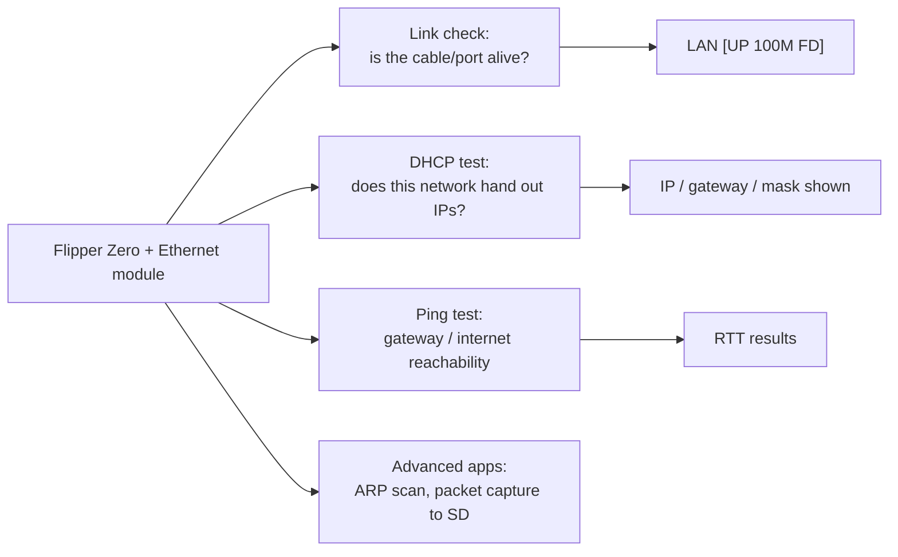

# Flipper Zero 乙太網路測試模組 — 完整指南

> **一句話總結**：乙太網路測試模組把**10/100 乙太網路連接埠裝上你的 Flipper Zero**——一顆內建 TCP/IP 協定堆疊的 WIZnet W5500——把 Flipper 變成口袋型 LAN 測試器，用於纜線檢查、DHCP 驗證與 ping 測試。

## 規格一覽

| 項目 | 規格 |
|---|---|
| 控制器 | WIZnet W5500（硬體 TCP/IP 協定堆疊） |
| 乙太網路 | 10/100 Mbps，內建 MAC + PHY，自動協商（全／半雙工） |
| 協定 | TCP、UDP、ICMP、IPv4、ARP、IGMP、PPPoE；透過 UDP 的 Wake-on-LAN |
| Socket | 8 個獨立 |
| 緩衝區 | 32 KB 內部 TX/RX 記憶體 |
| 介面 | SPI（最高 80 MHz） |
| 電壓 | 3.3 V 操作，I/O 可承受 5 V |
| 連接器 | RJ45，附 link/activity LED |
| 電源 | 來自 Flipper GPIO（3.3 V / OTG） |

## 你能用它做什麼



對大學網路實驗室來說這是寶物：在向 IT 抱怨之前先驗證牆上的插座、幾秒內證明纜線壞了、在真實網路上示範 DHCP 行為——全部從口袋裡完成。

## 與 Flipper 的接線

典型的 W5500 模組（W5500 Lite）接線：

| W5500 模組 | Flipper GPIO（腳位） |
|---|---|
| MOSI (MO) | A7（腳位 2） |
| SCLK (SCK) | B3（腳位 5） |
| CS (nSS) | A4（腳位 4） |
| MISO (MI) | A6（腳位 3） |
| RESET (RST) | C3（腳位 7） |
| 3V3 (VCC) | 3V3（腳位 9） |
| GND (G) | GND（腳位 8 或 11） |

> 現成的「Flipper Zero 用 W5500 乙太網路模組」板子（RJ45 + 分接點）也有販售；它們仍暴露相同的 SPI 訊號——請把絲印與上表對照確認。

## 設定

### 1. 安裝應用程式

乙太網路應用程式在**原廠與自訂韌體**上都能執行。安裝方式：

- **網頁目錄**（瀏覽器 + WebUSB）：在 Chromium 瀏覽器中開啟 Flipper 應用程式目錄，連接 Flipper，按安裝。搜尋「W5500」或「Ethernet」。
- **手機應用程式**：Flipper 手機應用程式 → 應用程式目錄 → GPIO → W5500 Ethernet。

### 2. 連接所有東西

1. 依上表把模組接到 Flipper GPIO。
2. 把乙太網路纜線插入模組的 RJ45。
3. 另一端插入交換器／路由器／電腦連接埠。

### 3. 第一次測試

1. 啟動 **Ethernet** 應用程式（`Apps → GPIO`）。
2. 檢查標題：`LAN [UP 100M FD]` 代表連線已建立。
3. 按 **DHCP**——應用程式會要求位址並顯示：

```
IP:      192.168.1.162
MASK:    255.255.255.0
GW:      192.168.1.1
```

4. 按 **Ping** 並以閘道（或 `8.8.8.8`）為目標：回覆附帶延遲，確認端到端連線。

## 疑難排解

| 問題 | 原因 | 修正 |
|---|---|---|
| 沒有連線燈 | 纜線／連接埠／接線不良 | 換一條纜線與連接埠；重新檢查 SPI 接線（尤其 CS + RESET） |
| `LAN [DOWN]` | 模組未初始化 | 確認 3V3 與 GND；重新執行應用程式；重新開機 Flipper |
| DHCP 逾時 | 網路沒有 DHCP／纜線故障 | 先檢查連線；試試靜態 IP；到別處測試纜線 |
| 應用程式不見 | 未安裝 | 透過網頁或手機應用程式目錄安裝 |
| 只有 10 Mbps | 某些交換器的自動協商怪癖 | 換一個交換器連接埠；模組設計上就是 10/100 |

更多協助：[SDRLAB 疑難排解中心](/sdrlab/troubleshooting/)。

## 相關

- [WiFi multiboard](/sdrlab/expansion/wifi-multiboard/) — 無線網路工具。
- [NRF24 模組](/sdrlab/expansion/nrf24/) — 2.4 GHz 封包無線電。
- [Flipper Zero 專區](/flipper-zero/) — 基礎裝置與韌體。