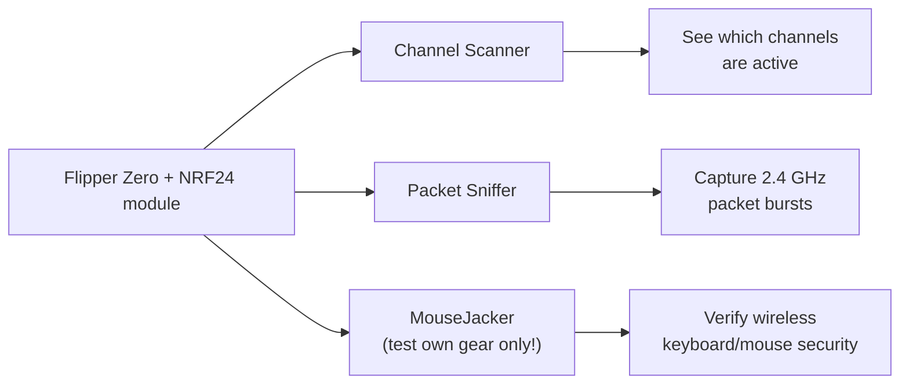

# Flipper Zero NRF24 模組 — 完整指南

> **一句話總結**：NRF24 模組為你的 Flipper Zero 加上**2.4 GHz 封包無線電**——以無所不在的 Nordic nRF24L01+ 晶片為核心——讓你能掃描 2.4 GHz 頻段、嗅探無線鍵盤／滑鼠流量，並測試你自己裝置的安全性。

## 規格一覽

| 項目 | 規格 |
|---|---|
| 無線電晶片 | Nordic nRF24L01+（2.4 GHz ISM 頻段） |
| 頻率範圍 | 2.400 – 2.525 GHz（126 個頻道，間距 1 MHz） |
| 調變 | GFSK |
| 資料速率 | 250 kbps、1 Mbps、2 Mbps |
| 介面 | SPI（完全由 Flipper 應用程式控制） |
| 天線 | 外部 SMA（配備 PA/LNA 的模組範圍好得多） |
| 電源 | 來自 Flipper GPIO（3.3 V） |
| 額外無線電 | 有些板子把 NRF24 與 CC1101（sub-GHz）整合在同一模組上 |

## 你能用它做什麼

- **頻道掃描器**：126 個頻道中有哪些在忙碌——有助於找出裝置在哪裡跳頻。
- **嗅探器**：觀察實驗室中 2.4 GHz 裝置（無線滑鼠、鍵盤、無人機、遊戲手把）的封包突發訊號。
- **MouseJack 測試**：知名的 nRF24「MouseJack」技術鎖定*未加密*的無線鍵盤／滑鼠。請嚴格只用在自己擁有的設備上，用來示範為什麼未加密的輸入裝置有風險。

> **法律與道德注意事項**：在非你所有的裝置上嗅探與注入封包，在大多數司法管轄區是違法的。這個模組是安全教育工具——測試你自己的設備，或你獲得書面許可測試的設備。

## 設定

### 1. 韌體與應用程式

NRF24 應用程式**不在**原廠 Flipper 韌體中。請安裝內建它們的自訂韌體——**Momentum**、**Unleashed** 或 **Xtreme**（見 [Flipper Zero 專區](/flipper-zero/)）。

### 2. GPIO 腳位（如需要）

大多數現成的 NRF24 模組已預先接好線，不需要改腳位——直接插上即可。如果你的板子有可設定腳位，請在 `Protocol Settings → GPIO Pin Settings` 設定 **NRF24 SPI 腳位**（SPI 預設值通常就夠用）。在多無線電板子上，請確認 NRF24 無線電是選取／啟用的那一個（有 dip 開關或按鈕就切到它）。

### 3. 第一次測試 — 頻道掃描

1. 接上天線。
2. 開啟 `Apps → GPIO → [NRF24] Channel Scanner`。
3. 移動無線滑鼠或反覆按無線鍵盤的按鍵。
4. 觀察頻道亮起——裝置發射的地方會出現突發訊號。

預期行為：使用中的頻道出現活動高峰；跳頻的滑鼠會顯示突發訊號在頻道間跳動。

## 使用嗅探器

1. 開啟 `Apps → GPIO → [NRF24] Sniffer`。
2. 先把**速率**設為 2 Mbps（大多數裝置），什麼都看不到再試 1 Mbps / 250 kbps。
3. 把位址設為目標（滑鼠上通常是 6 位元組位址；應用程式會顯示設定選項）。
4. 按 OK 按鈕切換嗅探。裝置發射時，位址與封包計數開始跳動。

## 疑難排解

| 問題 | 原因 | 修正 |
|---|---|---|
| 掃描器什麼都沒顯示 | 天線遺失／裝置閒置 | 接上 SMA 天線；移動／搖晃無線裝置 |
| 只有雜訊／沒有突發訊號 | 資料速率錯誤 | 試 2 Mbps → 1 Mbps → 250 kbps |
| 應用程式不見 | 原廠韌體 | 安裝 Momentum/Unleashed/Xtreme |
| 「No module」錯誤 | 腳位設定或 dip 開關 | 檢查 GPIO 腳位設定／模組開關；重新開機 Flipper |
| 範圍很小 | 沒有 PA/LNA 的模組 | 接受短範圍，或改用 PA/LNA 模組 |

更多協助：[SDRLAB 疑難排解中心](/sdrlab/troubleshooting/)。

## 相關

- [5G 擴充板](/sdrlab/expansion/5g-board/) — 2.4/5 GHz WiFi + GPS 板。
- [WiFi multiboard](/sdrlab/expansion/wifi-multiboard/) — ESP8266 WiFi 工具。
- [Flipper Zero 專區](/flipper-zero/) — 韌體與裝置基礎知識。