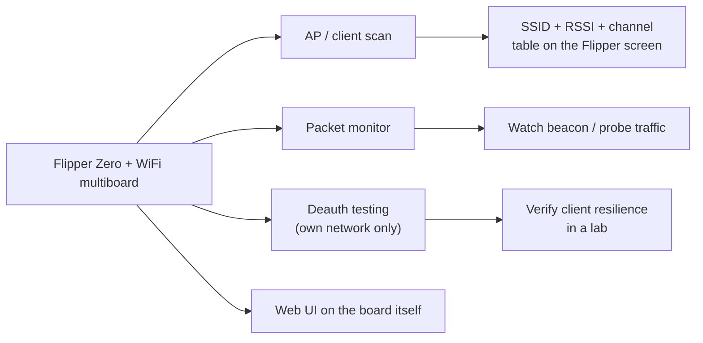

# Flipper Zero WiFi Multiboard（ESP8266）— 完整指南

> **一句話總結**：WiFi multiboard 是**以 ESP8266 驅動、給 Flipper Zero 用的 WiFi 工具**——通常預先燒錄 ESP8266 Deauther 韌體——提供 AP 掃描、封包監控與（在你自己的網路上）deauth 測試，還有一個可從任何瀏覽器控制的獨立網頁介面。

## 規格一覽

| 項目 | 規格 |
|---|---|
| WiFi 晶片 | Espressif ESP8266（2.4 GHz、802.11 b/g/n） |
| 韌體（典型） | ESP8266 Deauther v2（Spacehuhn）或 ESP8266 Marauder 移植版 |
| 頻段 | 僅 2.4 GHz（沒有 5 GHz） |
| 介面 | UART 序列連到 Flipper GPIO（TX/RX） |
| 電源 | 來自 Flipper GPIO（3.3 V） |
| 額外配件（依板子而定） | 第二個無線電模組（NRF24 / CC1101）的插槽、無線電選擇用 dip 開關 |
| 網頁介面 | AP 模式在 `192.168.4.1`（預設 SSID `pwned`、密碼 `deauther`） |

## 你能用它做什麼



ESP8266 Deauther 是經典的口袋工具：掃描網路、挑選目標、執行攻擊模式（deauth、beacon 轟炸）——以 Flipper 作為控制介面。因為 ESP8266 也暴露自己的**存取點**，你可以從手機瀏覽器在 `http://192.168.4.1` 操作一切——Flipper 螢幕可有可無。

> **請在你擁有或明確獲得許可測試的網路上使用。** Deauth 攻擊會主動干擾他人的連線；在非你控制的網路上使用，在大多數地方是違法的。這個工具在大學實驗室的重點，是學習*為什麼*未受保護的 WiFi 會失效，以及如何防禦它。

## 設定

### 1. Flipper 上的韌體

安裝自訂韌體（**Momentum**、**Unleashed**、**Xtreme**），讓 WiFi deauther/Marauder 應用程式可用——見 [Flipper Zero 專區](/flipper-zero/)。

### 2. 燒錄 ESP8266（僅第一次）

大多數板子出廠時已預先燒錄 Deauther。要（重新）燒錄：

1. 依廠商指示讓板子進入燒錄模式（通常是在供電時按某個按鈕）。
2. 透過 USB/UART 連接（或使用 Flipper 自己的燒錄應用程式）。
3. 燒錄 **ESP8266 Deauther v2** 二進位檔——原始碼與預先建置的檔案：[SpacehuhnTech/esp8266_deauther](https://github.com/SpacehuhnTech/esp8266_deauther)。

### 3. 接線／安裝到 Flipper

| ESP8266 | Flipper GPIO |
|---|---|
| TX0 | 14 或 16（RX 腳位） |
| RX0 | 13 或 15（TX 腳位） |
| VIN | 1（5V）或 9（3.3 V） |
| GND | 8 或 11（GND） |

> 在多無線電板子上，使用前先把 dip 開關切到 WiFi/ESP8266 位置。

### 4. 第一次執行 — 掃描

1. 插上板子，開啟 `Apps → WiFi → WiFi Deauther`。
2. 等待啟動掃描完成（藍色 LED 熄滅）。
3. 附近 AP 的清單出現：SSID、頻道、RSSI。

預期的應用程式畫面：

```
#  SSID            CH  RSSI
1  yupitek-lab     6   -55
2  Library_Guest   1   -78
...
```

## 使用網頁介面

1. 在手機／電腦上加入 WiFi 網路 `pwned`（密碼 `deauther`）。
2. 瀏覽 `http://192.168.4.1`。
3. 完整的 Deauther 介面載入：掃描、選取目標、設定攻擊、儲存設定。
4. 小技巧：只把 Flipper 用於序列控制時，可以停用網頁介面（`set webinterface false`、儲存、重新開機）來隱藏 `pwned` AP。

## 疑難排解

| 問題 | 原因 | 修正 |
|---|---|---|
| 網頁介面連不上 | 用戶端加入了另一個網路 | 停用自動加入／行動數據；加入 `pwned`；瀏覽 `192.168.4.1` |
| 應用程式在啟動時卡住 | 啟動掃描被中斷 | 觸碰控制前先等藍色 LED 熄滅 |
| 沒有列出任何網路 | dip 開關／腳位錯誤 | 把開關切到 WiFi；重新檢查 TX/RX 接線 |
| 板子未被偵測 | UART 腳位錯誤 | 使用腳位 13/15（TX）與 14/16（RX） |
| 訊號弱或沒有 | 2.4 GHz 天線方向 | 接上／對準 SMA 天線 |

更多協助：[SDRLAB 疑難排解中心](/sdrlab/troubleshooting/)。

## 相關

- [5G 擴充板](/sdrlab/expansion/5g-board/) — 2.4/5 GHz Marauder，含 GPS。
- [NRF24 模組](/sdrlab/expansion/nrf24/) — 2.4 GHz 封包無線電嗅探。
- [Flipper Zero 專區](/flipper-zero/) — 韌體基礎知識。