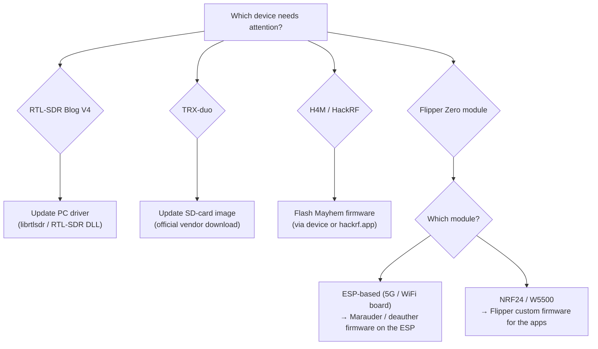
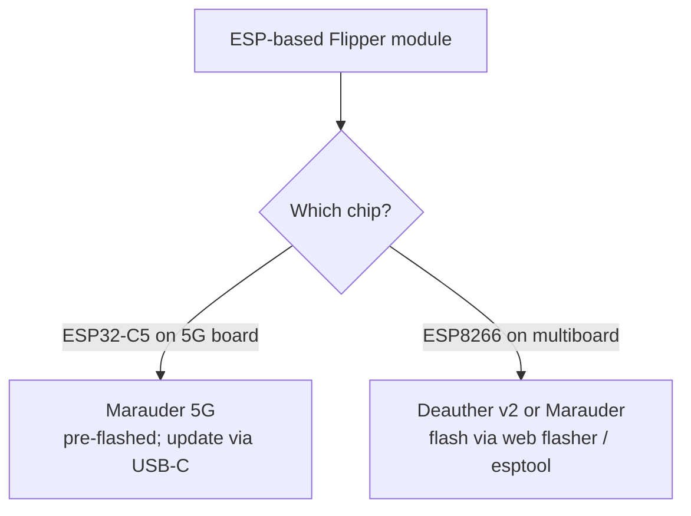

# 韌體與驅動程式 — 讓 SDRLAB 硬體保持最新

> **學習目標**：你將了解每台 SDRLAB 裝置執行的是哪個「大腦」，並能安全地更新它——或至少確切知道官方更新在哪裡。
> **適用對象**：初階到中階 ｜ **前置需求**：一件來自 [SDRLAB 專區](/sdrlab/)的裝置，且已完成其[快速入門](/sdrlab/quickstart/)。

## 概念：韌體 vs 驅動程式

兩個常被搞混的詞——讓我們把它弄清楚：

- **韌體**是*嵌入在硬體裡*的軟體：TRX-duo 的 SD 卡作業系統、H4M 的 PortaPack 作業系統、Flipper 模組上的 ESP 晶片。更新它會改變裝置本身能做的事。
- **驅動程式**是*你電腦上*讓作業系統與硬體溝通的軟體：Linux 上的 `librtlsdr`、Windows 上的 RTL-SDR DLL。



## RTL-SDR Blog V4：更新驅動程式，不是更新接收棒

V4 **沒有使用者可更新的韌體**——重要的是你電腦上的驅動程式。較舊的驅動程式（尤其是發行版打包的）早於 V4 的 R828D 調諧器，會以令人困惑的錯誤失敗。V4 頁面有完整的 [Linux 驅動程式安裝](/sdrlab/hardware/rtl-sdr-v4/#linux-install)——簡短版：

```bash
sudo apt purge ^librtlsdr
sudo apt install libusb-1.0-0-dev git cmake pkg-config build-essential
git clone https://github.com/osmocom/rtl-sdr
cd rtl-sdr && mkdir build && cd build
cmake ../ -DINSTALL_UDEV_RULES=ON
make && sudo make install
sudo cp ../rtl-sdr.rules /etc/udev/rules.d/
echo 'blacklist dvb_usb_rtl28xxu' | sudo tee /etc/modprobe.d/blacklist-dvb_usb_rtl28xxu.conf
sudo ldconfig
```

然後**重新開機**並用 `rtl_test` 驗證。在 Windows 上，SDR#、SDR++ 與 SDR Console 內建最新的 V4 相容驅動程式——只要保持這些應用程式更新即可。

## TRX-duo：SD 映像檔就是韌體

TRX-duo 是一台嵌入式 Linux 電腦（Xilinx Zynq 7010 + ARM Cortex-A9），**從 microSD 卡開機**。卡片包含作業系統、FPGA bitstream 與 Red Pitaya 相容應用程式——更新「韌體」實際上就是寫入較新的官方 SD 映像檔。

> ⚠️ **重要**：SD 映像檔必須從**官方廠商頁面**下載——**不要**使用來路不明的第三方連結。官方下載位置請見 [TRX-duo 頁面 → 韌體與 SD 映像檔](/sdrlab/hardware/trx-duo/#firmware-and-sd-image)（廠商網站，以及附韌體／快速入門手冊的廠商產品頁）。

典型的 SD 卡流程（確切的官方指示請見產品頁面）：

1. 從廠商下載官方映像檔。
2. 用 `dd` 或 balenaEtcher 寫入 microSD 卡（≥ 4 GB）。
3. 插入卡片、連接乙太網路 + USB-C 電源，然後開機。
4. 裝置會出現在它的網路位址（預設透過 DHCP 取得 IP；沒有 DHCP 時，Red Pitaya 相容的預設值是 `http://192.168.1.100`）。

## H4M：Mayhem 韌體

H4M 執行開源 **Mayhem 韌體**（把 PortaPack 變成完整工具組的社群分支）。[H4M 頁面](/sdrlab/hardware/h4m/#mayhem-firmware)涵蓋安裝；官方來源如下：

- [Mayhem 韌體版本](https://github.com/portapack-mayhem/mayhem-firmware/releases) — 下載 `FIRMWARE_mayhem_*.zip` 與對應的 `COPY_TO_SDCARD` 檔案。
- [hackrf.app](https://hackrf.app/) — 透過 USB（WebUSB）在瀏覽器中更新。

燒錄方式，依便利性排序：

1. **裝置內建 Flash Utility** — 把韌體 `.bin` 複製到 microSD，開啟 `Utilities → Flash Utility`，選取它。最簡單。
2. **hackrf.app** — 連接 USB-C，讓網站幫裝置燒錄。不需要本機工具。
3. **hackrf_spiflash**（傳統方式）— 裝置處於 HackRF 模式時：

```bash
sudo apt install hackrf
hackrf_spiflash -w portapack-h1_h2-mayhem.bin
```

> 讓 **microSD 內容與韌體版本保持同步**：每個版本都附帶 `COPY_TO_SDCARD` 壓縮檔——把它解壓縮到 FAT32 的 microSD 卡。SD 卡不同步是「應用程式不見了」回報的頭號原因。

## Flipper Zero 擴充模組：兩層韌體

Flipper 模組有*兩個*大腦要記住：

### 1. Flipper Zero 本身（應用程式用的自訂韌體）

NRF24 嗅探器、mousejacker 與擴充 WiFi 應用程式**不在**官方 Flipper 韌體中。請安裝自訂版本——**Momentum**、**Unleashed** 或 **Xtreme**——它們內建這些應用程式。更新 Flipper 可透過 `qFlipper`（桌面版）或手機應用程式；基礎流程請見 [Flipper Zero 專區](/flipper-zero/)。

### 2. 模組自己的晶片（ESP 韌體）

- **5G board / ESP32-C5** → Marauder 韌體（2.4/5 GHz）。透過主機板的 USB-C 連接埠燒錄；廠商出廠時已預先燒錄。
- **WiFi multiboard / ESP8266** → ESP8266 Deauther 或 Marauder 韌體。透過主機板的 USB/UART 或網頁燒錄器燒錄。
- **NRF24 / W5500 模組** → 沒有模組韌體；它們是完全由 Flipper 應用程式控制的純 SPI 周邊。



## 更新安全核對清單

- [ ] 重寫前先備份 SD 卡（TRX-duo、H4M）。
- [ ] 只從**官方廠商／專案頁面**下載韌體（上方連結與各產品頁面）。
- [ ] 讓韌體版本與 SD 卡內容相符（H4M）。
- [ ] 驅動程式變更後重新開機／重新插拔（RTL-SDR V4）。
- [ ] 用裝置專屬測試驗證（`rtl_test`、`hackrf_info`、網頁介面、模組應用程式）。

## 相關

- [SDR 軟體指南](/sdrlab/sdr-software/) — 電腦端該執行什麼。
- [疑難排解](/sdrlab/troubleshooting/) — 韌體更新的恐怖故事，在此解決。
- 產品頁面：[RTL-SDR V4](/sdrlab/hardware/rtl-sdr-v4/)、[TRX-duo](/sdrlab/hardware/trx-duo/)、[H4M](/sdrlab/hardware/h4m/)。