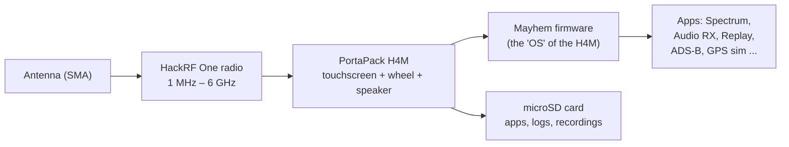
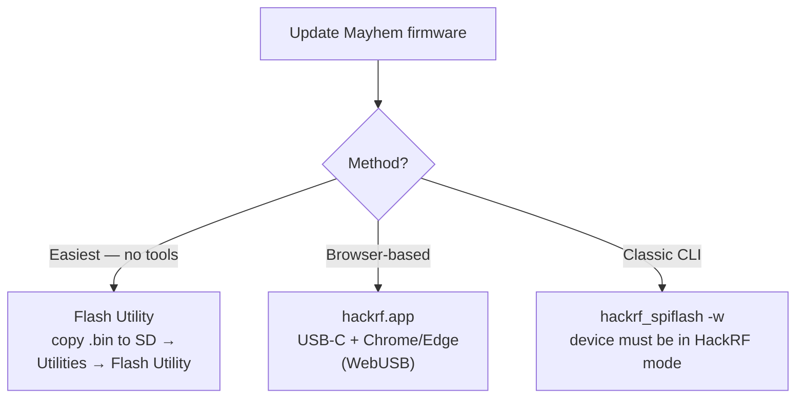

# SDRLab H4M（HackRF PortaPack）— 完整指南

> **一句話總結**：H4M 是現行世代的 HackRF One PortaPack——一個 3.2 吋觸控螢幕外殼，把 1 MHz–6 GHz 的 SDR 收發器變成**獨立的手持無線電實驗室**，靠電池運作、不需要電腦。Mayhem 韌體把它變成音訊接收器、頻譜分析儀、訊號錄音機與更多工具。

## 盒內內容

| 專案 | 典型內容 |
|---|---|
| PortaPack H4M | 擴充外殼，含 3.2 吋霧面觸控螢幕、旋轉滾輪、喇叭、麥克風 |
| HackRF One（或 R10C） | H4M 所安裝的 SDR 主機板 |
| 天線 | 寬頻伸縮天線（40–6000 MHz）+ 頻段專用天線（5dBi、12dBi、8dBi、35dBi 變體） |
| 纜線 | USB-C 纜線、SMA 公對公 |
| 額外配件（依套件而定） | 20 dB 功率放大器、電池、外殼 |

## 規格一覽

### HackRF One（無線電核心）

| 專案 | 規格 |
|---|---|
| 頻率範圍 | 1 MHz – 6 GHz |
| 操作模式 | 半雙工收發器 |
| 取樣率 | 2 – 20 Msps（正交） |
| 解析度 | 8 位元 I / 8 位元 Q |
| 介面 | 高速 USB（H4M 套件為 USB-C） |
| 天線連線埠 | SMA 母座，50 Ω |
| 天線連線埠供電 | 軟體控制，最大 50 mA @ 3.0–3.3 V |
| 最大 RX 輸入 | -5 dBm（超過可能永久損壞裝置！） |
| 最大 TX 輸出 | +10 dBm（10 mW）；典型 0 至 +5 dBm |
| 時脈 | CLK IN / CLK OUT 用於同步 |

### PortaPack H4M（外殼）

| 專案 | 規格 |
|---|---|
| 顯示器 | 3.2 吋 240×320 霧面 LCD 觸控螢幕 |
| 控制 | 方向鍵、360° 旋轉滾輪（平面設計）、選擇按鈕、電源按鈕 |
| 音訊 | 內建喇叭、內建麥克風（切換開關）、3.5 mm 耳機／麥克風插孔 |
| 儲存 | microSD 卡槽（應用程式、日誌、錄音所需） |
| 電池 | 2500 mAh 可充電，含管理 IC + 狀態顯示 |
| 充電 | USB-C，附真正的開／關開關 |
| 擴充 | GPIO 連線埠（支援 I2C），用於 GPS 接收器等擴充配件 |
| 外殼 | 透明 ABS 射出成型外殼 |

### H4M 相較於舊款 H2 的新功能

改用 USB-C 取代 Micro-USB、真正的開／關開關、內建喇叭 + 麥克風並自動切換、支援 I2C 的 GPIO 連線埠、韌體中顯示電池資訊，以及更扁平的設計。

## 概念：H4M 如何運作



HackRF 將頻譜數位化；PortaPack 提供人機介面；Mayhem 韌體提供應用程式。不需要電腦——H4M 就是完整的實驗室。

## Mayhem 韌體 {#mayhem-firmware}

H4M 執行開源 **Mayhem 韌體**（[portapack-mayhem/mayhem-firmware](https://github.com/portapack-mayhem/mayhem-firmware)），這是 PortaPack 軟體的社群延續，內含數百個應用程式：頻譜分析儀、音訊接收器／發射器、訊號錄音與重播、ADS-B、APRS、GPS 模擬器與更多。

### 步驟 1 — 準備 microSD 卡

1. 將 microSD 卡（16 GB 很夠用）格式化為 **FAT32**。
2. 從 [Mayhem 版本頁面](https://github.com/portapack-mayhem/mayhem-firmware/releases)下載與你要燒錄的版本相符的 `COPY_TO_SDCARD` 壓縮檔。
3. 解壓縮到卡片根目錄。這會把應用程式、地圖與資源放到卡片上。

### 步驟 2 — 更新韌體（三種方式）



**選項 A — Flash Utility（建議）：**
1. 把版本壓縮檔中的 `FIRMWARE_mayhem_*.bin` 複製到 microSD 卡根目錄。
2. 插入卡片，開啟 H4M 電源。
3. `Utilities → Flash Utility` → 選取檔案 → 確認。裝置會重新開機。

**選項 B — hackrf.app：**連線 USB-C（資料纜線），在支援 WebUSB 的瀏覽器中開啟 [https://hackrf.app/](https://hackrf.app/)，按 *Connect Device*，選取你的 PortaPack，讓它燒錄。

**選項 C — 傳統 CLI（Linux/macOS）：**

```bash
sudo apt install hackrf          # Debian/Ubuntu/Kali; brew install hackrf on macOS
hackrf_info                      # confirm the board is seen
hackrf_spiflash -w portapack-h1_h2-mayhem.bin
```

預期的 `hackrf_info` 輸出：

```
Found HackRF board.
Board ID Number: 2 (HackRF One)
Firmware Version: git-... (API:1.02)
```

> ⚠️ 在 HackRF 模式下，H4M 就是一臺普通的 HackRF——PortaPack 介面會被繞過。請讓 `COPY_TO_SDCARD` 內容與韌體版本保持同步。

## 快速入門 — 聆聽世界

1. 把電池充飽（USB-C），直到指示燈顯示滿電。
2. 插入準備好的 microSD 卡。
3. 在 SMA 連線埠接上合適的天線。
4. 推開電源開關。Mayhem 選單出現。
5. 開啟 **Audio RX**（或 **FM Broadcast RX**），調諧到當地的 FM 電臺（88–108 MHz）。調整增益；聲音從內建喇叭出來。

### 命令列頻譜檢查（作為一般 HackRF）

```bash
hackrf_transfer -s 8M -f 100M -g 20 -r /dev/null
```

如果裝置無錯誤地持續串流，代表無線電核心健康。

## 範例專案 — 你身邊的頻譜

1. **Spectrum Analyzer** 應用程式 → 掃描 88–108 MHz：你應該會看到 FM 廣播頻段呈現數個明亮的波峰。
2. 在瀑布圖上調整中心頻率，用 **Audio RX** → FM 記下電臺呼號。
3. 試試 1090 MHz（ADS-B）：安裝 ADS-B 應用程式，觀看飛機位置持續流入。

## 相容性

| 平臺 | 支援 | 備註 |
|---|---|---|
| 獨立（PortaPack） | ✅ | 這正是重點——不需要電腦 |
| Linux / macOS（作為 HackRF） | ✅ | `hackrf` 工具、GQRX、搭配 ExtIO 的 SDR# |
| Windows（作為 HackRF） | ✅ | 以 HackRF 為來源的 SDR# / SDR++ |
| PortaPack 的 SDR 軟體 | ✅ | Mayhem 生態系應用程式 |

## 負責任使用注意事項

H4M 是**收發器**：搭配合適的天線，它可以在業餘頻段及更廣的範圍發射。各國無線電法規不同——未經授權發射，或在你不被允許的頻率上發射，可能違法，也可能幹擾關鍵服務（航空、緊急通訊）。非常適合*收聽*與實驗室實驗；按下 TX 前請三思。

## 疑難排解

| 問題 | 原因 | 修正 |
|---|---|---|
| 無法開機 | 電池沒電／卡在模式 | 充電 10 分鐘以上；按住電源按鈕；試試 USB-C 接電腦 |
| 應用程式消失 | microSD 遺失或過舊 | 把對應的 `COPY_TO_SDCARD` 解壓縮到 FAT32 卡片 |
| 沒有聲音 | 輸出錯誤／增益 | 拔掉耳機改走喇叭；調高增益；檢查模式（FM 用 WFM） |
| 電腦看不到 HackRF | 不在 HackRF 模式 | 使用 USB 工具前先在介面中切換到 HackRF 模式 |
| 到處都是雜訊底 | 沒有天線／過載 | 接上天線；調低增益；最大 RX 輸入為 -5 dBm |

更多協助：[SDRLAB 疑難排解中心](/sdrlab/troubleshooting/)。

## 相關

- [SDR 軟體](/sdrlab/sdr-software/) — HackRF 工具、GQRX 與 SatDump。
- [韌體與驅動程式](/sdrlab/firmware/) — Mayhem 更新流程深入說明。
- [SDRLAB 快速入門](/sdrlab/quickstart/) — 第一個 30 分鐘的核對清單。