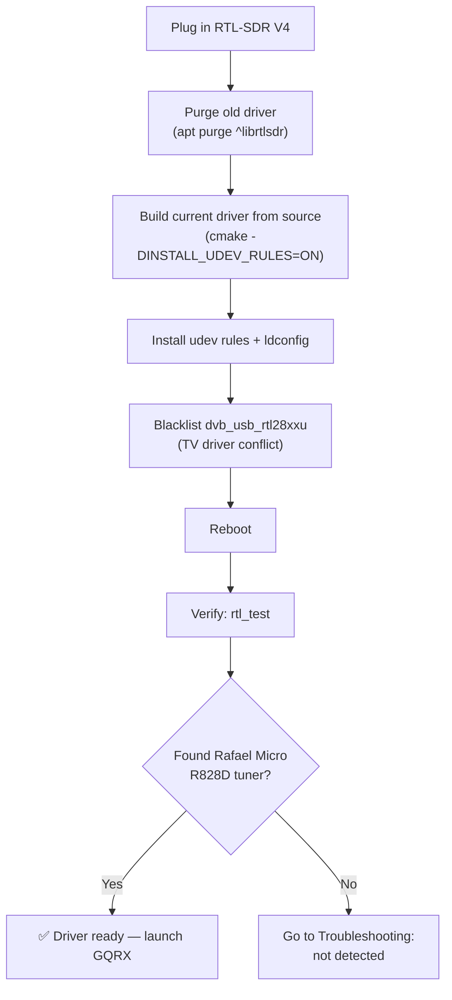

# RTL-SDR Blog V4 — 完整指南

> **一句話總結**：RTL-SDR Blog V4 是終極的 USB SDR 接收棒——對傳奇 RTL2832U 設計的精煉改良，涵蓋 **500 kHz 至 1.766 GHz**，內建 HF 升頻器與鋁製外殼。它是學生完美的第一支 SDR：便宜、耐操，背後還有龐大的社群。

## 規格一覽

| 專案 | 規格 |
|---|---|
| 解調器 / ADC | RTL2832U（8 位元） |
| 調諧器晶片 | Rafael Micro R828D（三個輸入、28.8 MHz HF LO） |
| 頻率範圍 | 500 kHz – 1.766 GHz |
| 頻寬 | 2.56 MHz 穩定（最高 3.2 MHz，可能掉封包） |
| HF 實作 | 內建升頻器，28.8 MHz 本地振盪器（不再有直接取樣混疊） |
| 輸入濾波 | 三工器：HF（0–28.8 MHz）/ VHF（28.8–250 MHz）/ UHF（250 MHz–1.766 GHz）+ 可切換陷波濾波器 |
| 輸入聯結器 | 1× SMA（50 Ω） |
| USB 聯結器 | USB-A 公頭，USB 匯流排供電 |
| 電流消耗 | 典型 250–270 mA |
| 參考時脈 | 1 PPM TCXO |
| Bias tee | 4.5 V、180 mA（軟體可切換） |
| 外殼 | 鋁製，含導熱墊 |
| 發射 | 無（僅接收） |

## V4 與舊接收棒的不同之處

把 V4 想成「SDR 最佳化」的改版。舊款 RTL-SDR 是為無線電駭客改裝的 DVB-T 電視棒；V4 是從零開始為 SDR 使用者重新設計的：

1. **不再有 HF 混疊問題。** 舊接收棒在約 24 MHz 以下使用直接取樣，會把頻譜折疊在 14.4 MHz 附近，讓 HF 接收令人沮喪。V4 內含真正的**升頻器**（28.8 MHz LO），把 HF 訊號移到調諧器能妥善處理的位置。驅動程式會自動做頻率換算——你只要正常調諧就好。
2. **三工器搭配三個可切換輸入。** R828D 調諧器有三個 RF 輸入；V4 依頻段（HF / VHF / UHF）切分，讓強力廣播 FM 電臺無法淹沒你的 HF 或 UHF 接收。
3. **可切換陷波濾波器**，針對已知的問題頻段（AM/FM 廣播、VHF 呼叫器／數位頻段）——同樣由最新驅動程式自動處理。

## Linux 安裝 {#linux-install}

V4 需要**最新**的驅動程式：發行版內建的套件有時早於 R828D 支援。以下步驟安裝最新的開源 Osmocom 驅動程式並附 udev 規則（之後執行 SDR 應用程式不需要 root）。



### 步驟 1 — 移除舊驅動程式

```bash
sudo apt purge ^librtlsdr
sudo rm -rvf /usr/lib/librtlsdr* /usr/include/rtl-sdr* /usr/local/lib/librtlsdr* /usr/local/include/rtl-sdr* /usr/local/include/rtl_* /usr/local/bin/rtl_*
```

預期：一串被移除的檔案清單，最後回到 shell 提示字元（關於檔案不存在的錯誤沒關係）。

### 步驟 2 — 建置並安裝最新驅動程式

```bash
sudo apt-get install libusb-1.0-0-dev git cmake pkg-config build-essential
git clone https://github.com/osmocom/rtl-sdr
cd rtl-sdr
mkdir build && cd build
cmake ../ -DINSTALL_UDEV_RULES=ON
make
sudo make install
sudo cp ../rtl-sdr.rules /etc/udev/rules.d/
sudo ldconfig
```

預期輸出以這些結尾：

```
[ 50%] Built target rtl_sdr ...
[100%] Built target rtl_fm ...
-- Install configuration: "Release"
```

### 步驟 3 — 封鎖電視驅動程式並重新開機

```bash
echo 'blacklist dvb_usb_rtl28xxu' | sudo tee --append /etc/modprobe.d/blacklist-dvb_usb_rtl28xxu.conf
sudo reboot
```

### 步驟 4 — 驗證

```bash
rtl_test
```

預期輸出：

```
Found 1 device(s):
  0:  Realtek, RTL2838UHIDIR, SN: 00000001

Using device 0: Generic RTL2832U OEM
Detached kernel driver
Found Rafael Micro R828D tuner
Supported gain values (29): 0.0 0.9 1.4 2.7 ...
[R82XX] PLL not locked!
Sampling at 2048000 S/s.
```

`Found Rafael Micro R828D tuner` 這行就是你的「V4 已辨識」徽章。

> **Windows**：安裝 [SDR#](https://airspy.com/download/)（或 SDR++ / SDR Console）——這些內建 V4 就緒的驅動程式；直接啟動並選取 RTL-SDR 來源即可。

## 快速入門 — 三下點選聽到 FM

1. 啟動 GQRX（見 [SDR 軟體指南](/sdrlab/sdr-software/#linux-install-gqrx-recommended-starting-point)）。
2. 按**▶**。瀑布圖應該開始。
3. 調諧到當地的 FM 電臺（88–108 MHz），選取**WFM**，取消靜音。完成——這就是你的第一個 SDR 訊號。

### 命令列健全性測試（音訊）

```bash
sudo apt install sox
rtl_fm -f 97.3M -M wbfm -s 200k | play -t raw -r 200k -e signed -b 16 -c 1 -V1 -
```

把 `97.3M` 換成你當地的電臺。聽到音樂 = 整條鏈路都正常。

## 使用 bias tee（為主動式天線供電）

V4 可以沿著天線同軸電纜供應 4.5 V / 180 mA，給 LNA、主動式天線與 GPS/ADS-B 放大器：

- **SDR# / SDR++**：在裝置設定中啟用**「Offset tuning」**——在 V4 上這個選項被重新用作 bias-tee 開關。
- **GQRX**：裝置圖示 → 啟用 **Bias-T**。
- **CLI**：`rtl_biast -b 1`（來自 rtl-sdr-blog 工具）或搭配你偏好的使用者端使用 `rtl_tcp -b`。

## 軟體相容性

| 軟體 | 平臺 | V4 支援 |
|---|---|---|
| GQRX | Linux / macOS / Windows | ✅ |
| SDR# | Windows | ✅（內建 V4 驅動程式） |
| SDR++ | Windows / Linux / macOS | ✅ |
| SDR Console V3 | Windows | ✅ |
| SDRuno / CubicSDR | Windows / 跨平臺 | ✅ / ✅ |
| `rtl_*` CLI 工具 | 全部 | ✅（搭配最新建置） |

## 疑難排解

| 問題 | 原因 | 修正 |
|---|---|---|
| `rtl_test` 顯示 `No devices found` | 核心 DVB 驅動程式佔用接收棒 | 封鎖 `dvb_usb_rtl28xxu`（上方步驟 3），重新開機 |
| HF 聽起來混疊／頻率錯誤 | 驅動程式過舊（早於 R828D） | 從步驟 2 重建驅動程式，驗證 `Found Rafael Micro R828D tuner` |
| 到處都是幽靈電臺 | 過載／增益太高 | 把增益降到約 20–30 dB；使用頻段天線 |
| Bias tee 無法為 LNA 供電 | Tee 未啟用 | 在應用程式中啟用「Offset tuning」/ Bias-T |
| 隨機從 USB 掉線 | 連線埠供電不足 | 使用直連連線埠或供電式集線器 |

更多協助：[SDRLAB 疑難排解中心](/sdrlab/troubleshooting/)。

## 相關

- [SDR 軟體指南](/sdrlab/sdr-software/) — GQRX/SDR#/CLI 工具深入說明。
- [SDRLAB 快速入門](/sdrlab/quickstart/) — 通用的第一個 30 分鐘流程。
- [ALFA Linux 指南](/sdrlab/shared/alfa-linux-guide/) — Wi-Fi 夥伴網絡卡。