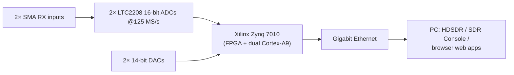
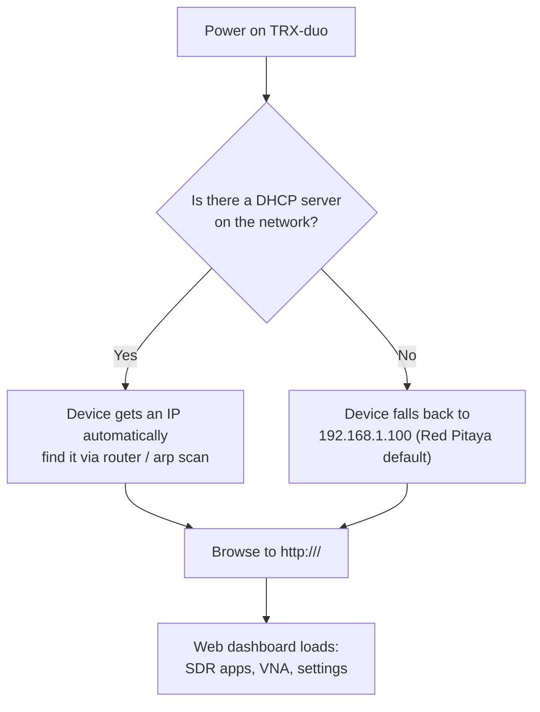

# SDRLab TRX-duo — 完整指南

> **一句話總結**：TRX-duo 是以 Xilinx Zynq 7010 SoC 為核心的專業雙通道、雙發射 SDR 收發器，配備兩顆 16 位元 ADC 與兩顆 14 位元 DAC，涵蓋 **10 kHz 至 60 MHz**——所有 HF 業餘頻段加上 6 m。因為它**相容 Red Pitaya**，所以繼承了整個開源 SDR、VNA 與實驗室軟體生態系。

## 規格一覽

| 項目 | 規格 |
|---|---|
| 無線電類型 | 雙通道收發器（2× RX、2× TX），直接取樣 |
| 頻率範圍 | 10 kHz – 60 MHz（HF 到 6 m） |
| ADC | 2× Linear Technology LTC2208，**16 位元**，125 MS/s |
| DAC | 2× Analog Devices AD9767，**14 位元**，125 MS/s |
| 即時頻寬 | 61.44 MHz |
| FPGA / SoC | Xilinx Zynq 7010（雙核心 ARM Cortex-A9） |
| RAM | 512 MB DDR3 |
| RF 輸入 | 2× SMA（50 Ω），0.5 Vpp，變壓器 + AC 耦合 |
| RF 輸出 | 2 通道，1 Vpp |
| 網路 | Gigabit 乙太網路（1 Gbit） |
| USB | USB 2.0 Type-C（供電 + 連線） |
| 擴充 | 16 個數位 I/O、4 個類比輸入（0–3.3 V、12 位元、100 kSps）、4 個類比輸出（0–1.8 V）、I2C、UART、SPI |
| 開機媒體 | microSD 卡（作業系統 + 應用程式都在卡片上） |
| 外殼 | 鋁製，115 × 70 × 25 mm（含連接器） |
| 相容性 | Red Pitaya（STEMlab 125-14 風格）軟體生態系 |

## TRX-duo 特別在哪裡

如果 RTL-SDR V4 是口袋小刀，TRX-duo 就是實驗室儀器：

- **兩個獨立接收器** — 執行分集接收、比較兩支天線，或同時抄收兩個頻段。非常適合大學的分集、測向與干擾研究實驗。
- **真正的收發器** — 兩個 14 位元發射通道讓你能實驗真正的 TX（在業餘無線電規則與當地法規範圍內）。
- **Red Pitaya 相容** — 能在 Red Pitaya STEMlab 125-14 上執行的應用程式（來自 [red-pitaya-notes](https://github.com/pavel-demin/red-pitaya-notes) 專案的 SDR 接收器／收發器、VNA、示波器應用程式）也能在搭配對應 SD 映像檔的 TRX-duo 上執行。
- **網路原生** — 它是一台無頭裝置，你可以從任何電腦、手機或平板瀏覽器透過 Gigabit 乙太網路操作。不需要 USB 綁定。



## 韌體與 SD 映像檔

> ⚠️ **SD 映像檔不是我們託管的。** 請只從下方**官方廠商頁面**下載。不要使用來路不明的鏡像站。

| 資源 | 官方連結 | 內容 |
|---|---|---|
| 廠商網站 — TRX-DUO | [https://trx-duo.com/](https://trx-duo.com/) | 官方產品網站，含韌體與入門資訊 |
| 廠商產品頁（SDRLab） | [https://opensourcesdrlab.com/products/trx-duo-compatible-with-red-pitaya-sdr-dual-16bit-adc-zynq7010](https://opensourcesdrlab.com/products/trx-duo-compatible-with-red-pitaya-sdr-dual-16bit-adc-zynq7010) | 官方產品頁，含**韌體與快速入門手冊** |
| Red Pitaya 軟體生態系 | [https://github.com/pavel-demin/red-pitaya-notes](https://github.com/pavel-demin/red-pitaya-notes) | TRX-duo 相容的開源應用程式套件（SDR RX/TX、VNA） |

**SD 卡如何運作**：TRX-duo 是一台嵌入式 Linux 電腦。microSD 卡承載作業系統、FPGA bitstream 與 SDR 應用程式。「更新韌體」= 寫入較新的官方映像檔。務必先閱讀廠商的韌體／快速入門指示——它們會列出要使用的確切映像檔。

### 寫入映像檔（通用流程）

1. 從上方廠商頁面下載官方映像檔。
2. 寫入 microSD 卡（≥ 4 GB；卡片會被抹除！）：

```bash
# Replace /dev/sdX with YOUR card device — double-check with lsblk!
sudo dd if=trx-duo-image.zip of=/dev/sdX bs=4M status=progress conv=fsync
```

> Zip 映像檔有時需要先解壓縮——請依廠商指示。在 Windows 上，[balenaEtcher](https://etcher.balena.io/) 能安全處理 zip 與 img 兩種檔案。

3. 把卡片插入 TRX-duo。
4. 連接 **Gigabit 乙太網路**與 **USB-C 電源**，然後開機。

## 首次開機與網路



- 在有 DHCP 的網路（典型家用路由器）：把電腦與 TRX-duo 都連到路由器，然後查詢裝置的 IP（路由器管理頁面，或電腦上的 `arp -a` / `ip neigh show`）。
- 在直接纜線連接或隔離網路上：把電腦設成 `192.168.1.x` 的靜態位址（例如 `192.168.1.10/24`），然後開啟 `http://192.168.1.100`。
- 有些映像檔也會回應主機名稱 `trx-duo-alpine`。

### 驗證

```bash
ping 192.168.1.100
curl -s http://192.168.1.100/ | head
```

正常運作的裝置會回應 ping 並提供它的儀表板 HTML。

## 搭配 SDR 軟體使用

| 軟體 | 連接方式 | 典型用途 |
|---|---|---|
| 瀏覽器網頁應用程式（在主機板上） | 直接，不需要電腦軟體 | 頻譜、SDR RX、VNA — 最快的起點 |
| HDSDR | Red Pitaya 網路介面 | 經典全景顯示風格的 HF 收發器控制 |
| SDR Console V3 | Red Pitaya 相容網路來源 | 專業 RX，含數位模式、遠端操作 |
| Red Pitaya notes 應用程式（在主機板上） | 內建於 SD 映像檔 | 分集 RX、收發器實驗、FT8 skimmer |

更完整的圖像請見 [SDR 軟體指南](/sdrlab/sdr-software/#trx-duo-software-notes)。

## 快速入門核對清單

- [ ] 已從廠商頁面下載官方 SD 映像檔
- [ ] 已寫入 microSD 並插入
- [ ] 已連接乙太網路 + USB-C 電源
- [ ] 裝置可連線（DHCP IP 或 `192.168.1.100`）
- [ ] 瀏覽器中儀表板可載入
- [ ] 天線已接到 RX1/RX2（HF 天線——長導線或迴圈——不是 WiFi 天線）
- [ ] 已聽到真實的 HF 訊號（短波廣播電台夜間很大聲，3–30 MHz）

## 疑難排解

| 問題 | 原因 | 修正 |
|---|---|---|
| 儀表板連不上 | DHCP 遺失／子網路錯誤 | 把電腦設成靜態 `192.168.1.x`，試試 `http://192.168.1.100` |
| RJ45 沒有連線燈 | 纜線或連接埠問題 | 換纜線／連接埠；確認交換器連接埠支援 10/100/1000 |
| 開機了但從不出現 | SD 卡不良／映像檔錯誤 | 用官方映像檔重寫；把卡片拿到電腦上測試 |
| RX 只有雜訊 | 沒有 HF 天線／衰減器開啟 | 接上合適的 HF 天線；調高增益、移除衰減 |
| 應用程式與主機板不符 | 映像檔變體錯誤 | 重新查閱廠商快速入門，確認 125 MS/s 16 位元主機板的正確映像檔 |

更多協助：[SDRLAB 疑難排解中心](/sdrlab/troubleshooting/)。

## 相關

- [韌體與驅動程式](/sdrlab/firmware/) — SD 映像檔與韌體更新的關係。
- [SDR 軟體](/sdrlab/sdr-software/) — HDSDR / SDR Console / Red Pitaya 應用程式。
- [RTL-SDR Blog V4](/sdrlab/hardware/rtl-sdr-v4/) — SDR 價格光譜的另一端。