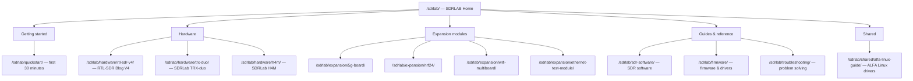

---

id: sdrlab-index
title: SDRLAB
sidebar_position: 4
description: SDRLAB 軟體無線電硬體 — RTL-SDR、TRX-duo、H4M 與 Flipper Zero 擴充模組。快速入門、軟體、韌體與疑難排解指南。
tags: [sdrlab, sdr, rtl-sdr, trx-duo, h4m, flipper-zero, expansion-modules]
keywords: [SDRLAB, SDR, RTL-SDR V4, TRX-duo, H4M, PortaPack, Flipper Zero, NRF24, ESP8266, W5500]
authors: yupitek
date: 2026-08-21
last_updated: 2026-08-21
category: guide
difficulty: beginner
toc: true
slug: /sdrlab/
---

# SDRLAB

歡迎來到本 wiki 的 **SDRLAB** 專區。本區涵蓋我們所販售的 SDR（軟體無線電）硬體——從掀起無數業餘專案的傳奇小 RTL-SDR 接收棒，到足以放進大學實驗室的專業雙通道收發器，再加上一臺可塞進外套口袋、以 HackRF 驅動的手持式無線電。我們也記錄了能將 Flipper 變成口袋型無線實驗室的 **Flipper Zero 擴充模組**。

> **SDR 到底是什麼？** *軟體無線電*以寬頻數位化器取代傳統類比無線電電路（混頻器、濾波器、解調器）：硬體擷取一段無線電頻譜，再由電腦——或 FPGA——以軟體進行「無線電運算」。想聽不同的模式或頻率？換軟體就好，不用換硬體。

## 本區的組織方式

## SDR 硬體

| 產品 | 是什麼 | 頻率範圍 | 最適合 |
|---|---|---|---|
| [RTL-SDR Blog V4](/sdrlab/hardware/rtl-sdr-v4/) | USB 接收棒（RTL2832U + R828D 調諧器） | 500 kHz – 1.766 GHz | 經典的第一支 SDR：ADS-B、AIS、POCSAG 呼叫器、FM、NOAA 衛星 |
| [SDRLab TRX-duo](/sdrlab/hardware/trx-duo/) | 雙通道 16 位元收發器（Xilinx Zynq 7010） | 10 kHz – 60 MHz | HF 業餘無線電、實驗室實驗、Red Pitaya 相容應用 |
| [SDRLab H4M](/sdrlab/hardware/h4m/) | HackRF One + PortaPack 手持式收發器 | 1 MHz – 6 GHz | 現場訊號追蹤、頻譜分析、可攜式 TX/RX 實驗 |

## Flipper Zero 擴充模組

| 模組 | 功能 | 無線電晶片 | 頁面 |
|---|---|---|---|
| [5G Expansion Board](/sdrlab/expansion/5g-board/) | 2.4/5 GHz WiFi（Marauder）+ GPS | ESP32-C5 | WiFi 偵察、war driving、GPS 記錄 |
| [NRF24 module](/sdrlab/expansion/nrf24/) | 2.4 GHz 封包無線電 | nRF24L01+ | 頻道掃描、嗅探、無線滑鼠／鍵盤測試 |
| [WiFi multiboard](/sdrlab/expansion/wifi-multiboard/) | 2.4 GHz WiFi 工具 | ESP8266 | Deauth 測試、封包擷取、Evil Portal 實驗 |
| [Ethernet test module](/sdrlab/expansion/ethernet-test-module/) | 10/100 乙太網路介面 | WIZnet W5500 | 纜線測試、DHCP 檢查、LAN 診斷 |

## 指南與參考資料

- [快速入門](/sdrlab/quickstart/) — 逐步帶你度過任何 SDRLAB 產品的第一個 30 分鐘。
- [SDR 軟體](/sdrlab/sdr-software/) — GQRX、SDR#、SDR++、SDR Console、HDSDR 與命令列工具，以及該如何依工作需求挑選。
- [韌體與驅動程式](/sdrlab/firmware/) — 如何讓硬體的驅動程式與韌體保持最新。
- [疑難排解](/sdrlab/troubleshooting/) — 提供決策樹與症狀表格的問題解決中心。
- [ALFA Linux 指南](/sdrlab/shared/alfa-linux-guide/) — 針對 Ubuntu 與 Kali 的 ALFA 網絡卡驅動程式（當你把 ALFA 網絡卡與 SDR 裝置搭配使用時很有用）。

## 相關章節

- [Flipper Zero](/flipper-zero/) — 我們大多數擴充模組所插接的基礎裝置。
- [ALFA Network](/alfa-network/) — 高增益 Wi-Fi 網絡卡與天線，常與 SDR 搭配進行無線協定分析。
- [快速入門](/getting-started/) — 如果你是第一次造訪本 wiki，請從這裡開始。