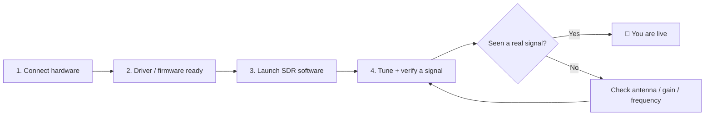

# SDRLAB 快速入門 — 你的第一個 30 分鐘

> **學習目標**：讀完本頁後，你將能挑選一款產品、理解通用的「插上 → 驅動程式 → 軟體 → 訊號」流程，並驗證你的 SDR 硬體確實能運作。
> **適用物件**：初次使用者 ｜ **前置需求**：一件 SDRLAB 產品、一臺電腦（Windows/Linux/macOS），以及想聽無線電雜訊並愛上它的意願。

## 概念：通用的 SDR 流程

每件 SDRLAB 產品都遵循相同的三階段旅程，即使細節各不相同：

把它想成插上新的遊戲手把：**先硬體**（裝置必須被辨識）、**再驅動程式**（作業系統必須能與它溝通）、**最後軟體**（遊戲——其實是無線電——必須知道怎麼用它）。十次有九次，「什麼都不能用」代表這三個階段中有一個被跳過了。

## 步驟 1：挑選你的產品並連線

| 產品 | 連線方式 | 需要額外供電？ | 第一步 |
|---|---|---|---|
| [RTL-SDR Blog V4](/sdrlab/hardware/rtl-sdr-v4/) | USB-A 接到電腦 | 否（USB 供電） | 插上，安裝驅動程式 |
| [SDRLab TRX-duo](/sdrlab/hardware/trx-duo/) | Gigabit 乙太網路 + USB-C 供電 | 是，透過 USB-C 供電 | 燒錄 SD 卡、開機、瀏覽網頁介面 |
| [SDRLab H4M](/sdrlab/hardware/h4m/) | 獨立手持裝置（USB-C 用於充電／燒錄） | 電池或 USB-C | 充電、插入 microSD、安裝 Mayhem 韌體 |
| [5G Expansion Board](/sdrlab/expansion/5g-board/) | Flipper Zero GPIO 排針 | 否（Flipper／電池） | 設定 GPIO 腳位，開啟 Marauder 應用程式 |
| [NRF24 module](/sdrlab/expansion/nrf24/) | Flipper Zero GPIO 排針 | 否 | 插上，開啟 NRF24 嗅探應用程式 |
| [WiFi multiboard](/sdrlab/expansion/wifi-multiboard/) | Flipper Zero GPIO 排針 | 否 | 插上，開啟 WiFi deauther 應用程式 |
| [Ethernet test module](/sdrlab/expansion/ethernet-test-module/) | Flipper Zero GPIO 排針 + RJ45 纜線 | 否 | 接好 SPI，開啟 Ethernet 應用程式 |

> **第一次用 Flipper Zero？** 請先前往 [Flipper Zero 專區](/flipper-zero/)，把 Flipper 更新到最新並熟悉操作。

## 步驟 2：讓驅動程式／韌體層就緒

- **Linux 上的 RTL-SDR V4**：你需要*最新*的驅動程式——較舊的發行版套件不認識 V4 的 R828D 調諧器。請依照 [RTL-SDR V4 頁面的驅動程式更新步驟](/sdrlab/hardware/rtl-sdr-v4/#linux-install)。
- **Windows 上的 RTL-SDR V4**：現代工具（SDR#、SDR++、SDR Console）內建 V4 相容驅動程式——直接安裝軟體即可使用。
- **TRX-duo**：SD 卡*就是*韌體。下載官方映像檔（見 [TRX-duo 頁面](/sdrlab/hardware/trx-duo/#firmware-and-sd-image)），寫入 microSD 卡、插入、開機。
- **H4M**：安裝 [Mayhem 韌體](/sdrlab/hardware/h4m/#mayhem-firmware)——裝置出廠即可運作，但 Mayhem 才能解鎖完整工具組。
- **Flipper 模組**：大多數需要*自訂* Flipper 韌體（Momentum、Unleashed、Xtreme）才能使用額外應用程式，還需要設定 GPIO 腳位。每個[擴充頁面](/sdrlab/#flipper-zero-expansion-modules)都列出了確切腳位。

## 步驟 3：啟動軟體並驗證訊號

各裝置最快的「可以用了！」測試：

| 產品 | 測試 | 預期結果 |
|---|---|---|
| RTL-SDR V4 | 在終端機執行 `rtl_test` | 出現「Supported sample rates」與滾動的 `PASS` 行 |
| TRX-duo | 瀏覽器 → `http://192.168.1.100` | Red Pitaya 風格的網頁儀錶板載入 |
| H4M | 螢幕上的 Spectrum 應用程式 | 瀑布圖顯示 FM 廣播頻段的雜訊／訊號 |
| 5G board | Marauder `scanap` | 附近的 SSID 連同 RSSI 一起出現 |
| NRF24 module | 頻道掃描器 | 頻道 1–126 出現 2.4 GHz 活動 |
| WiFi multiboard | Deauther 掃描 | AP 清單填入 |
| Ethernet module | W5500 應用程式 → DHCP | 取得 IP 位址，ping 可通 |

## 步驟 4：調諧到真實訊號

挑一個你*知道*有訊號的頻率，不要亂挑：

- **FM 廣播電臺**：88–108 MHz——你的第一個 SDR 訊號，保證收得到。
- **NOAA 氣象衛星（137 MHz）**：APT 衛星影像，週末專案的熱門選擇。
- **飛機（ADS-B，1090 MHz）**：飛機持續廣播位置資料。
- **呼叫器（POCSAG）**：約 137 MHz 與約 466 MHz——經典的 RTL-SDR 趣味來源。
- **飛機（HF，如果你有 TRX-duo）**：夜間 3–30 MHz 的短波廣播電臺。

## 步驟 5：檢查你的核對清單

- [ ] 硬體已被辨識（LED 亮起／應用程式看得到裝置）
- [ ] 驅動程式或韌體版本為最新
- [ ] SDR 軟體能以名稱／型號辨識裝置
- [ ] 瀑布圖或頻譜顯示*某些東西*——然後是真正的訊號
- [ ] 知道你的天線在哪、適合哪個頻段（這比你想的更重要！）

## 常見的第一天錯誤

| 錯誤 | 發生原因 | 修正 |
|---|---|---|
| `rtl_test` 顯示 `No devices found` | 核心 DVB 驅動程式搶走了接收棒 | 封鎖 `dvb_usb_rtl28xxu`（見 [RTL-SDR V4 頁面](/sdrlab/hardware/rtl-sdr-v4/#linux-install)） |
| TRX-duo 網頁介面連不上 | 靜態 IP 錯誤／網路上沒有 DHCP | 檢查[網路章節](/sdrlab/hardware/trx-duo/#first-boot-and-network) |
| H4M 沒有應用程式 | microSD 遺失或過舊 | 從 [Mayhem 版本](/sdrlab/hardware/h4m/#mayhem-firmware)複製 `COPY_TO_SDCARD` 檔案 |
| Flipper 應用程式顯示「no module」 | GPIO 腳位未針對該模組設定 | 在 `Protocol Settings → GPIO Pin Settings` 設定腳位（依各擴充頁面） |
| 全部沒反應 | 沒接天線 | 鎖上天線——沒有天線的 SDR 只是個非常安靜的紙鎮 |

## 下一步

- 準備深入？[SDR 軟體指南](/sdrlab/sdr-software/)說明各種工具；[韌體指南](/sdrlab/firmware/)涵蓋更新。
- 卡在特定問題？[疑難排解中心](/sdrlab/troubleshooting/)依症狀分類整理。
- 要把 ALFA Wi-Fi 網絡卡與 SDR 搭配使用？請見 [ALFA Linux 指南](/sdrlab/shared/alfa-linux-guide/)。