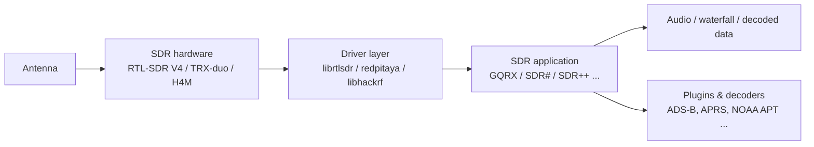
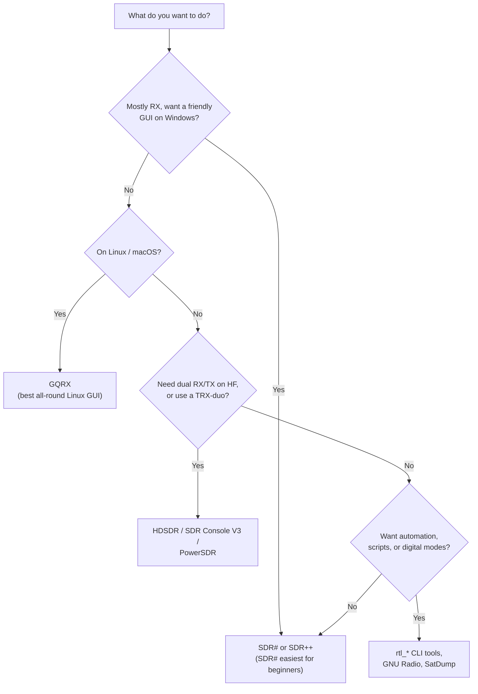

# SDR 軟體 — 選擇與安裝你的工具

> **學習目標**：讀完後你將能為你的裝置與目標挑選正確的 SDR 應用程式，並在 Linux 或 Windows 上安裝它。
> **適用物件**：初階到中階 ｜ **前置需求**：一臺可正常運作的 SDRLAB 裝置（見[快速入門](/sdrlab/quickstart/)）。

## 概念：軟體堆疊

你的 SDR 硬體將無線電頻譜數位化，但*必須有東西*把那些原始取樣轉成瀑布圖、音訊或解碼後的封包。那個「東西」就是 SDR 應用程式：



每個階段都有自己的生態系。常見的新手陷阱：硬體沒問題、應用程式也沒問題，但夾在兩者之間的**驅動程式層**過舊——RTL-SDR Blog V4 就是經典例子，因為舊驅動程式根本不認識它的調諧器。

## 我該用哪個應用程式？



### 快速挑選表

| 工具 | 平臺 | 裝置 | 最適合 |
|---|---|---|---|
| [GQRX](https://www.gqrx.dk/) | Linux / macOS / Windows | RTL-SDR V4、H4M（作為 HackRF） | 一般接收、頻譜、FM/AM 解調、Linux 上的 SDR 新手 |
| [SDR# (SDRSharp)](https://airspy.com/download/) | Windows | RTL-SDR V4 | 經典的新手 Windows 應用程式；龐大的外掛生態系 |
| [SDR++](https://www.sdrpp.org/) | Windows / Linux / macOS | RTL-SDR V4、HackRF | 跨平臺現代 GUI、伺服器模式、出色的瀑布圖 |
| [SDR Console V3](https://www.sdr-radio.com/console) | Windows | RTL-SDR V4、TRX-duo | 專業接收功能、業餘無線電、遠端操作 |
| [HDSDR](https://www.hdsdr.de/) | Windows | TRX-duo、RTL-SDR V4 | HF 收發器風格控制、IF 全景顯示、TRX-duo 支援 |
| [CubicSDR](https://cubicsdr.com/) | Windows / Linux / macOS | RTL-SDR V4、HackRF | 簡單的跨平臺瀑布圖 |
| [SatDump](https://github.com/SatDump/SatDump) | Windows / Linux | RTL-SDR V4 | 衛星解碼（NOAA、MetOp、LRPT、Meteor） |
| `rtl_*` 命令列工具 | Linux / Windows / macOS | RTL-SDR V4 | 測試（`rtl_test`）、原始 IQ 擷取、指令碼 |
| `hackrf_*` 工具 | Linux / Windows / macOS | H4M（作為 HackRF） | 韌體燒錄、原始 IQ TX/RX、頻譜（`hackrf_transfer`） |

## Linux：安裝 GQRX（建議的起點）

GQRX 是最友善的 Linux GUI，與 RTL-SDR V4 完美搭配。

### 步驟 1 — 安裝 GQRX

```bash
# Debian / Ubuntu / Kali
sudo apt update
sudo apt install gqrx-sdr
```

預期輸出（最後幾行）：

```
Setting up gqrx-sdr (2.17-1) ...
Processing triggers for desktop-file-utils ...
```

### 步驟 2 — 安裝 RTL-SDR 命令列工具（用於驅動程式檢查）

```bash
sudo apt install rtl-sdr
rtl_test -t
```

插入 V4 且驅動程式為最新時的預期輸出：

```
Found 1 device(s):
  0:  Realtek, RTL2838UHIDIR, SN: 00000001

Using device 0: Generic RTL2832U OEM
...
Supported sample rates: 225001-300000, 900001-3200000, ...
```

> 看到 `Found 1 device(s)` 就是值得歡呼的時刻。如果印出 `No devices found`，請見[疑難排解 → RTL-SDR 未被偵測](/sdrlab/troubleshooting/#rtl-sdr-not-detected)。

### 步驟 3 — 開啟 GQRX 並找一個訊號

1. 啟動 `gqrx`（或 `gqrx-sdr`）。
2. 第一次執行時會出現**Device configuration**（裝置設定）對話方塊——選取你的接收棒，I/Q 設定保持預設值，然後按**OK**。
3. 按**▶**（播放）按鈕。瀑布圖開始串流。
4. 在頻率欄輸入**97.3 MHz**（任何訊號強的 FM 電臺都可以——查一下你當地的電臺）。
5. 按**FM**模式按鈕，然後關閉**靜音**圖示。你應該能聽到電臺。

## Windows：安裝 SDR#（建議的起點）

1. 從 [Airspy 下載頁面](https://airspy.com/download/)下載 SDR# 的 zip 檔。
2. 將 zip 解壓縮到一個資料夾（例如 `C:\SDRSharp`）。
3. 執行 `sdrsharp.exe`。它需要 **.NET**——如果缺少，Windows 會主動提供安裝。
4. 在左上角的**Source**下拉選單中選取**RTL-SDR (RTL2832U)**，然後按播放圖示。
5. 調諧到當地的 FM 電臺（88–108 MHz），選取**WFM**解調，就可以收聽了。

## TRX-duo 軟體注意事項

TRX-duo *不是*隨插即用的 USB 裝置——它是一臺執行自有嵌入式軟體的網路儀器（官方韌體映像檔請見 [TRX-duo 頁面](/sdrlab/hardware/trx-duo/)）。在電腦端，能與它搭配的生態系是 **Red Pitaya SDR 軟體家族**：

- **HDSDR** — 透過 Red Pitaya 網路介面連線（依廠商檔案使用 ExtIO／網路介面）。
- **SDR Console V3** — 支援透過網路連線 Red Pitaya 相容裝置。
- **Red Pitaya 網頁應用程式** — 主機板本身直接從自己的網頁介面提供瀏覽器應用程式（頻譜分析儀、SDR 接收器、VNA）。

由於 Red Pitaya 生態系由 [Pavel Demin 的 red-pitaya-notes](https://github.com/pavel-demin/red-pitaya-notes) 專案驅動，大多數 Red Pitaya 相容應用程式都能在搭配對應 SD 映像檔的 TRX-duo 上執行。

## H4M 軟體注意事項

H4M 是獨立裝置：它在 PortaPack 上直接執行 **Mayhem 韌體**，因此基本操作不需要電腦軟體。若要把它當作一般 HackRF 從電腦使用，請安裝 **HackRF 工具**：

```bash
# Debian / Ubuntu / Kali
sudo apt install hackrf
hackrf_info
```

預期輸出：

```
Found HackRF board.
Board ID Number: 2 (HackRF One)
Firmware Version: git-... (API:1.02)
```

韌體安裝請見 [H4M 頁面](/sdrlab/hardware/h4m/)，更新步驟請見[韌體指南](/sdrlab/firmware/)。

## 值得學習的命令列基本功

| 指令 | 功能 | 典型用途 |
|---|---|---|
| `rtl_test` | 自我測試 RTL-SDR 接收棒 | 驗證驅動程式 + 硬體 |
| `rtl_fm -f 97.3M -M wbfm -s 200k \| play -t raw` | 將 FM 音訊串流到喇叭 | 快速「我的接收棒還活著嗎」測試 |
| `rtl_sdr -f 1090M -s 2M -` | 將原始 IQ 取樣傾印到 stdout | 餵給 ADS-B 解碼器 |
| `hackrf_transfer -r out.iq -f 433M -s 2M` | 從 HackRF 錄製原始取樣 | 擷取突發訊號供重播分析 |
| `hackrf_info` | 顯示 HackRF 版本資訊 | 驗證 H4M 作為 HackRF |

## 接下來去哪

- [韌體與驅動程式](/sdrlab/firmware/) — 讓軟體底下的各層保持健康。
- [疑難排解](/sdrlab/troubleshooting/) — 「應用程式開了但沒有訊號」之類的問題。
- 產品頁面：[RTL-SDR V4](/sdrlab/hardware/rtl-sdr-v4/)、[TRX-duo](/sdrlab/hardware/trx-duo/)、[H4M](/sdrlab/hardware/h4m/)。