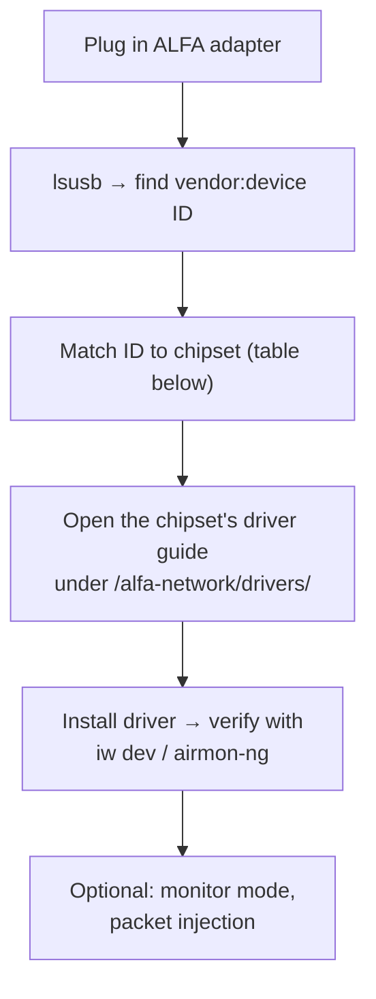

# Linux 上的 ALFA 網絡卡 — 驅動程式指引指南

> **學習目標**：用兩個指令辨識任何 ALFA 網絡卡內部的晶片組，然後直接落在你需要的確切驅動程式指南上——不用猜、不走冤枉路。
> **適用物件**：任何要把 ALFA Wi-Fi 網絡卡搭配 Ubuntu 或 Kali Linux 使用的人（包括同時做無線協定分析的 SDR 裝置）。

## 為什麼會有這個頁面

ALFA Network 生產很多網絡卡，而且它們並非都使用相同的無線電晶片。**決定驅動程式的是晶片組**——光看型號名稱不夠。這個頁面是共用的「前門」：教你兩個指令的辨識儀式，然後把你指向 [ALFA Network 專區](/alfa-network/)中的晶片組專屬指南。它適用於任何 Debian 家族發行版上的**任何** ALFA 網絡卡。



## 步驟 1 — 辨識晶片組

```bash
lsusb
```

找到 ALFA 網絡卡那一行。範例輸出：

```
Bus 003 Device 002: ID 0cf3:9271 Qualcomm Atheros Communications AR9271 802.11n
```

`ID xxxx:xxxx` 就是 vendor:device 配對。把它對照下表——*device* 部分會把範圍縮小到某一族晶片。

### 晶片組查詢表

| 晶片組 | 典型的 `lsusb` device ID | 典型的 ALFA 型號 | 驅動程式指南 |
|---|---|---|---|
| MediaTek MT7921AUN | `0e8d:7961` | AWUS036AXML、AWUS036AXM | [MT7921AUN 指南](/alfa-network/drivers/mt7921aun/) |
| Realtek RTL8812AU | `0bda:8812` | AWUS036ACH、AWUS036ACHM | [RTL8812AU 指南](/alfa-network/drivers/rtl8812au/) |
| Realtek RTL8811AU | `0bda:8811` | AWUS036ACS | [RTL8811AU 指南](/alfa-network/drivers/rtl8811au/) |
| Realtek RTL8821CU | `0bda:c811` / `0bda:1a2b` | AWUS036ACM | [RTL8821CU 指南](/alfa-network/drivers/rtl8821cu/) |
| Realtek RTL8832BU | `0bda:b832` | AWUS036AXER | [RTL8832BU 指南](/alfa-network/drivers/rtl8832bu/) |
| MediaTek MT7612U | `0e8d:7612` | AWUS036AC | [MT7612U 指南](/alfa-network/drivers/mt7612u/) |
| MediaTek MT7610U | `0e8d:7610` | AWUS036NHA（變體）、AWUS051NH | [MT7610U 指南](/alfa-network/drivers/mt7610u/) |

> 這張表是*起點*地圖——ALFA 會隨時間推出新的 SKU。不確定時，直接讀網絡卡 IC 上印的晶片型號，或到 [ALFA Network 產品頁面](/alfa-network/)查你的確切型號。

## 步驟 2 — 安裝對應的驅動程式

每個晶片組都有自己的特性：

- **MediaTek（MT79xx / MT76xx）**：有些核心已內建 `mt76` 支援——晶片組指南會告訴你何時夠用、何時要編譯廠商驅動程式。
- **Realtek（RTL88xx）**：幾乎總是需要樹外驅動程式（`rtl88x2bu` 風格的 DKMS 建置）。預期要 `make` + `sudo make install` + 重新開機。
- **Atheros**：`ath9k_htc` 已在核心中——通常隨插即用。

請依晶片組專屬指南取得確切指令；它們都以**驗證步驟**收尾：

```bash
iw dev          # shows your wlan interface and connected state
sudo airmon-ng  # confirms monitor-mode capability
```

預期的 `iw dev` 輸出片段：

```
Interface wlan0
    ifindex 3
    wdev 0x1
    addr 00:c0:ca:xx:xx:xx
    type managed
```

## 步驟 3 — 常見的 Linux 驅動程式陷阱

| 症狀 | 可能原因 | 快速修正 |
|---|---|---|
| `iw dev` 什麼都沒顯示 | 驅動程式未載入或建置失敗 | 檢查 `dmesg | grep -i rtl\|mt76`；依晶片組指南重建 |
| 網絡卡可用但重新開機後失效 | 核心模組衝突 | 依晶片組指南執行封鎖步驟 |
| 監聽模式失敗（`airmon-ng` 錯誤） | 驅動程式尚未支援 | 用晶片組指南中的 DKMS 版本，不要用發行版套件 |
| Ubuntu 可用、Kali 不行 | Kali 的核心標頭版本不符 | 重建 DKMS：`sudo dkms autoinstall` |

## SDR 使用者為什麼在意這個

ALFA 網絡卡不是 SDR——但它是 SDR 天然的*夥伴*。常見的搭配組合：

- **Wi-Fi 協定分析**，同時讓你的 [RTL-SDR V4](/sdrlab/hardware/rtl-sdr-v4/) 監看 ISM 頻段頻譜。
- **以 Kali 為基礎的實驗室工作站**進行無線滲透測試課程，用 SDR 驗證 Wi-Fi 網絡卡在頻譜中的行為。
- **現場調查**，把 [H4M](/sdrlab/hardware/h4m/) 的頻譜檢視與 ALFA 網絡卡的 deauth／封包工具搭配使用。

[SDR 軟體指南](/sdrlab/sdr-software/)涵蓋 SDR 那一側；[疑難排解中心](/sdrlab/troubleshooting/)在無線電那一側出問題時提供協助。

## 相關

- [ALFA Network 專區](/alfa-network/) — 產品、天線、Jetson/Raspberry Pi/Unitree 整合。
- 晶片組驅動程式指南：[MT7610U](/alfa-network/drivers/mt7610u/) ・ [MT7612U](/alfa-network/drivers/mt7612u/) ・ [MT7921AUN](/alfa-network/drivers/mt7921aun/) ・ [RTL8811AU](/alfa-network/drivers/rtl8811au/) ・ [RTL8812AU](/alfa-network/drivers/rtl8812au/) ・ [RTL8821CU](/alfa-network/drivers/rtl8821cu/) ・ [RTL8832BU](/alfa-network/drivers/rtl8832bu/)。