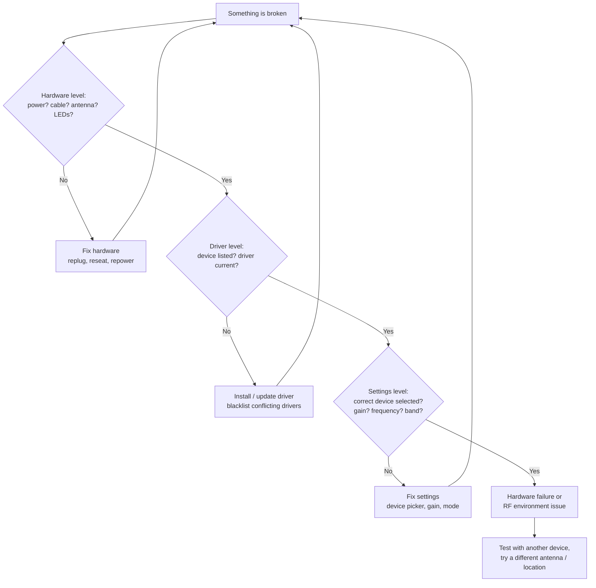

# SDRLAB 疑難排解中心

> **黃金法則**：永遠依這個順序除錯——**先硬體、再驅動程式、最後設定**。九成的 SDR 問題都是沒接天線、驅動程式過舊，或某個設定藏在眼皮底下。



## 問題索引

| 類別 | 這裡涵蓋的問題 |
|---|---|
| RTL-SDR V4 | [未被偵測](#rtl-sdr-not-detected) ・ [奇怪訊號／混疊](#rtl-sdr-picks-up-images-of-other-signals) ・ [Bias tee 無法開啟](#bias-tee-wont-turn-on) |
| TRX-duo | [網頁介面連不上](#trx-duo-web-ui-unreachable) ・ [開機迴圈／沒有 DHCP](#trx-duo-boots-but-never-appears-on-the-network) ・ [收不到訊號](#trx-duo-rx-shows-noise-only) |
| H4M | [更新後應用程式消失](#h4m-apps-missing-after-firmware-update) ・ [無法開機](#h4m-wont-power-on) ・ [沒有聲音](#h4m-no-audio-from-speaker-or-jack) |
| Flipper 模組 | [模組應用程式顯示「no module」](#flipper-app-says-no-module) ・ [NRF24 什麼都看不到](#nrf24-sees-nothing-on-channel-scan) ・ [WiFi 板連不上](#wifi-board-web-interface-unreachable) ・ [Ethernet 模組沒有連線燈](#ethernet-module-no-link-light) |

---

## RTL-SDR 未被偵測

### 症狀
`rtl_test` 印出 `No devices found.`，或 GQRX 列出不到任何裝置。

### 診斷
```bash
lsusb
```
預期輸出會顯示接收棒：

```
Bus 001 Device 004: ID 0bda:2838 Realtek Semiconductor Corp. RTL2838 DVB-T
```

如果 `lsusb` 什麼都沒顯示，問題出在 USB 連線本身（纜線、連線埠、集線器）。如果*有*顯示裝置，請繼續。

### 根本原因
核心的 DVB-T 驅動程式（`dvb_usb_rtl28xxu`）在 SDR 驅動程式之前搶走了接收棒——這是經典的 RTL-SDR 故障模式。

### 修正
1. 封鎖 DVB 驅動程式：
```bash
echo 'blacklist dvb_usb_rtl28xxu' | sudo tee /etc/modprobe.d/blacklist-dvb_usb_rtl28xxu.conf
```
2. 重新開機，或若模組已載入則執行 `sudo modprobe -r dvb_usb_rtl28xxu`。
3. 重新執行 `rtl_test`——預期看到 `Found 1 device(s)`。
4. 還是沒有？從原始碼安裝最新驅動程式——請見 [RTL-SDR V4 → Linux 安裝](/sdrlab/hardware/rtl-sdr-v4/#linux-install)。

---

## RTL-SDR 收到其他訊號的影像

### 症狀
你調諧到某個頻率，卻聽到*其他*頻率的電臺混進來，尤其是在 HF。

### 根本原因
來自強力廣播電臺的過載，或調諧到約 24 MHz 以下——舊式接收棒會在此折疊訊號（混疊）。RTL-SDR Blog V4 處理方式與舊接收棒不同——它內建 28.8 MHz 的 HF 升頻器，以及用於強 FM/DAB 幹擾的三工器 + 陷波濾波器。

### 修正
- 在 HF 上，確認你的驅動程式支援 V4（R828D）。驅動程式過舊時升頻器不會啟動，HF 會像一團混疊。
- 把增益**調低**（從 20–30 dB 開始）——大多數「幽靈訊號」都是過載。
- 加衰減器，或改用頻段專用天線而非寬頻天線。

---

## Bias tee 無法開啟

### 症狀
需要 DC 電源的主動式天線沒有供電。

### 根本原因
V4 的 bias tee 由軟體控制（4.5 V、180 mA）。在 SDR# / SDR++ 中它對應到**「Offset tuning」**選項；必須每次工作階段都啟用。

### 修正
在裝置設定中啟用「Offset tuning」（這就是 V4 上的 bias-tee 開關）。在 GQRX 中，按裝置圖示 → 啟用 **Bias-T**。請注意 tee 無法供應重負載——上限 180 mA。

---

## TRX-duo 網頁介面連不上

### 症狀
瀏覽器無法載入 TRX-duo 儀錶板；`ping` 失敗。

### 診斷
```bash
ip neigh show
arp -a
```
尋找像 `192.168.1.100` 的位址或 `trx-duo-alpine` 主機名稱。

### 根本原因
網路設定錯誤：裝置預期有 DHCP，或你所在的子網路容不下它的預設靜態位址。

### 修正
1. 把 TRX-duo 連到與電腦**相同的交換器／路由器**。
2. 優先使用有 DHCP 的網路——裝置會自動要求位址。
3. 如果沒有 DHCP 伺服器，Red Pitaya 相容的預設值是 `http://192.168.1.100`——把電腦設成靜態 `192.168.1.x` 位址再試。
4. 完整的官方程式請見 [TRX-duo → 首次開機與網路](/sdrlab/hardware/trx-duo/#first-boot-and-network)。

---

## TRX-duo 開機了但從不出現在網路上

### 症狀
電源 LED 亮著，但乙太網路插孔沒有連線燈，或連線燈亮著卻沒有位址。

### 診斷
- 檢查 RJ45 插孔上的乙太網路連線 LED——如果沒亮，問題在纜線／連線埠。
- 檢查 SD 卡：映像檔損壞或錯誤，代表作業系統根本沒開機到足以設定網路。

### 根本原因
通常是其中之一：纜線不良、卡片未完全插好，或寫入了錯誤主機板版本的映像檔。

### 修正
1. 換一條纜線／連線埠試試。
2. 重新插好並用官方映像檔重寫 microSD 卡（見[韌體與 SD 映像檔](/sdrlab/hardware/trx-duo/#firmware-and-sd-image)）。
3. 如果還是沒出現，把卡片拿到電腦上測試——`fsck` 失敗或讀起來幾乎是空的卡片很可疑。

---

## TRX-duo 接收端只有雜訊

### 症狀
瀑布圖有反應，但你什麼都聽不到，即使強力 HF 廣播電臺也一樣。

### 診斷
檢查輸入：天線有接在**RX1/RX2 SMA 連線埠**嗎？頻段正確嗎（10 kHz – 60 MHz）？

### 根本原因
沒有天線／接錯連線埠、輸入衰減器啟動，或接收應用程式的增益設為最低。

### 修正
1. 接上合適的 HF 天線（長導線或調諧迴圈——2.4 GHz WiFi 天線在這裡幾乎沒用）。
2. 在應用程式中調高 RX 增益／關閉衰減器。
3. 確認你啟動的是 *SDR 接收器*應用程式，不是 VNA。

---

## H4M 韌體更新後應用程式消失

### 症狀
PortaPack 開機了、選單看起來正常，但很多應用程式不見了。

### 根本原因
從 Mayhem 1.8.0 起，大多數應用程式存放在 **microSD 卡**上，而不是 flash 中。SD 卡遺失或過舊就等於應用程式消失。

### 修正
1. 準備一張 microSD 卡（16 GB 很夠用），格式化為 **FAT32**。
2. 從 [Mayhem 版本頁面](https://github.com/portapack-mayhem/mayhem-firmware/releases)下載該版本的 `COPY_TO_SDCARD` 壓縮檔——見 [H4M → Mayhem 韌體](/sdrlab/hardware/h4m/#mayhem-firmware)。
3. 把壓縮檔解壓縮到卡片根目錄。
4. 插入並重新開機。應用程式就出現了。

---

## H4M 無法開機

### 症狀
沒有顯示、沒有 LED。

### 診斷
- 用 USB-C 充電 10 分鐘以上，然後試試**電源開關**（H4M 有真正的開／關按鈕）。
- 試著把 USB-C 纜線連到電腦再開機。

### 根本原因
電池沒電是常見嫌疑；偶爾是卡在 DFU／flash 模式。

### 修正
1. 充電直到充電指示燈顯示進度。
2. 按住電源按鈕約 3 秒。
3. 還是無法啟動？連線 USB-C，檢查電腦是否看到 HackRF 裝置——如果有，依照 [H4M → Mayhem 韌體](/sdrlab/hardware/h4m/#mayhem-firmware)重新燒錄 Mayhem。

---

## H4M 喇叭或插孔沒有聲音

### 症狀
瀑布圖有訊號，耳朵卻一片寂靜。

### 根本原因
模式／增益設定，或音訊被導到錯誤的輸出（插入耳機時，H4M 會在內建喇叭與 3.5 mm 插孔之間自動切換）。

### 修正
1. 調高 RX 增益並重新檢查解調模式（廣播 FM 用 WFM）。
2. 拔掉耳機讓音訊改走喇叭，或反過來。
3. 檢查音訊選單中的音量設定。

---

## Flipper 應用程式顯示「no module」

### 症狀
擴充應用程式（NRF24、Marauder、GPS）回報模組不存在，即使它明明插著。

### 根本原因
GPIO 腳位沒有針對該模組設定，或 Flipper 韌體沒有內建該應用程式。大多數模組需要自訂韌體（Momentum / Unleashed / Xtreme）與明確的腳位指派。

### 修正
1. 在 **Momentum** 上：`Protocol Settings → GPIO Pin Settings`——設定模組的腳位（確切腳位依各產品頁面）。
2. 在 **Unleashed/Xtreme** 上：對應的 GPIO 設定位於應用程式自己的設定或韌體設定中。
3. 重新開機 Flipper 再試一次。

請見各模組頁面：[5G board](/sdrlab/expansion/5g-board/)、[NRF24](/sdrlab/expansion/nrf24/)、[WiFi multiboard](/sdrlab/expansion/wifi-multiboard/)、[Ethernet](/sdrlab/expansion/ethernet-test-module/)。

---

## NRF24 頻道掃描什麼都看不到

### 症狀
即使附近有無線滑鼠／鍵盤，嗅探器也顯示零活動。

### 診斷
確認模組的 SMA 天線已接上，且滑鼠正在持續移動（閒置的滑鼠幾乎不發射）。

### 根本原因
沒有天線、SPI 腳位錯誤，或單純沒有流量：許多 2.4 GHz 裝置使用跳頻，閒置時很安靜。

### 修正
1. 接上天線。
2. 依 [NRF24 頁面](/sdrlab/expansion/nrf24/)確認腳位。
3. 掃描時移動／搖晃滑鼠或鍵盤——你應該會看到頻道突發訊號。
4. 試試 2 Mbps 的頻道範圍 1–126，然後 1 Mbps 與 250 kbps（不同裝置使用不同速率）。

---

## WiFi 板網頁介面連不上

### 症狀
燒錄 deauther 後，你連不上 `192.168.4.1`。

### 根本原因
你的手機／電腦自動加入了另一個網路，或主機板的存取點沒啟動。

### 修正
1. 連到主機板的存取點（預設 SSID `pwned`、密碼 `deauther`）。
2. 在使用者端上停用行動資料／自動加入。
3. 瀏覽 `http://192.168.4.1`。
4. 還是沒用？依 [WiFi multiboard 頁面](/sdrlab/expansion/wifi-multiboard/)重新燒錄韌體。

---

## Ethernet 模組沒有連線燈

### 症狀
插入纜線後，RJ45 連線埠的 LED 保持熄滅。

### 診斷
- 換一條纜線、換一個交換器連線埠試試（模組是 10/100——有些僅支援 1G 的「智慧」連線埠很挑剔）。
- 依 [Ethernet 模組頁面](/sdrlab/expansion/ethernet-test-module/#wiring-to-the-flipper)確認與 Flipper 的接線。

### 根本原因
纜線／連線埠不良，或 SPI 接線（CS/RESET）錯誤導致 W5500 從未初始化。

### 修正
1. 先用任何已知正常的裝置測試纜線。
2. 逐一檢查每一條 SPI 線——一條接錯就會讓連線失效。
3. 啟動應用程式；連線成功時標題應顯示 `LAN [UP 100M FD]`。

---

## 還是卡住？

把問題帶給我們（或論壇）時，請附上：

- **裝置 + 韌體版本**：例如「RTL-SDR V4、osmocom 驅動程式 2.x」；「H4M、Mayhem nightly 2026-07-26」；「Flipper Zero、Momentum 8.x」。
- **環境**：作業系統與版本、USB 集線器或直連、網路裝置的網路拓撲。
- **證據**：`lsusb` / `dmesg` 輸出、`rtl_test` 錯誤、`hackrf_info` 輸出、應用程式截圖。
- **你已經試過什麼**：這能避免重複建議，也顯示除錯順序有被遵循。

相關：[快速入門](/sdrlab/quickstart/) ・ [韌體與驅動程式](/sdrlab/firmware/) ・ [SDR 軟體](/sdrlab/sdr-software/)。