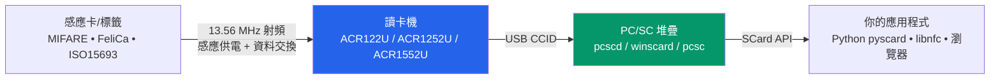

---

id: acs-index
title: ACS 智慧卡與 NFC 讀卡機
slug: /acs/
sidebar_position: 5
description: ACS (Advanced Card Systems) smart card readers and NFC readers — ACR122U, ACR1252U and ACR1552U. Contactless ISO 14443, MIFARE, FeliCa, ISO 15693 and NFC.
tags: [acs, smart-card, nfc, rfid, acr122u, acr1252u, acr1552u, pcsc]
keywords: [ACS, ACR122U, ACR1252U, ACR1552U, smart card reader, NFC reader, PC/SC, ISO 14443, MIFARE]
authors: yupitek
date: 2026-08-21
last_updated: 2026-08-21
category: product
difficulty: beginner
toc: true
---

# ACS — 智慧卡與 NFC 讀卡機

> **一句話定位**：ACS (Advanced Card Systems) 的 PC/SC 智慧卡與 NFC 讀卡機，把現實世界的感應卡（門禁卡、交通卡、MIFARE、FeliCa、電子護照、ISO 15693 資產標籤）變成電腦上一個標準的 `SCard*` 介面，讓任何 PC/SC 應用程式與你寫的程式都能讀寫它們。

若你是第一次接觸「讀卡機」，可以先看下面的概念圖，再用底下的產品連結跳到自己那一顆。

## 概念：讀卡機到底在做什麼？

把感應卡放到讀卡機上的那一刻，發生的事可以拆成三層。理解這三層，比記住任何單一指令都重要：

- **感應卡** 是靠射頻（RF）從讀卡機「無線供電」的。卡片自己沒有電池，放上讀卡機的瞬間由 13.56 MHz 天線啟動。
- **讀卡機**（如 ACR122U）負責把射頻通訊「翻譯」成標準的 USB 協定，讓系統認得它是一臺「智慧卡讀卡機」。
- **PC/SC 堆疊** 是作業系統層的標準。Linux 上叫 `pcscd`，macOS/Windows 內建。只要讀卡機符合 PC/SC，任何「懂 PC/SC」的軟體不用改一行就能用。

:::tip 為什麼 PC/SC 重要？
因為 PC/SC 是「讀卡機世界的 USB」——一個統一的 API。同一套程式碼，換一臺廠牌的讀卡機也能跑，前提是那臺讀卡機符合 PC/SC。
:::

## 三顆產品的定位

| 產品 | 一句話定位 | 最佳用途 |
|------|-----------|---------|
| [ACR122U](/acs/products/acr122u/) | 最經典、最便宜、社群支援最廣的入門 NFC 讀卡機 | 學生專題、MIFARE 研究、libnfc/多卡測試 |
| [ACR1252U](/acs/products/acr1252u/) | NFC Forum 認證、帶 SAM 安全插槽的 NFC Reader III | 需要元件的 NFC 應用、卡片模擬/點對點、正式部署 |
| [ACR1552U](/acs/products/acr1552u/) | 第 4 代、多協定、支援 ISO 15693 的旗艦 | 政府/健保/交通/資產盤點等專業多卡應用 |

## 怎麼選？3 個問句

1. **你要做什麼？** 只要讀 MIFARE 門禁卡或學校專題 → **ACR122U**。要正式產品、要 SAM 安全 → **ACR1252U**。要連 ISO 15693（資產標籤）都支援、要最快 → **ACR1552U**。
2. **你想用什麼開發？** 想用 libnfc 直連 + 大量開源工具 → **ACR122U**（唯一有 libnfc 直連 driver 的一顆）。要走標準 PC/SC、跨平臺 → 三者皆可。
3. **預算與未來？** 入門省預算選 ACR122U；要 NFC Forum 認證與安全性的商業開發選 ACR1252U；要最大相容性的長期投資選 ACR1552U。

## 快速規格比較

| 專案 | ACR122U | ACR1252U | ACR1552U |
|------|---------|----------|----------|
| 讀寫速度（ISO 14443） | 106/212/**424** kbps | 106/212/424 kbps | 106/212/424/**848** kbps |
| 讀距 | 最遠 50 mm | 最遠 50 mm | 最遠 70 mm |
| ISO 15693 | ❌ | ❌ | ✅ |
| SAM 安全插槽 | ❌ | ✅ | ✅ |
| NFC Forum 認證 | ❌ | ✅ | ❌ |
| 鍵盤模擬模式 | ❌ | ❌ | ✅ |
| libnfc 直連 driver | ✅ `acr122_usb` | ⚠️ 只能走 PC/SC | ⚠️ 只能走 PC/SC |
| 網頁/瀏覽器 NFC | 需 PC/SC bridge | 需 PC/SC bridge（詳見 [ACR1252U 的 Web NFC 章節](/acs/products/acr1252u/#web-nfc-macos-browser)） | 需 PC/SC bridge |

## 進入方式

- **拿到的是 ACR122U？** → 開 [ACR122U 完整說明](/acs/products/acr122u/)
- **拿到的是 ACR1252U？** → 開 [ACR1252U 完整說明](/acs/products/acr1252u/)
- **拿到的是 ACR1552U？** → 開 [ACR1552U 完整說明](/acs/products/acr1552u/)
- **想知道整臺機器怎麼裝上 Linux？** 三顆的設定頁都有完整的 `pcscd` / `pcsc_scan` / `libnfc` step-by-step。

## 未涵蓋？

- 若你要找的是其他品牌（ALFA 網絡卡、Hak5 滲透工具、Flipper Zero、SDR）請回到 [Yupitek Wiki 總覽](/getting-started/)。
- ACS 全系列完整的英文官方檔案（datasheet、SDK、API reference）可在 [acs.com.hk](https://www.acs.com.hk) 取得，每顆產品頁的「規格總覽」都有對應連結。

:::info 合法使用提醒
智慧卡讀卡機與 NFC 測試工具僅供教學、研究與合法授權之安全評估。請僅在您個人持有或已獲正式授權的卡片與系統上進行讀寫測試（遵守臺灣刑法第 358～363 條妨害電腦使用罪）。
:::
