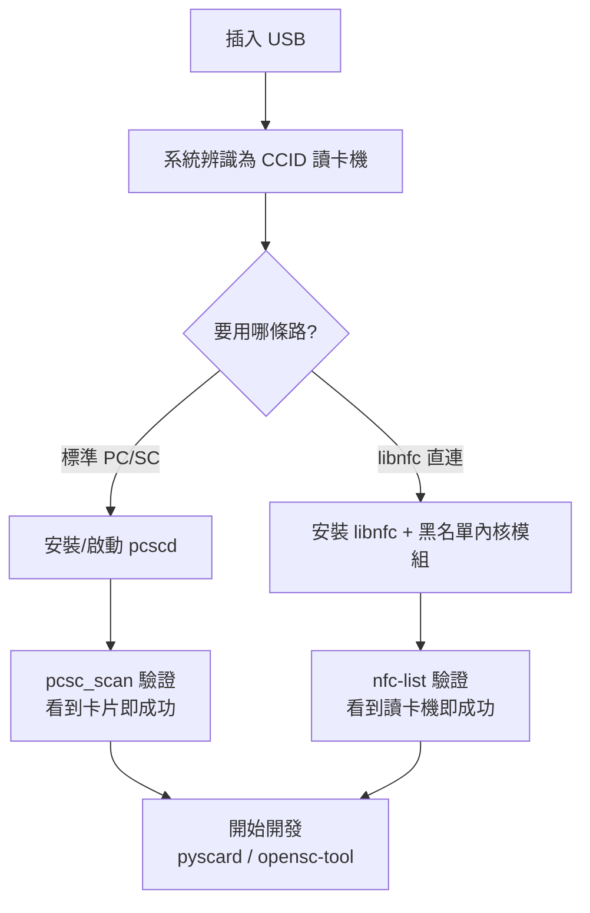

# ACR122U — USB NFC Reader 完整說明

> **一句話定位**：ACR122U 是 ACS 最經典、最廣為人知的 PC/SC 感應讀卡機。它把 ISO 14443 Type A/B、MIFARE、FeliCa 與 NFC (ISO 18092) 卡片/標籤變成標準 USB 讀卡機，開源社群（libnfc、pyscard、mfoc...）支援最完整，是大學生專題與 MIFARE 研究的最佳起點。

它是「讀卡機界的 Arduino」——便宜、到處買得到、任何 PC/SC 程式都能用、且是這三顆裡**唯一**有 libnfc 直連 driver 的型號（這在開發上有巨大優勢，後面「進階應用」會講）。

## 開箱與外觀

- **主體**：98.0 × 65.0 × 12.8 mm，珍珠白塑膠外殼，70 g。
- **天線**：主體下方內建 50 × 40 mm 天線，卡片直接放上頂面即可（讀距最遠 50 mm）。
- **LED**：1 顆雙色 LED（紅/綠），可由軟體控制。
- **蜂鳴器**：單音，可由軟體控制。
- **連線線**：固定式 USB Type-A 線，長 1 m，不可拆。

讀卡成功時 LED 通常會閃綠、並發出一聲嗶——這是「讀到了」最直接的訊號。

## 規格總覽

| 專案 | 規格 |
|------|------|
| 晶片/核心 | NXP PN532（13.56 MHz） |
| 支援標準/卡片 | ISO/IEC 18092 NFC、ISO 14443 Type A & B、MIFARE Classic®、MIFARE Ultralight®、FeliCa |
| 作業頻率 | 13.56 MHz |
| 讀寫速度 | 106 / 212 / **424** kbps（NFC 標籤） |
| USB 介面 | USB 2.0 Full Speed（12 Mbps）、CCID compliant |
| 讀距 | 最遠 50 mm（依卡片型別而定） |
| 防碰撞 | 內建（同一時間只存取一張卡） |
| 供電 | 由 USB 供電，典型 100 mA / 最大 200 mA，5 V |
| 尺寸/重量 | 98.0 × 65.0 × 12.8 mm / 70 g |
| API | PC/SC、CT-API（透過 PC/SC wrapper） |
| 認證 | ISO 14443、PC/SC、CCID、CE、FCC、KC、VCCI、RoHS、Microsoft WHQL |
| USB Vendor/Product ID | `072F:2200` |
| 系統支援 | Windows、Linux、macOS、Solaris、Android 3.1+ |
| 官方檔案 | [ACR122U 產品頁](https://www.acs.com.hk/en/products/3/acr122u-usb-nfc-reader/)、[API 手冊 (PDF)](https://downloads.acs.com.hk/drivers/en/API-ACR122U-2.02.pdf) |

## 這顆能做什麼、不能做什麼

| 能力 | 說明 |
|------|------|
| ✅ 讀/寫 MIFARE Classic、Ultralight | 可搭配 `libfreefare` / `nfc-mfclassic` 使用 |
| ✅ 讀/寫 ISO 14443-4 卡片 | 走標準 PC/SC APDU |
| ✅ 讀/寫 FeliCa、ISO 18092 NFC 標籤 | 走 pseudo-APDU |
| ✅ 卡號（UID）讀取 | 最常用的操作，幾行程式碼 |
| ❌ 卡片模擬（Card Emulation） | 本顆為 Reader/Writer 用途，非模擬 |
| ❌ ISO 15693 | 這顆不支援（需 ACR1552U） |
| ❌ SAM 安全插槽 | 這顆沒有（ACR1252U/1552U 才有） |

## 安裝與驅動

先把安裝流程看成一條管線，跟著做即可：



:::caution 最重要的第一步：核心模組衝突
Linux 核心的 `pn533` / `pn533_usb` 模組會自動認領 ACR122U（因為它內建 PN532 晶片），導致 libnfc 或 pcsc 拿不到裝置。**大多 Linux 上的 ACR122U 問題都源自這裡**。先黑名單這幾個模組再繼續。
:::

### 方法 A（建議先試）：標準 PC/SC — pcscd + pcsc_scan

這是最「標準」的路，也是 macOS/Windows 原生走的路，程式相容性最好。

**Step 1：安裝 PC/SC 套件（Debian/Ubuntu）**

```bash
sudo apt update
sudo apt install -y pcscd pcsc-tools libpcsclite-dev
```

**Step 2：確認 pcscd 有在跑**

```bash
ps aux | grep pcscd
```

預期你會看到一個 `pcscd` 行程（`/usr/sbin/pcscd`）。若沒有，啟動它：

```bash
sudo systemctl enable --now pcscd
sudo systemctl status pcscd
```

**Step 3：插入讀卡機並列出來**

```bash
pcsc_scan
```

按住不放執行，插入讀卡機（或已插入就重新插一次），預期輸出：

```text
Scanning present readers...
0: ACS ACR122U PICC Interface 00 00
...
```

現在把一張感應卡放到讀卡機上，`pcsc_scan` 會即時印出卡片資訊：

```text
Friday, August 21, 2026  10:00:00
Reader 0: ACS ACR122U PICC Interface 00 00
  Card state: Card inserted,
  ATR: 3B 8F 80 01 80 4F 0C A0 00 00 03 06 03 00 01 00 00 00 00 6A
```

看到 **"Card inserted" + ATR** 就代表整條 PC/SC 管線通了。按 `Ctrl+C` 離開。

:::note ATR 是什麼？
ATR（Answer To Reset）是卡片接上後第一個回傳的位元組串，像卡片的「自我介紹」。不同卡片會有不同 ATR，可拿來初判卡片型別。
:::

**Step 4（可選）：用 opensc-tool 發一道 APDU**

```bash
sudo apt install -y opensc
opensc-tool -l
```

預期列出一臺讀卡機 `ACS ACR122U PICC Interface`。放上卡片後抓 UID：

```bash
opensc-tool --atr        # 印 ATR
opensc-tool --reader 0 -s 00:A4:04:00:07:D2:76:00:00:85:01:00  # 選 AID（MIFARE 常用）
```

### 方法 B：libnfc 直連（進階、推薦給開發者）

ACR122U 有專屬的 libnfc 直連 driver `acr122_usb`，不需 pcscd，速度更直接，且能用大量開源工具（`mfoc`、`mfcuk`、`nfc-mfclassic`）。

**Step 1：黑名單核心模組（關鍵！）**

```bash
echo -e 'blacklist pn533\nblacklist pn533_usb\nblacklist nfc' | sudo tee /etc/modprobe.d/blacklist-libnfc.conf
sudo rmmod pn533_usb pn533 nfc 2>/dev/null   # 若已載入，卸載
```

:::warning
`rmmod` 只有在模組已載入時才有意義，解除安裝失敗的錯誤訊息可忽略。重插一次讀卡機讓黑名單生效。若已拔插仍被認領，重開機即可。
:::

**Step 2：安裝 libnfc 與工具**

```bash
sudo apt install -y libnfc-dev libnfc-bin libmfoc libfreefare-bin
```

**Step 3：驗證讀卡機被 libnfc 認得**

```bash
nfc-list
```

預期輸出：

```text
nfc-list uses libnfc 1.8.0
NFC device: ACS / ACR122U PICC Interface opened
1 NFC device(s) found:
- ACS / ACR122U PICC Interface:
    acr122_usb:001:008
```

放一張卡上去再跑一次，預期多了卡片資訊（`NFC-A`、`UID` 等）。看到 `NFC device: ... opened` 就是成功。

**Step 4（可選）：確認無 pcsc 佔用**

若同時有 pcscd 在跑，兩者會搶裝置。不想用 pcsc 時可停掉：

```bash
sudo systemctl stop pcscd
```

### 兩條路怎麼選？

| 情境 | 用哪條 |
|------|--------|
| 只要標準 PC/SC、跨平臺、跟現有軟體相容 | 方法 A（pcscd） |
| 要研究 MIFARE、用 mfoc/mfcuk、開發自己韌體層邏輯 | 方法 B（libnfc） |
| 我想兩者並存 | 可以，但**同時只能一個佔用裝置**——跑 libnfc 前先停 pcscd |

## 快速開始：3 行 Python 讀卡號

安裝 pyscard（PC/SC 的 Python 繫結）：

```bash
pip install pyscard
```

放上卡片，執行：

```python
import smartcard
from smartcard.System import readers

r = readers()
print("Readers:", r)

connection = r[0].createConnection()
connection.connect()
# GET UID (0xFF 0xCA 0x00 0x00 0x04)
try:
    data, sw1, sw2 = connection.transmit([0xFF, 0xCA, 0x00, 0x00, 0x04])
    print("UID:", data)
    print(f"Status words: {sw1:02X} {sw2:02X}")
except Exception as e:
    print("Error:", e)
```

預期輸出（UID 依卡片不同）：

```text
Readers: ['ACS ACR122U PICC Interface 00 00']
UID: [4, 165, 60, 138, 185, 79, 128]
Status words: 90 00
```

- `90 00` = **成功**（無錯誤）。
- UID 是卡片的唯一識別碼——這是最常被拿來做「卡號當身分」的基礎。

## 相容性

| 平臺 | 支援 | 備註 |
|------|------|------|
| Windows 10/11 | ✅ | 內建 Microsoft CCID/PC/SC 驅動，免裝 ACS 驅動即插即用 |
| Linux (Kali/Ubuntu) | ✅ | 建議黑名單 `pn533` 模組；pcscd 或 libnfc 皆可 |
| macOS | ✅ | 內建 PC/SC，`pcsc_scan` 可直接用；可搭 pyscard |
| Android 3.1+ | ⚠️ | 需 ACS Android Library，非免驅動 |
| 瀏覽器 | ⚠️ | Web NFC API **只支援 Chrome on Android**；桌面瀏覽器需 PC/SC bridge（見 ACR1252U 的 [Web NFC](/acs/products/acr1252u/#web-nfc-macos-browser) 章節） |

## 疑難排解

### 1. `nfc-list` 說「No NFC device found」但有接
- **原因**：多半是 `pn533_usb` 核心模組搶走了裝置。
- **解法**：執行方法 B 的 Step 1（黑名單 + `rmmod`），重插或重開機，再用 `nfc-list` 檢查。

### 2. `pcsc_scan` 列不到讀卡機
- **原因**：`pcscd` 沒跑，或裝置許可權不足（少數桌面環境）。
- **解法**：`sudo systemctl start pcscd`；若許可權問題，確認使用者身處能被 udev 允許的群組（通常 default 即可）。

### 3. libnfc 報 `Device or resource busy`
- **原因**：pcscd（或 pn533 模組）正佔用讀卡機。
- **解法**：`sudo systemctl stop pcscd`（並確認模組已解除安裝），再跑 `nfc-list`。

### 4. LED 一直紅、讀卡不嗶
- **原因**：卡片放歪、超過讀距，或該卡與讀卡機不相容（例如 ISO 15693 卡，ACR122U 不支援）。
- **解法**：確認卡片平放於天線正上方、距離 ≤ 50 mm；換一張支援的卡測。

### 5. `pcsc_scan` 出現大量重複 ATR / 瞬間插拔
- **原因**：USB 供電不穩或 udev 許可權抖動。
- **解法**：換一條原廠線、插主機板後方的 USB 埠（避免 HUB）。

## 相關資源

- [ACS — 讀卡機系列總覽](/acs/)
- [ACR1252U — NFC Forum 認證、帶 SAM](/acs/products/acr1252u/)（要 SAM 安全插槽、元件級 NFC 時選它）
- [ACR1552U — 第 4 代、支援 ISO 15693](/acs/products/acr1552u/)（要 ISO 15693、848 kbps 時選它）
- [Yupitek Wiki 總覽](/getting-started/)
