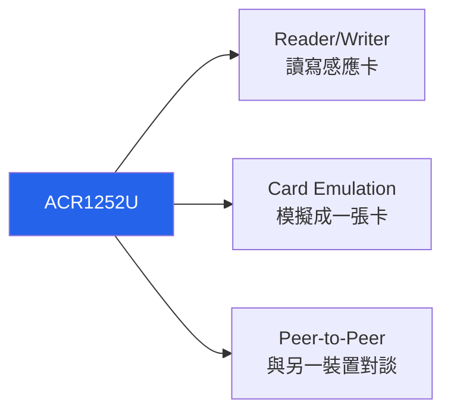
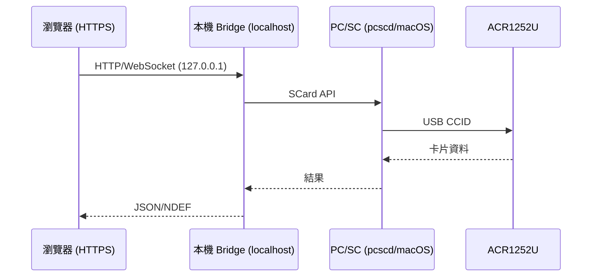

# ACR1252U — USB NFC Reader III（NFC Forum Certified）完整說明

> **一句話定位**：ACR1252U 是 ACS 第二代 NFC 讀卡機家族中最受歡迎的成員，主打 **NFC Forum 認證** + **內建 SAM（Secure Access Module）安全插槽**。它能做 NFC 的 Reader/Writer、Card Emulation、Peer-to-Peer 三種模式，適合要上正式產品、需要金鑰分散與雙向認證的開發者。

如果你在 ACR122U 與 ACR1252U 之間猶豫：ACR122U 是「便宜好玩的入門」，ACR1252U 是「要上線、要安全、要 NFC Forum 相容標章」的專業選擇。

## 開箱與外觀

- **主體**：98.0 × 65.0 × 12.8 mm，霧黑（Matte Black）塑膠外殼，81 g。
- **天線**：內建 50 × 40 mm 天線，讀距最遠 50 mm。
- **兩個 USB 版本**：USB Type-A（`ACR1252U-M1`）與 USB Type-C（`ACR1252U-MF`）——買之前確認你電腦的連線埠。
- **SAM 插槽**：主體一個標準 SIM 尺寸插槽，用來插 SAM 卡。
- **可程式 LED + 蜂鳴器**：LED（紅/綠）與蜂鳴器都可由軟體控制。
- **選配底座**：可選購立架，讓讀卡機站立成最佳感應角度。

## 規格總覽

| 專案 | 規格 |
|------|------|
| 認證 | **NFC Forum Certified**、IEC/EN 62368、CE、UKCA、FCC、VCCI、TELEC、KC、BIS、RoHS、REACH、WEEE、Microsoft WHQL |
| 支援標準/卡片 | ISO/IEC 18092 NFC、ISO 14443 Type A & B（T=CL）、MIFARE®、FeliCa |
| 作業頻率 | 13.56 MHz |
| 讀寫速度 | 106 / 212 / **424** kbps（可程式） |
| NFC 模式 | Reader/Writer、Peer-to-Peer、Card Emulation（三種全支援） |
| SAM 插槽 | 1 × ISO 7816 Class A（5 V）/ SIM 尺寸／T=0、T=1，9.6–215 kbps |
| 防碰撞 | 內建 |
| 擴充 APDU | ✅（最大 64 KB） |
| USB 介面 | USB CCID，USB 2.0 Full Speed（12 Mbps），相容 USB 3.0 |
| 供電 | 5 VDC，最大 200 mA |
| Firmware 升級 | ✅（透過 USB） |
| 尺寸/重量 | 98.0 × 65.0 × 12.8 mm / 81 g |
| USB Vendor/Product ID | `072F:223B` |
| 系統支援 | Windows、Linux、macOS、Android |
| 官方檔案 | [ACR1252U 產品頁](https://www.acs.com.hk/en/products/178/acr1252u-usb-nfc-reader-iii/)、[技術規格 (PDF)](https://www.smartcardfocus.com/files/ACR1252U-DOT/TechnicalSpecification_TSP-ACR1252U-2.02_Mar2024.pdf) |

## 重點特色深入

### SAM 安全插槽（這顆的殺手級功能）

SAM = Secure Access Module。把一張 SAM 卡插進 slot 後，讀卡機可以把**金鑰分散（Key Diversification）**與**雙向認證（Mutual Authentication）**這些敏感運算「外包」給實體 SAM 卡執行，金鑰永遠不離開硬體。這對金融、門禁、交通等需要高安全等級的應用至關重要——就算主機被入侵，讀卡機也拿不到真正的金鑰。

### 三種 NFC 模式



- **Reader/Writer**：最常用，讀寫 NFC 標籤與卡片。
- **Card Emulation**：讓讀卡機「扮演」一張感應卡，供其他讀卡機/手機讀取（例如會員卡模擬、數位門禁）。
- **Peer-to-Peer**：與另一臺支援 P2P 的 NFC 裝置交換資料（例如與手機 Android Beam 對談）。

## 安裝與驅動（Linux）

:::caution libnfc 相容性：這顆很關鍵
與 ACR122U 不同，**ACR1252U 沒有 libnfc 的直連 driver**。libnfc 社群明確表示 `acr122_usb` 只認 `072F:2200`（ACR122U）、`072F:90CC`（Touchatag）、`072F:2214`（ACR1222），**不包括 `072F:223B`（ACR1252U）**。
因此要用 libnfc 的話，只能透過 libnfc 的 **PC/SC driver**（`pcsc` wrapper），也就是**一定要先啟動 `pcscd`**，libnfc 再去「經過 PC/SC」存取。這代表 mfoc/mfcuk 這類依賴 libnfc 直連的工具對 ACR1252U 支援不佳。
**務實建議**：這顆就用標準 PC/SC（`pcsc_scan` + `pyscard`），這才是它的主場。
:::

**Step 1：安裝並啟動 PC/SC（Debian/Ubuntu）**

```bash
sudo apt update
sudo apt install -y pcscd pcsc-tools libpcsclite-dev
sudo systemctl enable --now pcscd
```

**Step 2：插入讀卡機並掃描**

```bash
pcsc_scan
```

預期輸出：

```text
Scanning present readers...
0: ACS ACR1252U 0
```

放上卡片，預期看到：

```text
Reader 0: ACS ACR1252U 0
  Card state: Card inserted,
  ATR: 3B 8F 80 01 80 4F 0C A0 00 00 03 06 03 00 01 00 00 00 00 6A
```

**Step 3：確認 USB 裝置名（可選）**

```bash
lsusb
```

預期：

```text
Bus 001 Device 008: ID 072f:223b Advanced Card Systems, Ltd
```

確認 `072f:223b` 就是它。

## macOS 安裝

macOS **內建 PC/SC**（`pcscd` 以 launchd 服務存在），ACR1252U 是 CCID 讀卡機，插上就能被系統認得，不需額外驅動。

**Step 1：列讀卡機**

```bash
pcsc_scan
```

在 macOS 上會透過內建 PC/SC 列出 `ACS ACR1252U 0`。

**Step 2（可選）：用 Python 測試**

macOS 對 Python 的 PC/SC 繫結較常見的是 `pyscard`（它底層走系統 PC/SC）：

```bash
python3 -m pip install pyscard
python3 - <<'EOF'
from smartcard.System import readers
print(readers())
EOF
```

預期印出 `['ACS ACR1252U 0']`（版本不同名稱可能略異）。放上卡片再跑，就能開始讀 UID / 發 APDU。

## Web NFC、macOS 與瀏覽器：真相與解法 {#web-nfc-macos-browser}

很多人誤以為「買一臺支援 Web NFC 的讀卡機，瀏覽器就能直接讀卡」。這裡必須把真相講清楚：

1. **Web NFC API（`NDEFReader`）只在 Chrome 的 Android 版可用**。macOS 桌面 Chrome/Safari/Firefox **都不支援**——這是 Web NFC 目前最主要、也最常被誤解的限制。
2. **WebUSB 也行不通**：ACR1252U 的 USB 介面是 **Smart Card class（0x0B）**，而瀏覽器的 WebUSB 明確**禁止**存取受保護的 class（含 Smart Card）。所以 `navigator.usb.requestDevice()` 會回報 blocked。
3. **正解 = PC/SC bridge**：在 macOS/Windows/Linux 上，正確做法是讓電腦上的 PC/SC 堆疊接管讀卡機，再用一支本機橋接程式暴露 HTTP/WebSocket 給瀏覽器。這正是開源專案如 [web-nfc-bridge](https://github.com/YuDefine/web-nfc-bridge)（以 ACR1252U-M1 實測）採用的架構：



:::tip 結論
在 macOS 上要「瀏覽器 + ACR1252U」，別找 Web NFC——架一支本機 PC/SC bridge 就對了。若你只想在手機瀏覽器讀卡，手機本身的 NFC 天線 + Web NFC（Android Chrome）即可，與讀卡機無關。
:::

## 快速開始：pyscard 讀 UID（跨平臺）

```bash
pip install pyscard
```

```python
from smartcard.System import readers

r = readers()
print("Readers:", r)
conn = r[0].createConnection()
conn.connect()
# GET UID
data, sw1, sw2 = conn.transmit([0xFF, 0xCA, 0x00, 0x00, 0x04])
print("UID:", data)
print(f"SW: {sw1:02X} {sw2:02X}")
```

預期 `SW: 90 00`（成功）。

## 相容性

| 平臺 | 支援 | 備註 |
|------|------|------|
| Windows 10/11 | ✅ | 內建 Microsoft CCID/PC/SC 驅動，即插即用 |
| Linux (Kali/Ubuntu) | ✅ | 走 PC/SC（pcscd）；**無 libnfc 直連** |
| macOS | ✅ | 內建 PC/SC，免驅動 |
| Android | ✅ | 可透過 OTG + PC/SC 應用使用 |
| 瀏覽器 | ⚠️ | Web NFC 只在 Android；桌面需 PC/SC bridge |

## 疑難排解

### 1. `nfc-list` 找不到 ACR1252U
- **原因**：libnfc 沒有這顆的直連 driver（`072F:223B` 不在表內）。
- **解法**：這顆請改用 `pcsc_scan` / `pyscard` / `opensc-tool`，走標準 PC/SC。若真要 libnfc，確保 pcscd 有跑，且 libnfc 以 `--with-drivers=pcsc` 建置。

### 2. `pcsc_scan` 沒東西
- **原因**：`pcscd` 沒啟動。
- **解法**：`sudo systemctl start pcscd`（Linux）；macOS 檢查 `ps aux | grep pcscd` 或 `sudo launchctl load -w /System/Library/LaunchDaemons/com.apple.securityd...`（通常內建已啟用）。

### 3. 讀 FeliCa/特定卡一直失敗
- **原因**：卡片超出了該顆的收發協定支援，或讀距/角度問題。
- **解法**：確認卡片屬 ISO 14443 A/B、MIFARE、FeliCa、ISO 18092；把卡平放於天線正中央；若要多協定（含 ISO 15693）請考慮 [ACR1552U](/acs/products/acr1552u/)。

### 4. SAM 插槽讀不到
- **原因**：SAM 卡方向/尺寸（SIM 尺寸）、或 SAM 卡 Class 不符（需 Class A / 5 V）。
- **解法**：確認使用 ISO 7816 Class A SIM 尺寸 SAM 卡，插入方向正確。SAM 與主讀卡機是兩套獨立通道，APDU 走不同節點。

## 相關資源

- [ACS — 讀卡機系列總覽](/acs/)
- [ACR122U — 經典入門 NFC 讀卡機](/acs/products/acr122u/)（libnfc 直連、便宜、學專題首選）
- [ACR1552U — 第 4 代、多協定](/acs/products/acr1552u/)（要 ISO 15693、更高 848 kbps 時選它）
- [Yupitek Wiki 總覽](/getting-started/)
