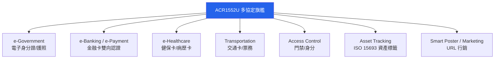

# ACR1552U — USB NFC Reader IV（第 4 代）完整說明

> **一句話定位**：ACR1552U 是 ACS 第 4 代旗艦 USB 讀卡機，特色是**多協定**——它多了 **ISO 15693** 支援與高達 **848 kbps** 的讀寫速度，並首度加入**鍵盤模擬（Keyboard Emulation）模式**，加上 SAM 安全插槽，是政府、健保、交通、資產盤點等「需要讀很多種卡」的應用首選。

如果 ACR122U 是「入門玩具」、ACR1252U 是「NFC 專業版」，那 ACR1552U 就是「什麼都能插、更快、更廣」的旗艦。

## 開箱與外觀

- **主體**：98.0 × 65.0 × 12.8 mm，白色塑膠外殼，約 79–89 g（依 USB 版本）。
- **天線**：內建 50 × 40 mm 天線，**讀距最遠 70 mm**（本家族最遠）。
- **兩個 USB 版本**：USB Type-A（`ACR1552U-M1`）與 USB Type-C（`ACR1552U-MF`）。
- **SAM 插槽**：1 × ISO 7816 Class A（5 V）/ SIM 尺寸插槽。
- **可程式 LED + 蜂鳴器**：藍/綠雙色 LED，蜂鳴器可程式。
- **連線線**：固定式 USB 線，長 1 m。

## 規格總覽

| 專案 | 規格 |
|------|------|
| 世代 | 第 4 代（USB NFC Reader IV） |
| 支援標準/卡片 | **ISO 14443 Type A & B（Part 1–4）、ISO 15693、ISO 18092 NFC**、MIFARE®、FeliCa、SRI/SRIX、CTS、Innovatron、Picopass、Topaz |
| 作業頻率 | 13.56 MHz |
| 讀寫速度 | **106 / 212 / 424 / 848 kbps**（ISO 14443）；26 / 53 kbps（ISO 15693） |
| 讀距 | 最遠 **70 mm**（依卡片型別） |
| NFC 模式 | Reader/Writer、**Keyboard Emulation**、Card Emulation |
| SAM 插槽 | 1 × ISO 7816 Class A（5 V）/ SIM 尺寸／T=0、T=1，13.4 kbps–1,250 kbps，時脈 5 MHz（可 10 MHz） |
| 防碰撞 | 內建 |
| 擴充 APDU | ✅（最大 64 KB） |
| USB 介面 | USB CCID，USB 2.0 Full Speed（12 Mbps），相容 USB 3.0 |
| 供電 | 5 VDC，最大 300 mA |
| Firmware 升級 | ✅（透過 USB） |
| 尺寸/重量 | 98.0 × 65.0 × 12.8 mm / 約 79–89 g |
| 系統支援 | Windows、Linux、macOS、Android、iOS/iPadOS 16+ |
| 官方檔案 | [ACR1552U 產品頁](https://www.acs.com.hk/en/products/575/acr1552u-usb-nfc-reader-iv/)、[技術規格 (PDF)](https://www.smartcardfocus.com/files/ACR1552U-M1SAM/TechnicalSpecification_TSP-ACR1552U-1.05_Jan2024.pdf) |

## 這顆與前兩顆差在哪（重點）

| 能力 | ACR122U | ACR1252U | **ACR1552U** |
|------|---------|----------|--------------|
| ISO 15693 | ❌ | ❌ | ✅ |
| ISO 14443 最高速度 | 424 kbps | 424 kbps | **848 kbps** |
| 最大讀距 | 50 mm | 50 mm | **70 mm** |
| 卡片型別數 | MIFARE/FeliCa/NFC | MIFARE/FeliCa/NFC | **+SRI/SRIX、CTS、Innovatron、Picopass、Topaz** |
| 鍵盤模擬 | ❌ | ❌ | ✅ |
| SAM 插槽 | ❌ | ✅ | ✅ |
| libnfc 直連 | ✅ | ❌（走 PC/SC） | ❌（走 PC/SC） |

:::note 哪些卡只有 ACR1552U 能讀？
**ISO 15693** 主要用在資產追蹤標籤（圖書館、倉儲、衣物吊牌）與部分智慧標籤；**Picopass / Topaz / SRIX** 等則出現在特定門禁與電子標籤生態。若你的專案會碰到這些，只有 ACR1552U 能通吃。
:::

## 應用場景



**鍵盤模擬（Keyboard Emulation）**值得特別介紹：啟用後，刷一張卡系統會自動「打字」輸出卡號，**就像你從鍵盤輸入一樣**。這對「不想寫程式、只想讓任何欄位自動填入卡號」的場景（如網頁登入框、Excel 打卡表）非常實用——不需要任何 SDK 或 PC/SC 程式。

## 安裝與驅動（Linux + macOS）

與 ACR1252U 相同，**ACR1552U 沒有 libnfc 直連 driver**（USB ID 不屬於 `acr122_usb`）。請一律走**標準 PC/SC**。

**Step 1：Linux — 安裝並啟動 PC/SC**

```bash
sudo apt update
sudo apt install -y pcscd pcsc-tools libpcsclite-dev
sudo systemctl enable --now pcscd
```

**Step 2：確認 USB 裝置**

```bash
lsusb
```

預期（依型號版本略有不同，皆為 Advanced Card Systems, Ltd）：

- `ACR1552U-M1`（USB Type-A）→ `ID 072f:2303`
- `ACR1552U-M2` / `-MF` → `ID 072f:2308`
- Firmware 升級模式 → `ID 072f:2302`

```text
Bus 001 Device 005: ID 072f:2303 Advanced Card Systems, Ltd
```

**Step 3：掃描讀卡機**

```bash
pcsc_scan
```

預期輸出：

```text
Scanning present readers...
0: ACS ACR1552U 0
```

放上卡片，預期看到 `Card state: Card inserted, ATR: ...`。

**Step 4：macOS**

macOS 內建 PC/SC，還特別新增了 **iOS/iPadOS 16+** 支援。直接：

```bash
pcsc_scan
```

即可列出 `ACS ACR1552U 0`。讀 ISO 15693 標籤時，`pcsc_scan` 會顯示對應的卡片狀態。

## 快速開始：用 pyscard 讀卡片（跨平臺）

```bash
pip install pyscard
```

```python
from smartcard.System import readers

r = readers()
print("Readers:", r)
conn = r[0].createConnection()
conn.connect()

# 讀 ISO 14443 UID
data, sw1, sw2 = conn.transmit([0xFF, 0xCA, 0x00, 0x00, 0x04])
print("ISO 14443 UID:", data, f"SW: {sw1:02X} {sw2:02X}")
```

預期 `SW: 90 00`。**若你放的是 ISO 15693 標籤**，這道 APDU 可能不適用——ISO 15693 有自己的一套指令（透過擴充 APDU 命令），建議從 ACS 的 Reference Manual 取得正確命令。

:::tip 第一次用 ISO 15693？
ISO 15693 標籤的讀法與 ISO 14443 不同，且各家標籤（NXP ICODE、ST）指令集略有差異。最直接的驗證方式是 `pcsc_scan` 看到卡片被識別為 ISO 15693 型別，之後再依參考手冊發對應命令。
:::

## 相容性

| 平臺 | 支援 | 備註 |
|------|------|------|
| Windows 10/11 | ✅ | 內建 Microsoft CCID/PC/SC 驅動 |
| Linux (Kali/Ubuntu) | ✅ | 走 PC/SC（pcscd）；無 libnfc 直連 |
| macOS | ✅ | 內建 PC/SC，免驅動 |
| Android | ✅ | OTG + PC/SC 應用 |
| iOS/iPadOS 16+ | ✅ | 透過支援的 PC/SC 應用使用 |
| 瀏覽器 | ⚠️ | Web NFC 只在 Android；桌面需 PC/SC bridge（見 ACR1252U 的 [Web NFC 章節](/acs/products/acr1252u/#web-nfc-macos-browser)） |

## 疑難排解

### 1. ISO 15693 標籤讀不到
- **原因**：可能用了 ISO 14443 那組 APDU，或標籤超出 70 mm 讀距。
- **解法**：用 `pcsc_scan` 先確認標籤被識別為 ISO 15693；再查 ACS Reference Manual 的 ISO 15693 命令；確認標籤平放且距離 ≤ 70 mm。

### 2. 鍵盤模擬沒輸出
- **原因**：鍵盤模擬模式需在控制項/韌體設定中啟用；或作業系統輸入焦點不在預期欄位。
- **解法**：依 ACS 工具啟用 Keyboard Emulation 模式；確保目標欄位取得輸入焦點；檢查鍵盤 layout（數字碼可能因 layout 不同而異）。

### 3. libnfc 找不到這顆
- **原因**：無直連 driver。
- **解法**：與 ACR1252U 相同，走 PC/SC（pcscd + pyscard/opensc-tool）。依賴 mfoc/mfcuk 的 MIFARE 破解工作流建議改用 [ACR122U](/acs/products/acr122u/)。

### 4. SAM 卡讀不到
- **原因**：需 ISO 7816 Class A（5 V）SIM 尺寸 SAM 卡；方向或型號不符。
- **解法**：確認 SAM Class A / SIM 尺寸；正確插入；SAM 與主通道是獨立的兩套 APDU 節點。

## 相關資源

- [ACS — 讀卡機系列總覽](/acs/)
- [ACR122U — 經典入門 NFC 讀卡機](/acs/products/acr122u/)（libnfc 直連、MIFARE 研究）
- [ACR1252U — NFC Forum 認證、帶 SAM](/acs/products/acr1252u/)（NFC 三模式、正式產品）
- [Yupitek Wiki 總覽](/getting-started/)
