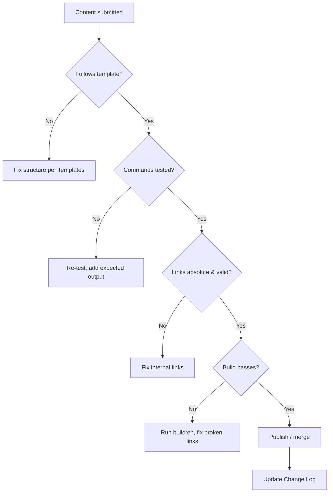

# 審查佇列

審查佇列是任何新增、編輯或翻譯的 wiki 內容在被視為完成之前的分類工作流程。它呼應 `support-policy` 的決策流程。

## 工作流程



## 核對清單

頁面核准之前：

- [ ] Frontmatter 的 `id` 在整個 wiki 中唯一。
- [ ] 結構符合 `Templates` 中的對應範本。
- [ ] 設定／指南／疑難排解頁面至少有一張圖表。
- [ ] 每個 ```bash 指令都測試過並顯示預期輸出。
- [ ] 沒有 `TODO` / `TBD` 佔位符。
- [ ] 所有內部連結都使用絕對路由路徑。
- [ ] `npm run build:en` 透過且零壞連結。
- [ ] 翻譯的語言版本在同一次變更中更新（見 `Translation Glossary`）。

## 核准之後

在 [`Change Log`](/admin/change-log/) 中記錄變更。

如果變更新增或重新命名產品，請在同一個 commit 中更新 `Product Registry` 與 `Driver Registry`。